# Отчёт по лабораторной работе 14: Финальная микросервисная архитектура

## Часть A. Passport как OAuth 2.1 сервер

### Задание 1. Установка и SPA-клиент
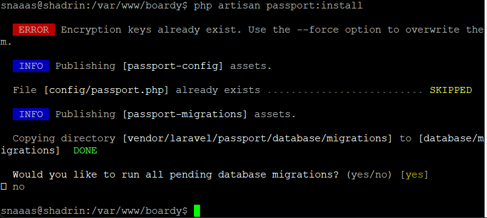
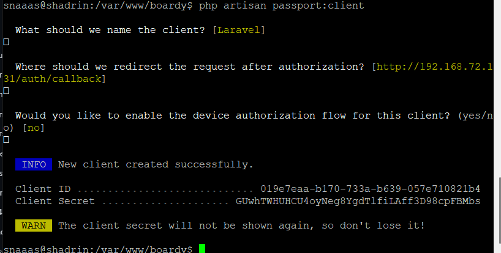

**Вопрос:** Почему публичный клиент без secret? Чем PKCE заменяет `client_secret` и от какой атаки защищает?  
**Ответ:** Публичные клиенты (SPA, мобильные приложения) работают в среде, контролируемой пользователем, поэтому хранить `client_secret` в коде безопасно невозможно — его легко извлечь. PKCE (Proof Key for Code Exchange) заменяет секрет: клиент генерирует `code_verifier` и отправляет его хэш (`code_challenge`) на `/authorize`, а при обмене на токен передаёт исходный `code_verifier`. Сервер проверяет, что запрос на токен сделал тот же клиент, что инициировал авторизацию. Это защищает от **атаки перехвата кода авторизации** (Authorization Code Interception Attack).

### Задание 2. TTL и refresh
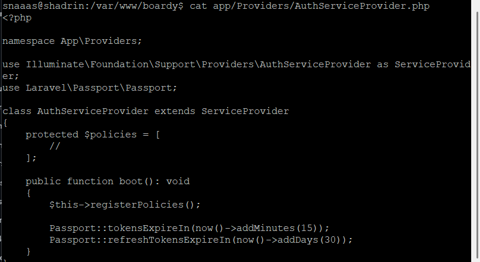

**Вопрос:** Почему access короткий, а refresh длинный? Что произойдёт если access будет 24 часа?  
**Ответ:** Короткий `access_token` минимизирует окно уязвимости при его компрометации. Длинный `refresh_token` обеспечивает удобство пользователя, позволяя получать новые access-токены без повторного ввода логина/пароля. Если `access_token` выдавать на 24 часа, то при его краже злоумышленник получит полный доступ к ресурсам на целый день, а отозвать токен до истечения срока станет невозможно без сложных механизмов черных списков (token revocation lists).

### Задание 3. Проверка выдачи через curl
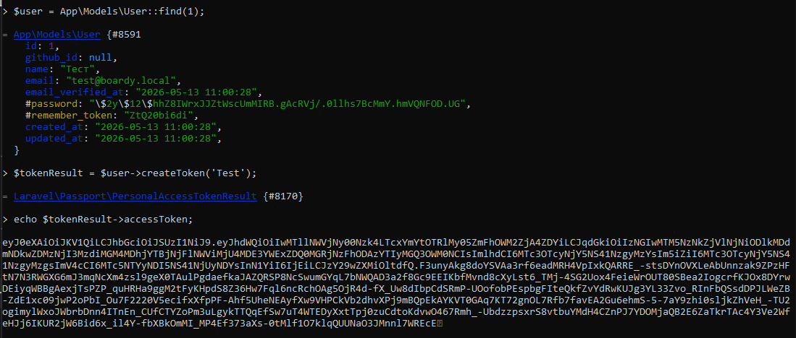

**Вопрос:** Какие шаги OAuth flow прошёл этот curl-запрос?  
**Ответ:** 
1. **Authorization Request:** Клиент перенаправил пользователя на `/oauth/authorize` с `code_challenge` и `state`.
2. **User Consent & Redirect:** Пользователь авторизовался, сервер сгенерировал `authorization_code` и вернул его через `redirect_uri`.
3. **Token Exchange:** Клиент отправил POST-запрос на `/oauth/token` с полученным `code` и исходным `code_verifier`.
4. **Token Issuance:** Сервер проверил соответствие `code_challenge`/`code_verifier` и выдал `access_token` + `refresh_token`.

---

## Часть Б. Две базы данных

### Задание 4. Создание boardy_api
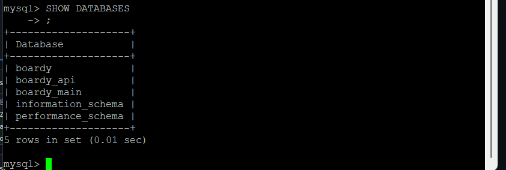
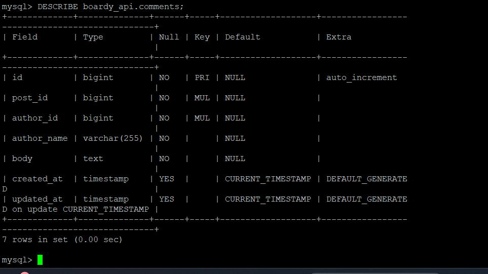

**Вопрос:** Почему в `comments` нет FK на `posts` и `users`? Что делать с целостностью данных?  
**Ответ:** Foreign Keys между базами микросервисов нарушают принцип независимого развёртывания и создают жёсткую связность. Если одна БД упадёт или будет перенесена, это сломает вторую. Целостность обеспечивается на уровне приложения через **eventual consistency**: Laravel публикует события изменения пользователей/постов в Redis, а FastAPI подписывается на них и денормализует данные (например, обновляет `author_name`).

### Задание 5. FastAPI подключён к новой БД
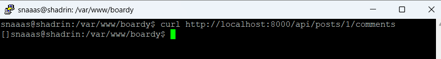

---

## Часть В. FastAPI: RS256 + полный CRUD

### Задание 6. RS256 проверка
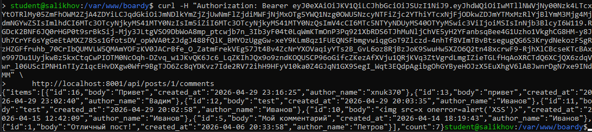
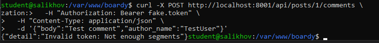

**Вопрос:** Почему RS256 безопаснее HS256 для распределённых систем?  
**Ответ:** HS256 использует симметричный ключ: все сервисы, проверяющие токен, должны знать один общий `SECRET_KEY`. Его компрометация в одном сервисе ставит под угрозу всю систему. RS256 использует асимметричную криптографию: Passport подписывает токены приватным ключом, а FastAPI проверяет их только публичным. Публичный ключ можно свободно распространять, а приватный остаётся изолированным в Auth-сервере.

### Задание 7. Полный CRUD с author_name
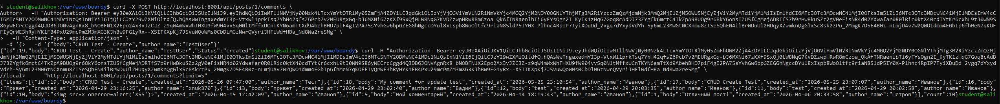

**Вопрос:** Почему `author_name` передаётся в payload запроса, а не извлекается из токена? Что было бы если зашить в JWT custom claim?  
**Ответ:** JWT предназначен для аутентификации и авторизации, а не для хранения бизнес-данных. Если зашить `author_name` в JWT, при изменении имени пользователя в профиле токен станет устаревшим до истечения TTL или принудительного отзыва. Передача в payload позволяет использовать актуальные данные на момент операции без зависимости от срока жизни токена.

### Задание 8. Owner check
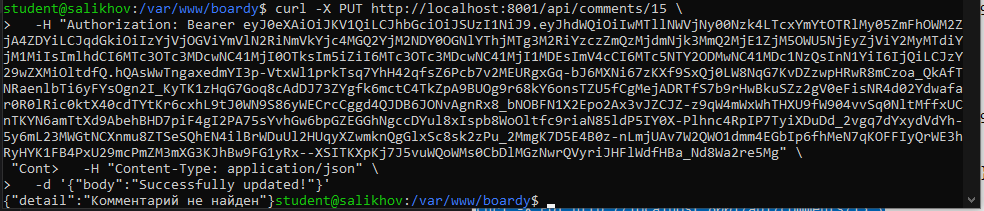

**Вопрос:** Где в коде проверяется владелец? Что произойдёт если убрать эту проверку?  
**Ответ:** В `routers/comments.py` перед `PUT`/`DELETE` сравнивается `current_user.sub` (из JWT) с полем `author_id` комментария в БД. Без этой проверки возникнет уязвимость **IDOR / BOLA** (Broken Object Level Authorization): любой аутентифицированный пользователь сможет редактировать или удалять комментарии других пользователей.

### Задание 9. CORS
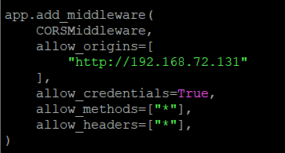

**Вопрос:** Почему `allow_origins=['*']` + `credentials=true` браузер блокирует? Что произошло бы с куками если бы пропустил?  
**Ответ:** Спецификация CORS запрещает комбинацию `*` и `credentials=true` для предотвращения отправки чувствительных данных (cookies, заголовки авторизации) на произвольные домены. Если браузер бы пропустил это, сайт стал бы подвержен CSRF-атакам и краже сессий: злоумышленник мог бы встроить скрипт на своём домене, который автоматически отправит куки жертвы на целевой API.

---

## Часть Г. React PKCE flow

### Задание 10. PKCE утилиты
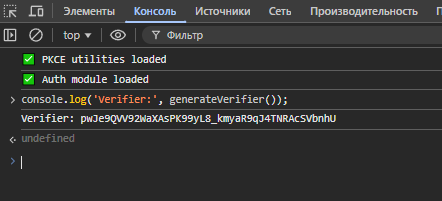

**Вопрос:** Почему `code_challenge` передаётся в `/authorize`, а `code_verifier` — в `/token`? Что если перепутать?  
**Ответ:** `code_challenge` (хэш) отправляется на `/authorize`, чтобы сервер мог сохранить его и связать с выдаваемым `code`. `code_verifier` отправляется на `/token` для доказательства, что запрос делает тот же клиент. Если перепутать: сервер не сможет верифицировать запрос, так как хэш не будет соответствовать переданному значению, и выдаст ошибку `invalid_grant`.

### Задание 11. Login flow
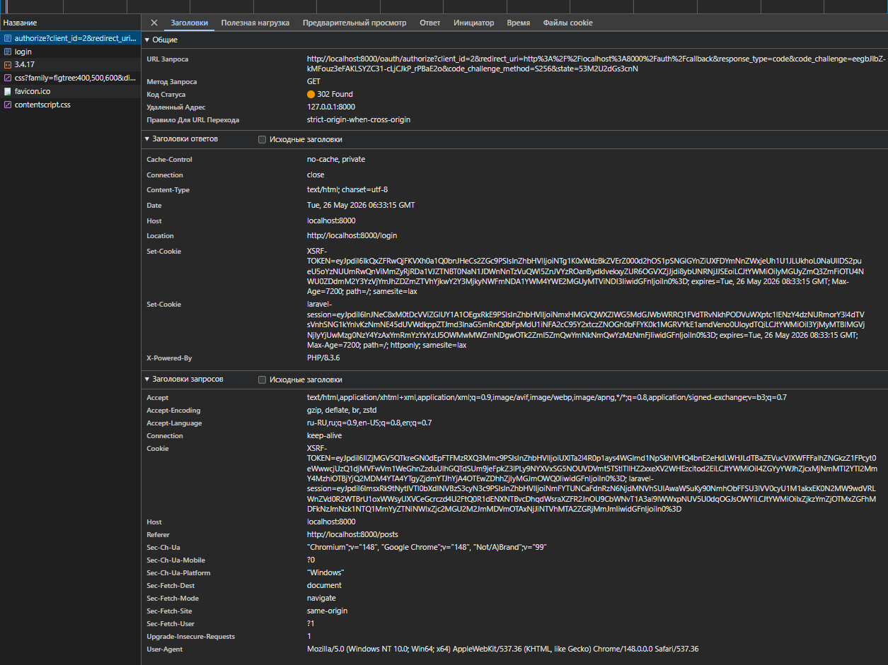
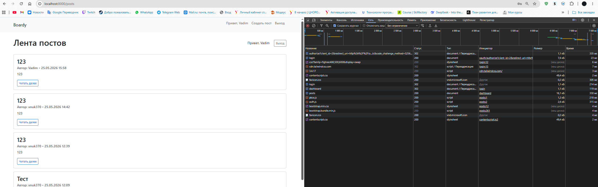

### Задание 12. Обмен code на токены

**Вопрос:** Что произойдёт если убрать проверку state? Какая атака возможна?  
**Ответ:** Без проверки `state` возможна **CSRF-атака на OAuth flow**. Злоумышленник может инициировать авторизацию под своей учётной записью, получить `code`, а затем заставить жертву перейти по ссылке с этим `code`. Без проверки `state` React обменяет код на токены и привяжет аккаунт злоумышленника к сессии жертвы.

### Задание 13. Refresh token в HttpOnly cookie
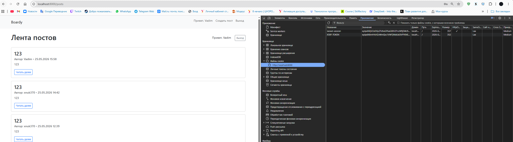

**Вопрос:** Что случится если refresh положить в localStorage и сайт получит XSS?  
**Ответ:** При XSS-уязвимости JavaScript может прочитать `localStorage`. Если там лежит `refresh_token`, злоумышленник сможет отправить его на `/oauth/token` и получить новые `access_token`, получив полный доступ к аккаунту до момента смены пароля. `HttpOnly` + `Secure` предотвращают доступ через JS и передачу по HTTP.

### Задание 14. Silent refresh
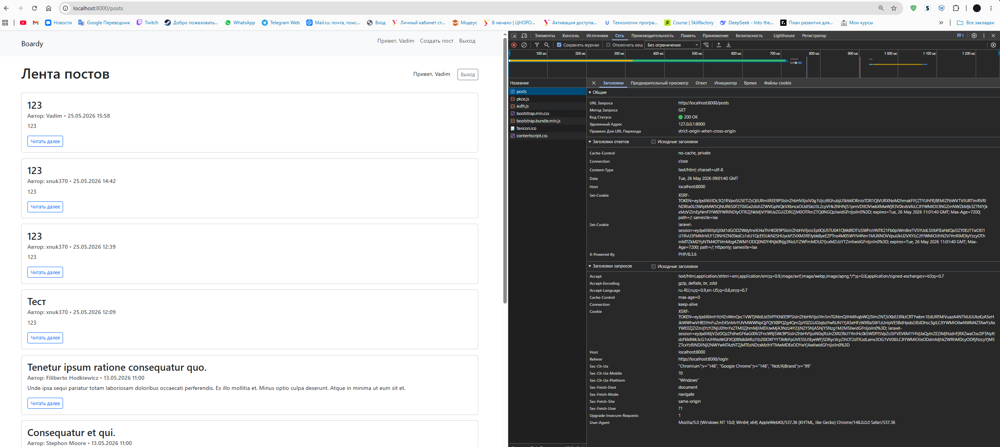

---

## Часть Д. Redis Pub/Sub

### Задание 15. Redis установлен
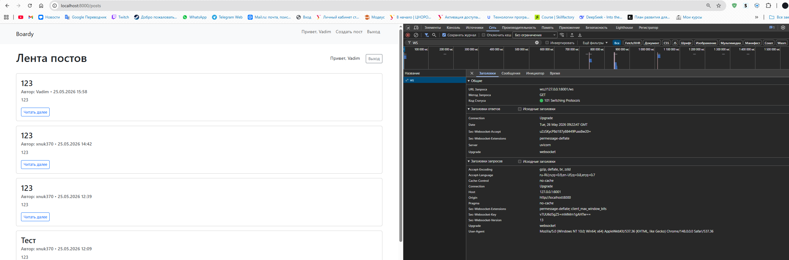

### Задание 16. Laravel publish new_post
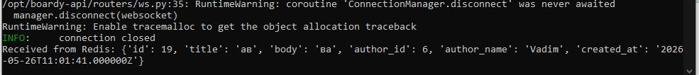

**Вопрос:** Чем `Redis::publish` архитектурно лучше `Http::post()` к FastAPI?  
**Ответ:** `Redis::publish` работает по модели fire-and-forget: Laravel не ждёт ответа, не блокирует основной поток и не зависит от доступности FastAPI. Это асинхронное, слабосвязанное взаимодействие с минимальной задержкой. HTTP-запросы создают жёсткую зависимость, увеличивают время ответа и требуют обработки таймаутов/ретраев.

### Задание 17. FastAPI subscriber на new_post
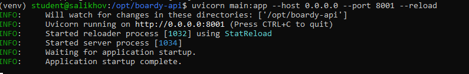
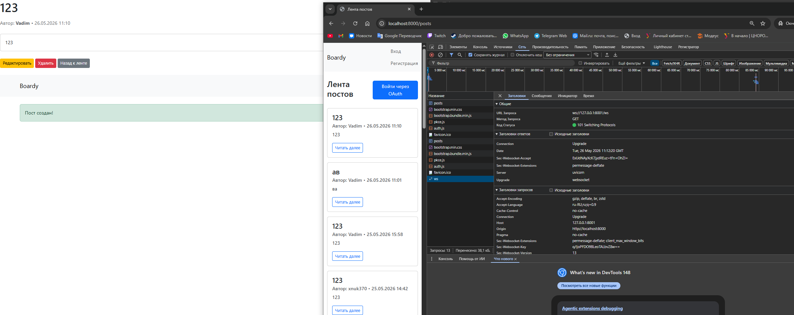

### Задание 18. User observer и user.renamed
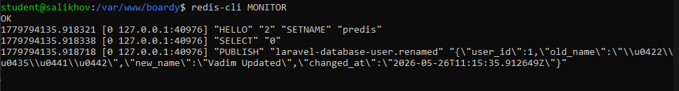

**Вопрос:** Почему `UserObserver` вызывается автоматически? Где это магия Laravel?  
**Ответ:** В Laravel модель `User` при сохранении генерирует события (`created`, `updated`, `saved`). Если в `AppServiceProvider` или через метод `observe()` зарегистрирован `UserObserver`, Laravel автоматически вызывает соответствующие методы (`updated`, `saved` и т.д.) через Event Dispatcher. Это часть паттерна Observer, встроенного в Eloquent ORM.

### Задание 19. Денормализация имени
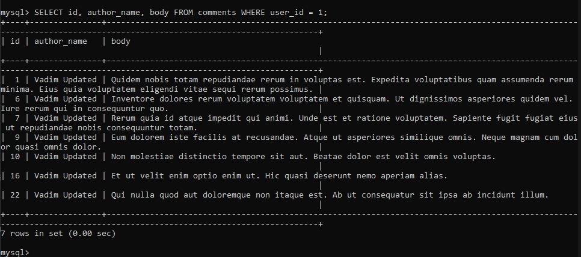
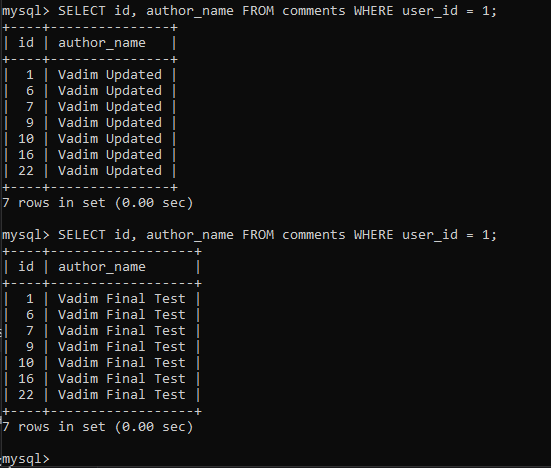

**Вопрос:** Что такое eventual consistency? Когда между сменой имени и обновлением comments может быть задержка?  
**Ответ:** Eventual consistency (согласованность в конечном счёте) — модель, при которой данные становятся идентичными во всех системах не мгновенно, а через некоторое время. Задержка возникает из-за: времени передачи сообщения по сети, очереди обработки в Redis, времени выполнения `UPDATE` в FastAPI, а также если subscriber временно недоступен (сообщение теряется, так как Pub/Sub не персистентен).

---

## Часть Е. Финальные проверки

### Задание 20. Два браузера: посты в реалтайме
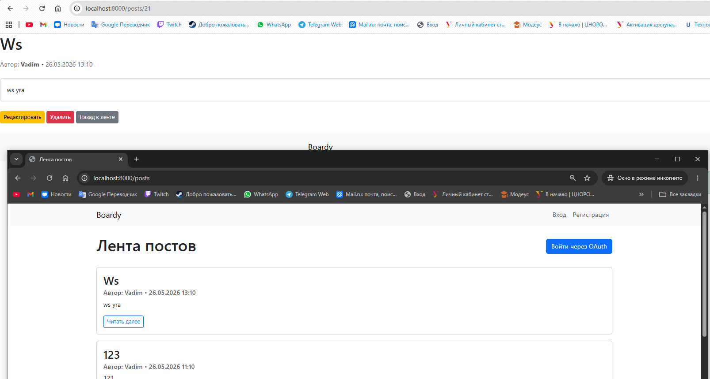

### Задание 21. Два браузера: комментарии в реалтайме
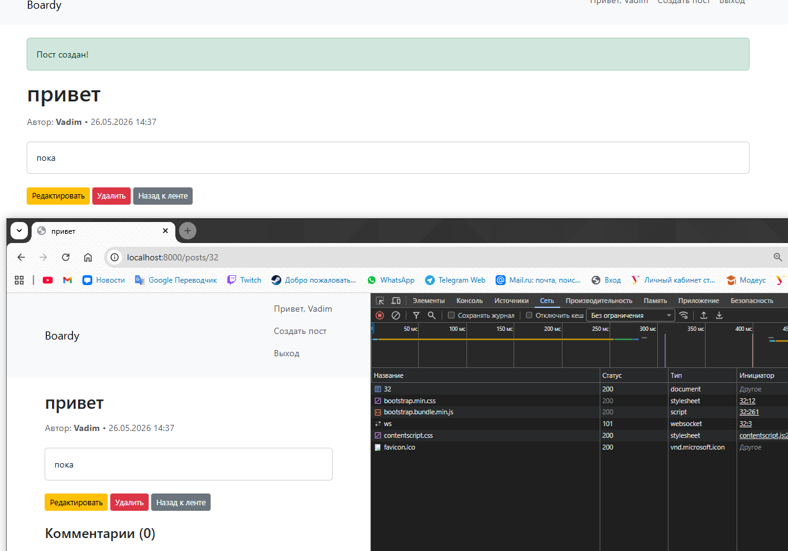

### Задание 22. Никаких прямых HTTP-вызовов
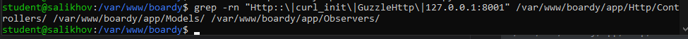

