# Отчёт по лабораторной работе №15
## Архитектура веб-приложений: Docker и Docker Compose

---

## Цель работы
Освоить контейнеризацию многокомпонентного веб-приложения (Laravel + FastAPI + Nginx + MySQL + Redis) с использованием Docker и Docker Compose. Обеспечить воспроизводимость среды: запуск приложения на чистой машине одной командой `docker compose up` без ручных установок зависимостей на хост-системе.

---

## Часть А. Dockerfile для Laravel

### Задание 1. PHP-FPM с расширениями
Создан `boardy-laravel/Dockerfile` на базе `php:8.2-fpm` с установкой необходимых расширений (`pdo_mysql`, `mbstring`, `zip`, `opcache`, `redis`).

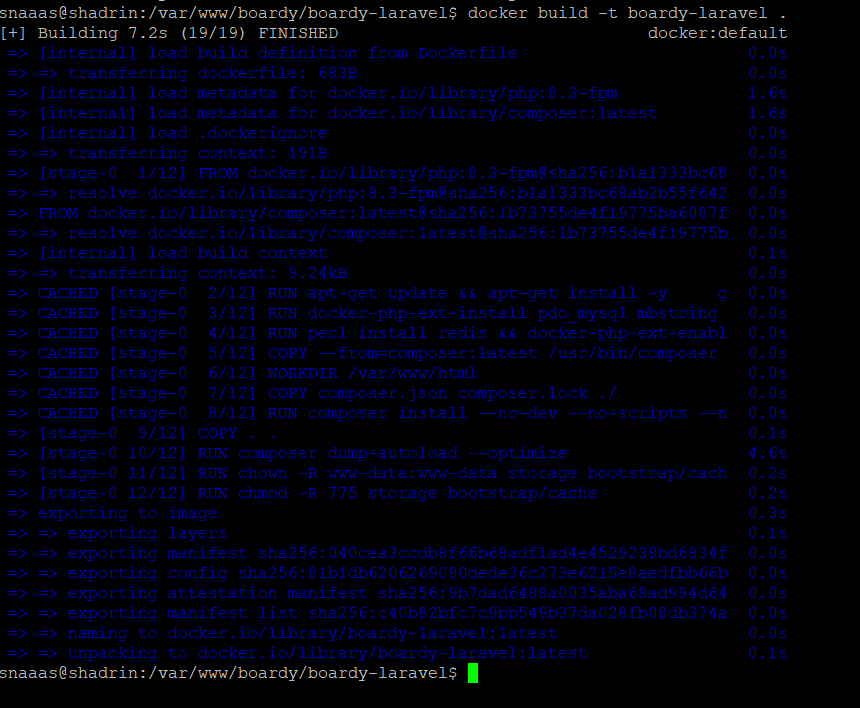

**Вопрос:** Зачем PHP-FPM в Docker, а не Apache+PHP? Какое архитектурное преимущество?  
**Ответ:** Использование PHP-FPM (FastCGI Process Manager) вместо Apache+mod_php обеспечивает разделение ответственности (Separation of Concerns). Nginx эффективно обслуживает статические файлы и проксирует PHP-запросы на FPM. Это делает образ легче, потребляет меньше оперативной памяти, лучше масштабируется и соответствует микросервисной архитектуре, где веб-сервер и интерпретатор PHP работают как независимые процессы.

### Задание 2. Кеширование composer-зависимостей
В Dockerfile реализован порядок: `COPY composer.json composer.lock` → `RUN composer install` → `COPY .`.

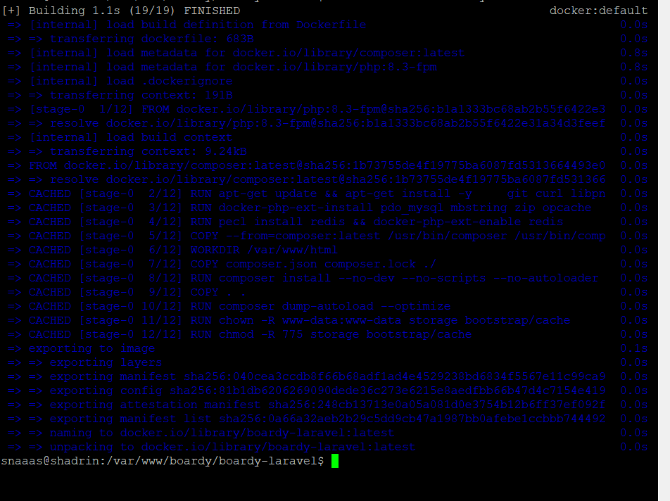

**Вопрос:** Что произойдёт, если `COPY .` всего проекта сделать ДО `composer install`? Объясните механизм кеширования слоёв.  
**Ответ:** Docker кеширует слои на основе контрольных сумм (checksum) измененных файлов. Если скопировать весь проект до установки зависимостей, любое минимальное изменение в исходном коде (например, пробел в комментарии) изменит хеш этого слоя. Это сделает невалидным кеш для всех последующих слоев, и `composer install` будет запускаться заново при каждой сборке, что критически замедлит процесс разработки.

### Задание 3. .dockerignore
Создан файл `boardy-laravel/.dockerignore`, исключающий `node_modules`, `vendor`, `.env`, `.git`, `storage/logs`, `storage/framework/cache`.

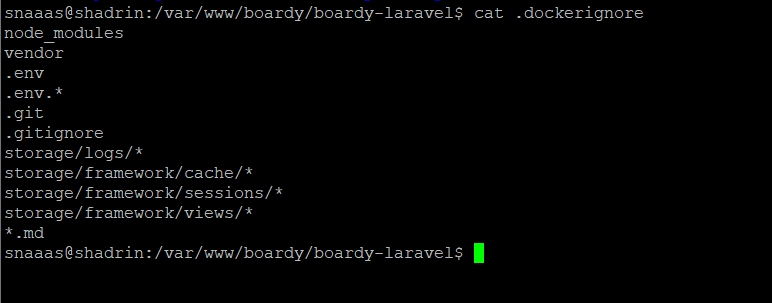

**Вопрос:** Что произойдёт, если не исключить `.env` из образа? Какая угроза безопасности?  
**Ответ:** Файл `.env` будет скопирован внутрь Docker-образа. Поскольку слои Docker-образа можно легко просмотреть и извлечь, все секреты (пароли от БД, API-ключи, приватные ключи шифрования) станут частью артефакта. Это прямая утечка конфиденциальных данных, особенно если образ публикуется в реестр.

---

## Часть Б. Dockerfile для FastAPI

### Задание 4. requirements.txt
Создан `boardy-api/requirements.txt` с фиксированными версиями пакетов.

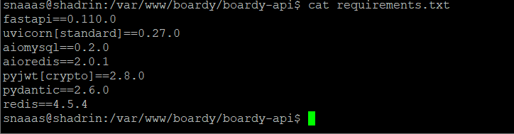

**Вопрос:** Почему версии фиксируем, а не пишем 'latest'? Что произойдёт через год без фиксации?  
**Ответ:** Фиксация версий гарантирует воспроизводимость сборки (Reproducible Builds). Если использовать `latest` или не указывать версию, при новой сборке будут загружены новейшие версии библиотек, которые могут содержать критические изменения (breaking changes), несовместимые с текущим кодом. Это приведёт к падению приложения без какого-либо изменения его исходного кода.

### Задание 5 и 6. Сборка образа и CMD
Создан Dockerfile на базе `python:3.11-slim`. Команда запуска: `CMD ["uvicorn", "main:app", "--host", "0.0.0.0", "--port", "8000"]`.

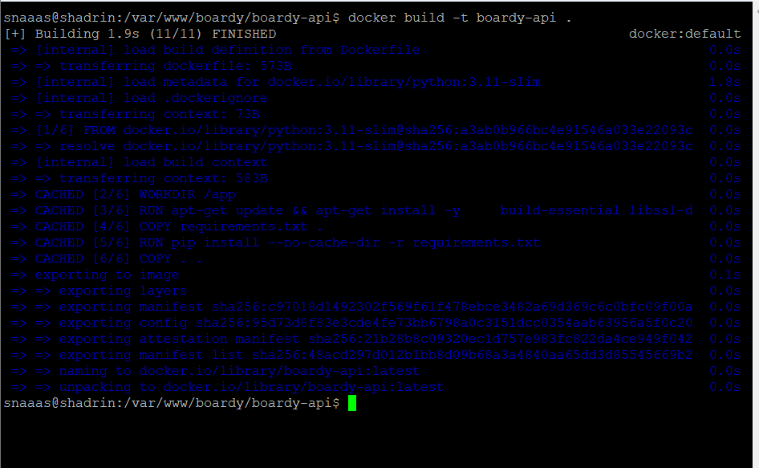

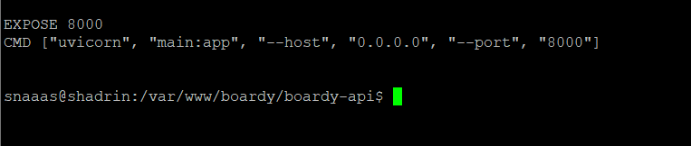

**Вопрос:** Почему `--host 0.0.0.0`, а не `127.0.0.1`? Что сломается с `127.0.0.1`?  
**Ответ:** Адрес `127.0.0.1` (loopback) внутри контейнера означает, что сервер будет слушать только внутренние соединения самого контейнера. Nginx или другие контейнеры не смогут достучаться до FastAPI. Адрес `0.0.0.0` указывает серверу слушать все доступные сетевые интерфейсы контейнера, делая его доступным для других сервисов в общей Docker-сети.

---

## Часть В. Конфиг Nginx

### Задание 7 и 8. Конфигурация Nginx и WebSocket
Создан `docker/nginx/default.conf` с проксированием на `laravel:9000` и `http://fastapi:8000`, а также настроен `location /ws` для WebSockets.

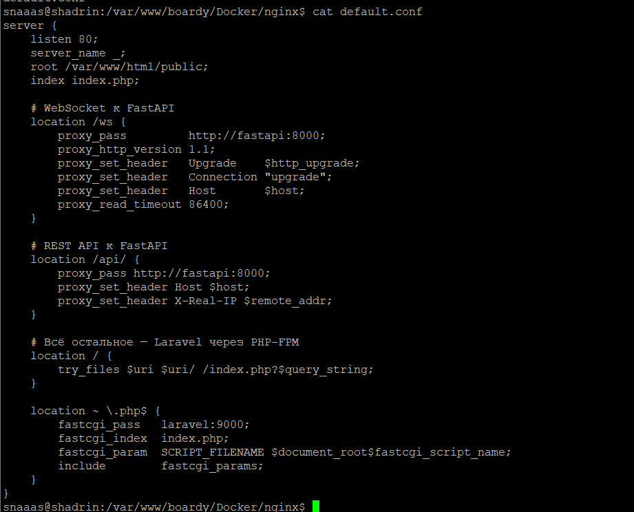

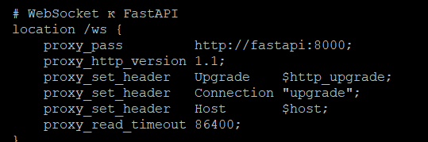

**Вопрос:** Почему `laravel:9000`, а не `127.0.0.1:9000`? Как Docker резолвит имена контейнеров?  
**Ответ:** Внутри изолированного контейнера Nginx адрес `127.0.0.1` ссылается на сам Nginx, а не на Laravel. Docker предоставляет встроенный DNS-сервер для пользовательских сетей. Имя сервиса `laravel`, указанное в `docker-compose.yml`, автоматически резолвится во внутренний IP-адрес соответствующего контейнера, обеспечивая бесшовную межконтейнерную связь.

---

## Часть Г. docker-compose.yml

### Задание 9, 10. Сервисы и Volumes
Описаны 5 сервисов в сети `boardy_net`. Настроены именованные тома: `mysql_data`, `redis_data`, `laravel_storage`.


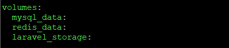

**Вопрос:** Что произойдёт с данными MySQL, если убрать `mysql_data` volume и сделать `docker compose down`? Чем именованный volume отличается от bind-mount?  
**Ответ:** Все данные БД будут безвозвратно удалены, так как без именованного тома данные хранятся только в эфемерном файловом слое контейнера.  
*Именованный volume* управляется самим Docker, хранится в специальной директории хоста, оптимизирован для производительности БД и не зависит от структуры ОС хоста.  
*Bind-mount* напрямую привязывает конкретную папку хост-машины к папке в контейнере, что удобно для разработки (например, монтирование кода), но менее производительно и переносимо для баз данных.

### Задание 11. Healthcheck
Для `laravel` и `fastapi` настроен `depends_on` с условием `service_healthy`.


**Вопрос:** Почему `depends_on` без healthcheck недостаточно? Какая race condition возникает?  
**Ответ:** Обычный `depends_on` ждет только *запуска* контейнера (статус Up), а не готовности сервиса внутри него принимать соединения. Контейнер MySQL может быть "Up", но процессу БД всё ещё требуется время на инициализацию. Возникает *race condition* (состояние гонки): Laravel пытается подключиться к БД до того, как MySQL готов принять соединение, что приводит к ошибке и падению приложения.

### Задание 12. init.sql
Создан скрипт `docker/mysql/init.sql` для создания баз `boardy_laravel` и `boardy_api`.

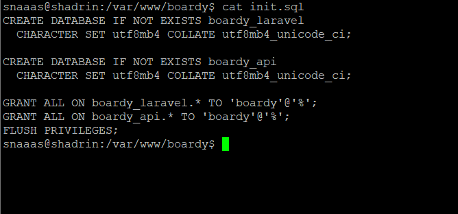

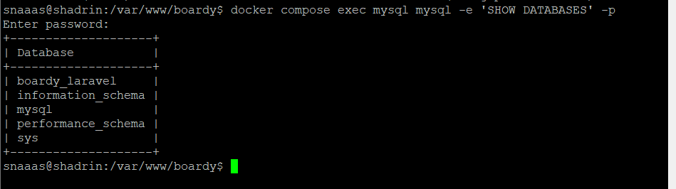

**Вопрос:** Почему `init.sql` выполняется только при первом запуске? Что произойдёт, если изменить файл после первого запуска?  
**Ответ:** Официальный образ MySQL выполняет скрипты из `/docker-entrypoint-initdb.d/` только в том случае, если директория данных (`/var/lib/mysql`) пуста (первая инициализация). Если изменить файл после первого запуска, скрипт **не** выполнится снова, так как том с данными уже существует и считается инициализированным. Для повторного выполнения потребуется удалить volume и пересоздать контейнер.

### Задание 13. Два .env файла
Используются два файла: корневой `.env` для переменных окружения Docker Compose и `boardy-laravel/.env` для конфигурации самого приложения.

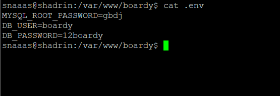

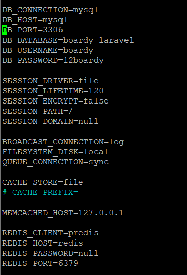

**Вопрос:** Зачем два разных `.env`? Почему `DB_HOST=mysql`, а не `127.0.0.1`?  
**Ответ:** Корневой `.env` управляет переменными, которые подставляются в сам `docker-compose.yml` (например, пароли для создания пользователей). `.env` внутри `boardy-laravel` управляет логикой фреймворка. `DB_HOST=mysql` используется потому, что приложение Laravel работает внутри сети Docker и должно обращаться к контейнеру БД по его DNS-имени (`mysql`), а не к `localhost` хост-машины.

---

## Часть Д. Запуск и проверка

### Задание 14. docker compose up
Выполнена сборка и запуск всех сервисов.


### Задание 15. Миграции в контейнере
Выполнены миграции и установка Laravel Passport.


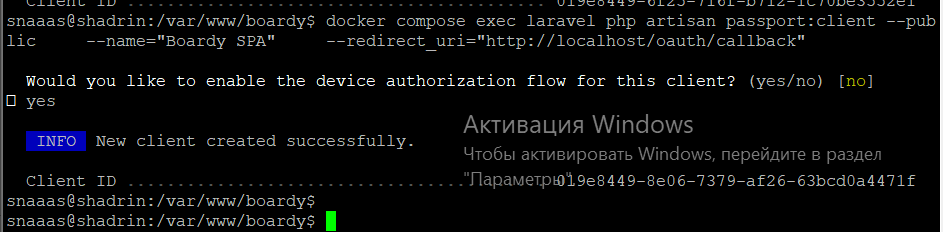

**Вопрос:** Чем `docker compose exec` отличается от `docker compose run`?  
**Ответ:** `docker compose exec` выполняет команду внутри **уже работающего** контейнера (например, запуск миграций в активном PHP-контейнере). `docker compose run` создает **новый, временный** контейнер на основе образа сервиса специально для выполнения одной команды и завершает его работу после выполнения.

### Задание 16 и 17. Приложение и Realtime работают
Проверена регистрация, создание постов, комментариев и работа WebSocket в реальном времени.

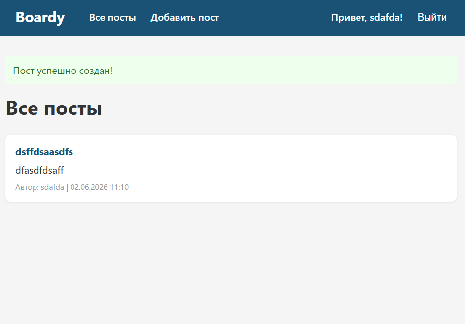


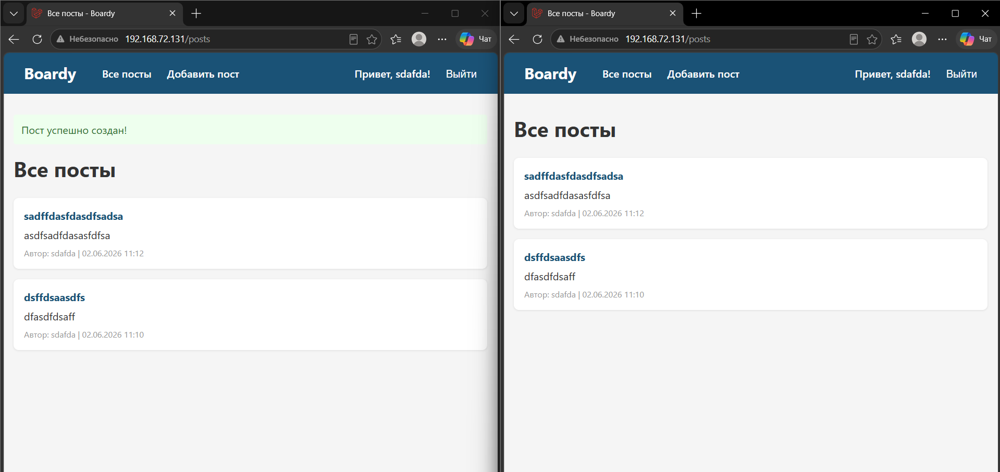


### Задание 18. Данные переживают перезапуск
Выполнен рестарт стека, данные сохранены.

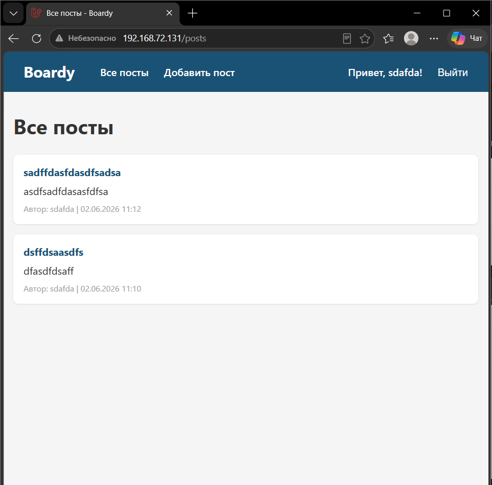

**Вопрос:** Что произойдёт с данными при `docker compose down -v`? В чём опасность флага `-v`?  
**Ответ:** Флаг `-v` (или `--volumes`) указывает Docker удалить все именованные тома, связанные с этим проектом. Опасность заключается в **полной и безвозвратной потере** всех персистентных данных (базы данных, загруженные файлы), так как они физически удаляются с диска хоста.

### Задание 19. Централизованные логи
Проверен вывод логов.

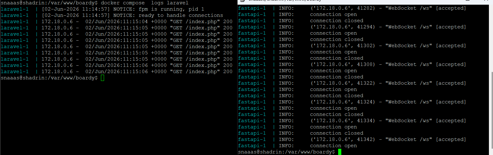

**Вопрос:** Какие плюсы централизованных логов Docker по сравнению с `tail -f /var/log/*` на хосте?  
**Ответ:** 
1. Не требуется пробрасывать файлы логов из контейнеров на хост или подключаться к каждому контейнеру отдельно.
2. `docker compose logs` собирает `stdout` и `stderr` всех сервисов в один поток с цветовой маркировкой и именами сервисов, что критически важно для отладки взаимодействия микросервисов.
3. Это работает одинаково на любой ОС, где установлен Docker, без привязки к специфичным путям файловой системы Linux.

### Задание 20. Чистая машина
Симуляция развертывания на чистом окружении.

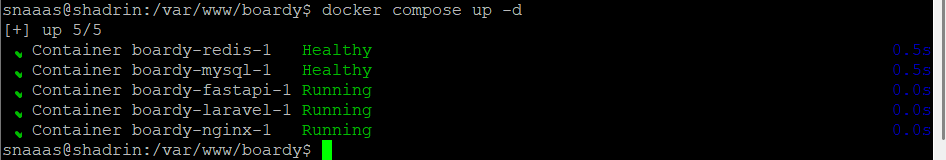

**Вопрос:** Какая команда нужна на новой машине от клона репозитория до рабочего приложения?  
**Ответ:** 
```bash
git clone <url_репозитория>
cd <имя_репозитория>
cp .env.example .env  # Настройка переменных окружения
docker compose up -d --build