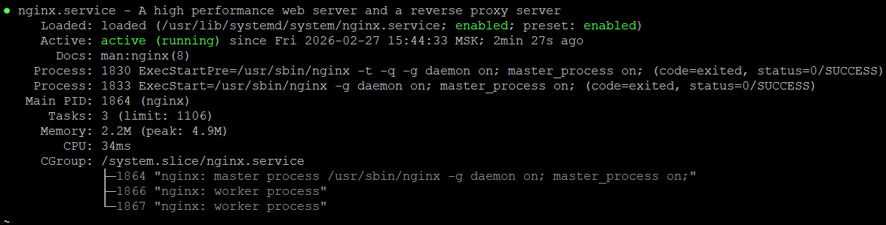
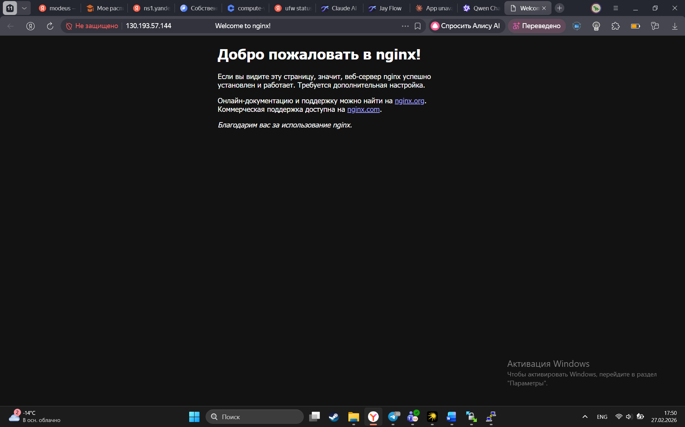
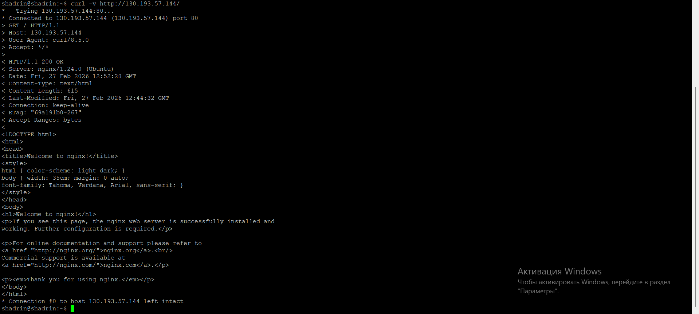
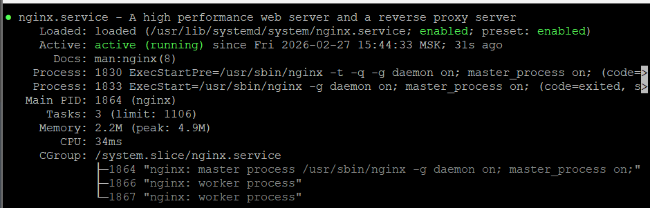
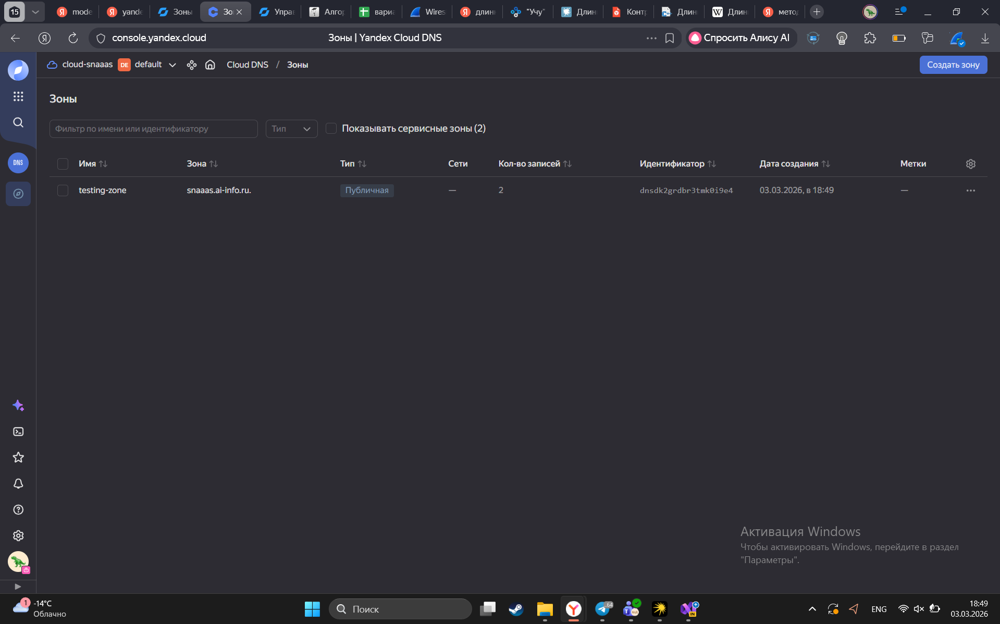
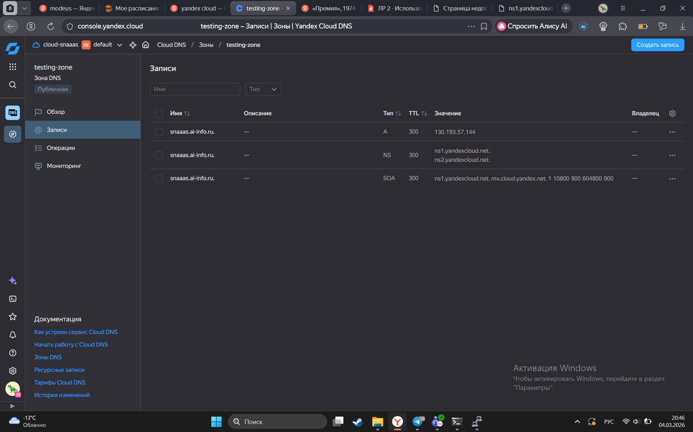
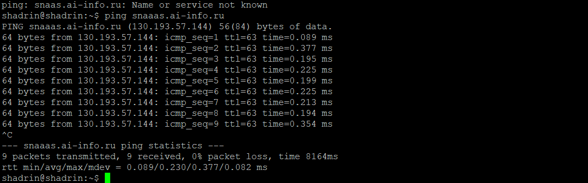
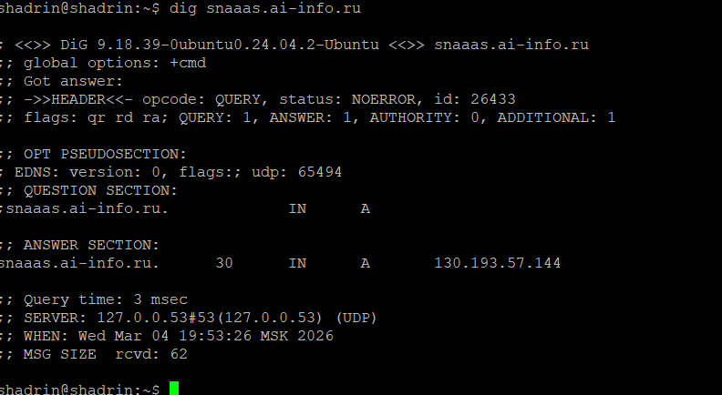
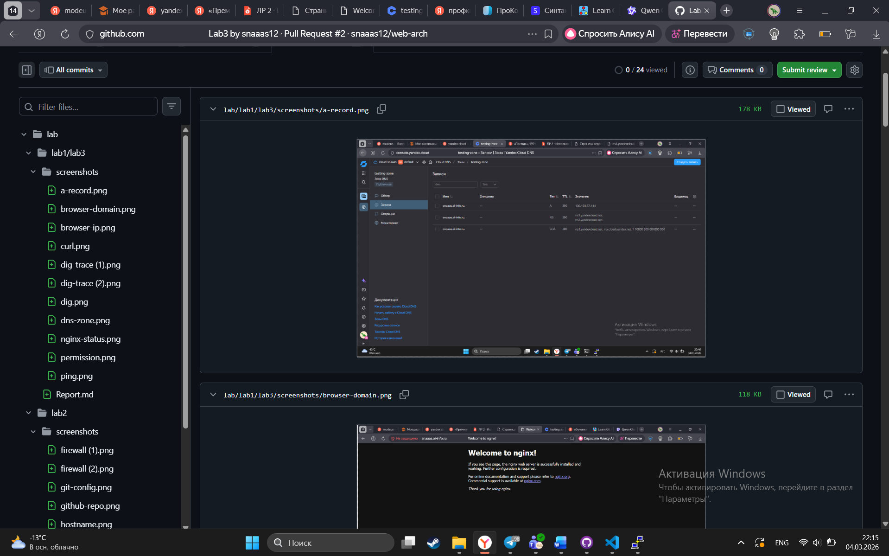

# Лабораторная работа №3 "Nginx, DNS"

## №1 Установка Nginx

Вывод systemctl status nginx

## №2 Страница по IP 

Страница в браузере 

## №3 curl

## №4 Директория и права

смена прав доступа

## №5 Конфигурация Nginx

директива - значение -- описание

listen - 80 -- Показывает какой порт прослушивается

root - /var/www/example.com -- Путь к папке, откуда сервер будет брать файлы для отправки клиенту 

server_name - example.com -- Имя Сервера 

index - index.html -- Имена файлов, которые будут использоваться по умолчанию, при запросе к содержимому директории

## №6 DNS-зона

Создание DNS-зоны на yandex-cloud

## №7 А-запись

Создание A записи

## №8 ping

пинг по домену

## №9 dig

* QUESTION SECTION - спросили сервер по интернету запрашивая получить A-запись
* ANSWER SECTION - TTL == 300, IP == 130.193.57.144 
* SERVER - ip == 127.0.0.53, port == #53, протокол == UPD

## №10 dig +trace

.png)
.png)

* .(корень) :
.                       19842   IN      NS      d.root-servers.net.
.                       19842   IN      NS      a.root-servers.net.
.                       19842   IN      NS      e.root-servers.net.
.                       19842   IN      NS      m.root-servers.net.
.                       19842   IN      NS      f.root-servers.net.
.                       19842   IN      NS      j.root-servers.net.
.                       19842   IN      NS      k.root-servers.net.
.                       19842   IN      NS      g.root-servers.net.
.                       19842   IN      NS      i.root-servers.net.
.                       19842   IN      NS      l.root-servers.net.
.                       19842   IN      NS      c.root-servers.net.
.                       19842   IN      NS      h.root-servers.net.
.                       19842   IN      NS      b.root-servers.net.
* ru. :
ru.                     172800  IN      NS      a.dns.ripn.net.
ru.                     172800  IN      NS      d.dns.ripn.net.
ru.                     172800  IN      NS      f.dns.ripn.net.
ru.                     172800  IN      NS      b.dns.ripn.net.
ru.                     172800  IN      NS      e.dns.ripn.net.
* ai-info.ru
ai-info.ru.             345600  IN      NS      ns1.netangels.ru.
ai-info.ru.             345600  IN      NS      ns2.netangels.ru.
ai-info.ru.             345600  IN      NS      ns3.netangels.ru.
ai-info.ru.             345600  IN      NS      ns4.netangels.ru.
* А-запись :
snaaas.ai-info.ru.      300     IN      A       130.193.57.144

## №11 Report

PR

