# lab10: auth, sessions, cookies

## №1 Столбец password_hash

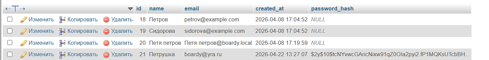

varchar(255) будет занимать 1 байт, так же как и varchar 60. varchar(50) мы не используем потому что, bcrypt шифрует строку в длину в 60 символов.

## №2 Partials

Так мы сохраняем принцип DRY + у нас есть централизованное управление. 
При добавлении новой ссылки достаточно изменить один файл (partials/nav.php), и она автоматически появится на всех страницах (лента постов, форма добавления, страницы входа/регистрации). Без вынесения в partials пришлось бы редактировать каждый PHP-файл отдельно, что увеличивает риск ошибок и забытых страниц.

## №3 Вёрстка форм по макетам

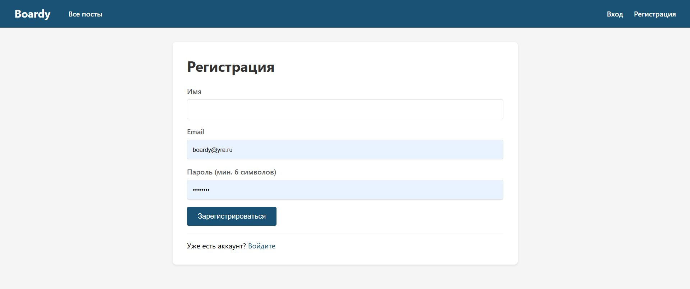

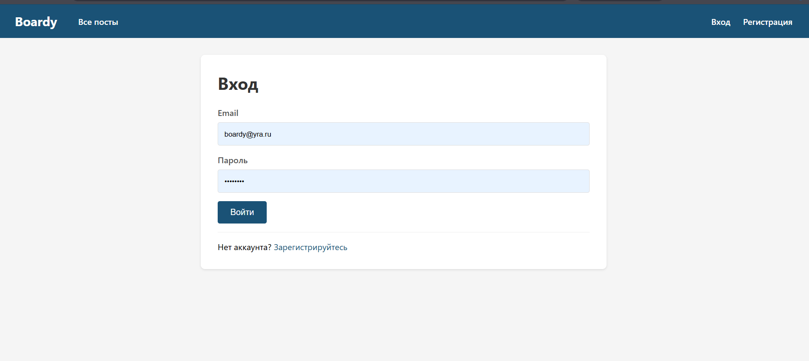

## №4 Регистрация

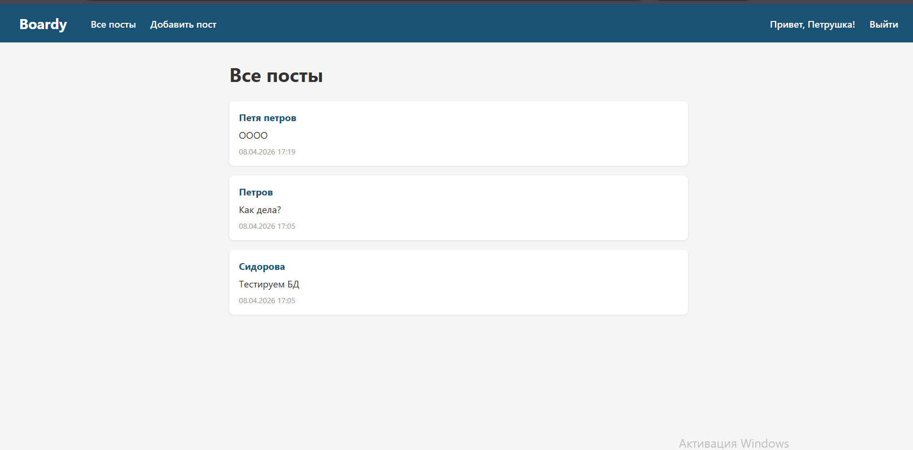

## №5 Хеш в базе

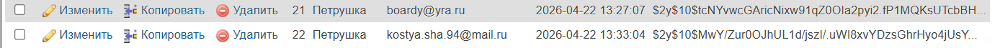

Структура хеша $2y$10$Kx8QnZq...:

$2y$ — идентификатор алгоритма bcrypt (современная версия)

10$ — cost factor, означает 2^10 = 1024 итерации хеширования

Следующие 22 символа (Kx8QnZq...) — криптографическая соль

Оставшиеся 31 символ — собственно хеш пароля

При увеличении cost factor с 10 до 15:

Количество итераций возрастает с 1,024 до 32,768 (в 32 раза)

Время вычисления хеша увеличивается с ~0.1 до ~3.2 секунд

Безопасность возрастает (перебор паролей становится в 32 раза сложнее)

Возникает риск таймаутов при регистрации/логине и повышенной нагрузки на CPU

## №6 Защита от повторной регистрации

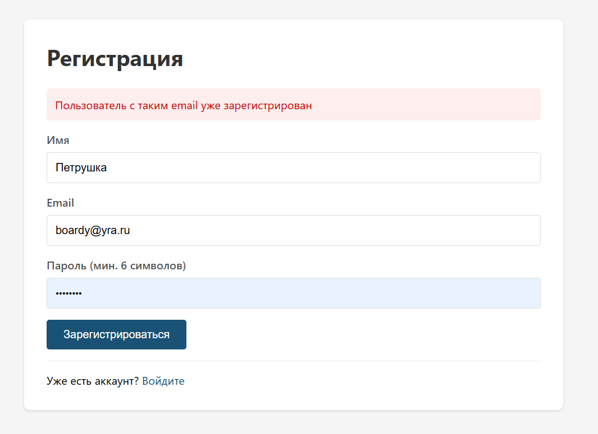

Проверка уникальности email перед вставкой нужна, чтобы гарантировать, что в системе не может быть двух пользователей с одинаковым email.

## №7 Логин

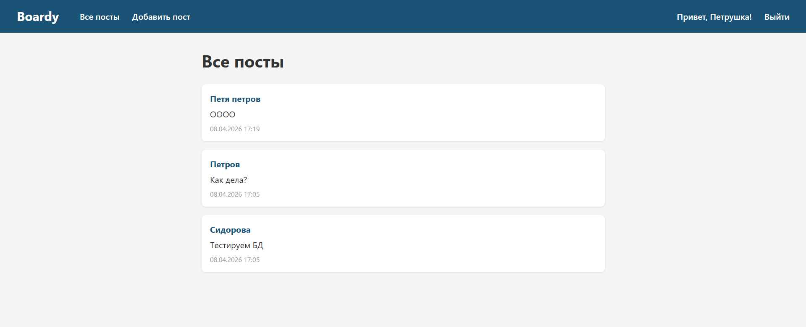

## №8 Неверный пароль

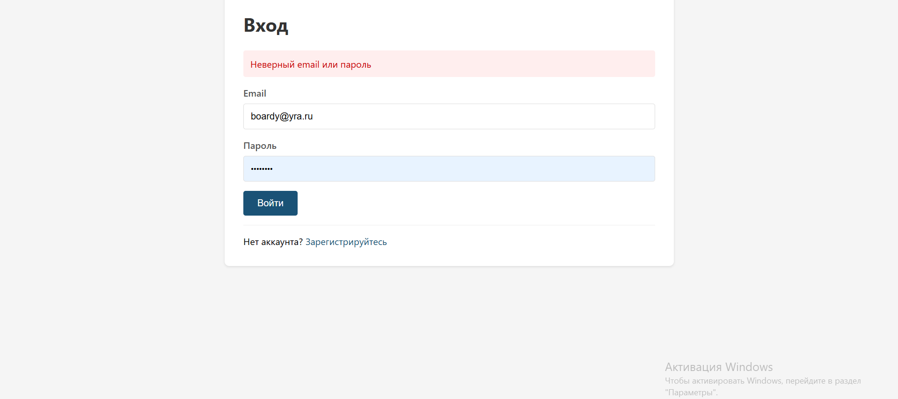

Это защита от перебора пользователей (User Enumeration Attack). Злоумышленник не должен иметь возможность узнать, зарегистрирован ли email в системе.

## №9 Кука PHPSESSID

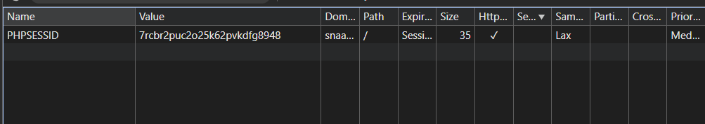

В куке хранится только идентификатор сессии (случайная строка), НИКАКИХ паролей, email или имён пользователя там нет.

## №10 Параметры куки

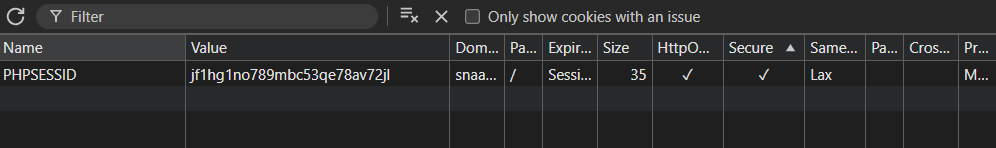

Если убрать HttpOnly:
JavaScript сможет прочитать document.cookie и получить значение PHPSESSID.

Как используют в XSS-атаке:
Злоумышленник внедряет в сайт скрипт:
Затем просто подставляет украденную куку в свой браузер и входит в аккаунт жертвы без пароля.

## №11 HttpOnly на практике

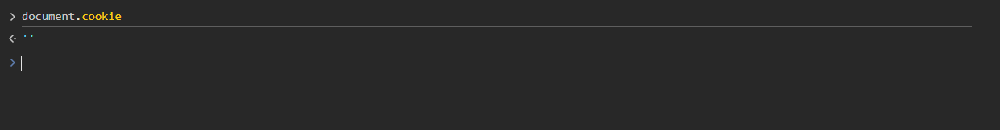

Потому что установлен флаг HttpOnly. При его наличии браузер не позволяет JavaScript (document.cookie) читать эту куку для защиты от XSS-атак

## №12 Файл сессии на сервере

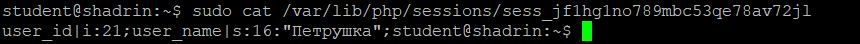

В файле хранятся все данные пользователя в сериализованном виде

Почему данные разделены?
Безопасность — клиент не должен видеть/менять user_id.
Размер — куки ограничены 4KB, файл сессии — нет.
Контроль — сервер хранит важные данные, клиент — только "ключ".

## №13 Защита страниц

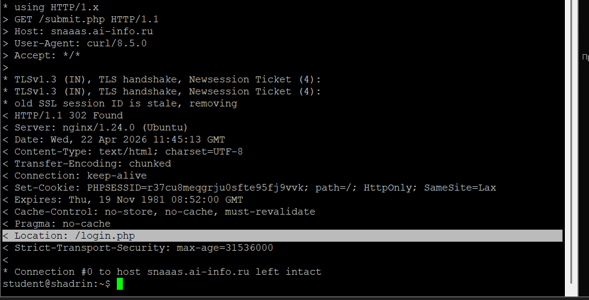

## №14 Посты с автором

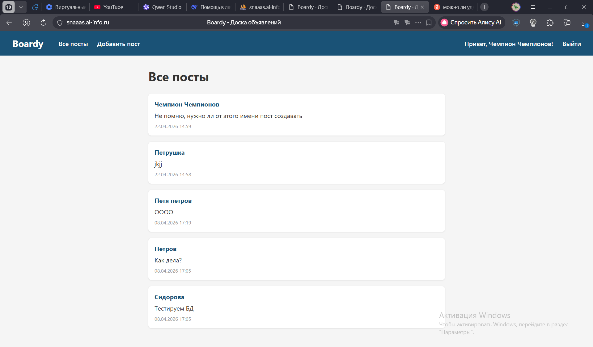

SELECT p.id, p.body, p.created_at,
       u.name AS author_name
FROM posts p
JOIN users u ON p.author_id = u.id
ORDER BY p.created_at DESC

JOIN - делает все а один запрос, что быстрее другие варианты

## №15 Добавление поста

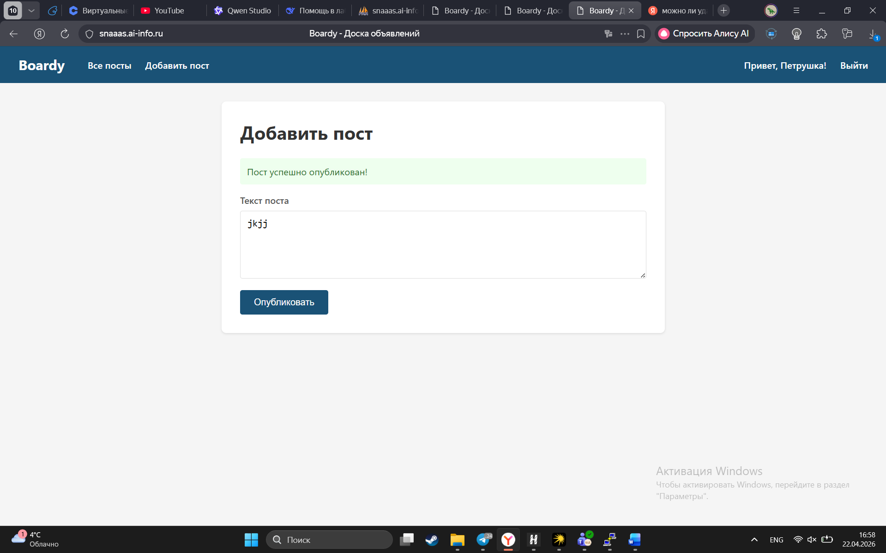

## №16 Logout

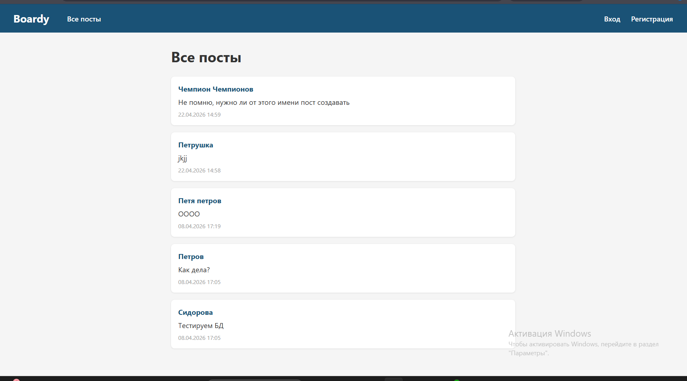

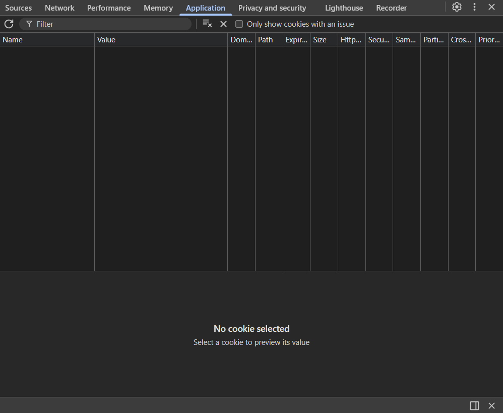

session_destroy()
Удаляет файл сессии на сервере (/tmp/sess_<ID>).

Зачем setcookie() с прошедшей датой?
Удаляет куку PHPSESSID в браузере клиента.

Если выполнить только session_destroy(), файл на сервере удалится, но кука останется в браузере. При следующем запросе браузер отправит старый PHPSESSID, сервер не найдет файл и автоматически создаст новую пустую сессию с тем же ID. Пользователь останется неавторизованным, но мёртвая кука продолжит существовать.

Если выполнить только setcookie(), кука удалится из браузера, но файл сессии останется на сервере. Данные будут висеть на диске до автоматической сборки мусора (обычно 24 минуты), занимая место. При последующих запросах без куки сервер создаст новую сессию с новым ID, а старый файл так и останется до чистки.

## №17 Истёкшая сессия

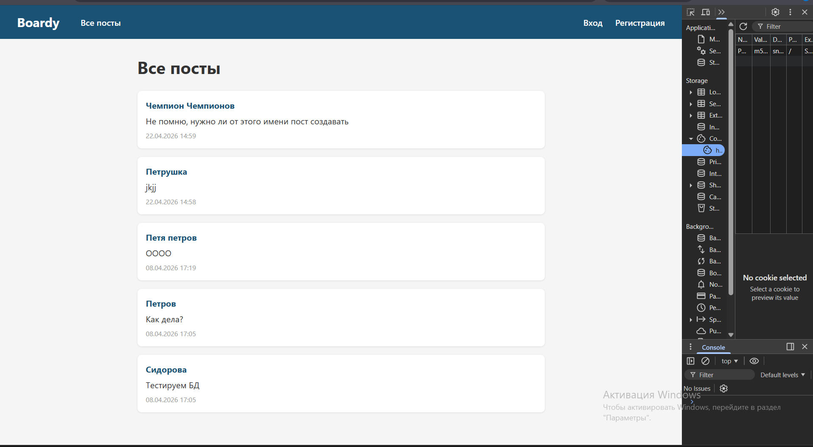

Браузер считает себя залогиненным, потому что у него есть кука PHPSESSID. Кука хранится на стороне клиента, и браузер её видит. Для браузера наличие куки означает "я должен быть залогинен".

Сервер же при получении запроса с этой кукой пытается найти файл сессии /tmp/sess_<ID>. После того как вы удалили файл вручную, сервер не находит соответствующих данных. При вызове session_start() PHP видит, что файла нет, и создаёт новую пустую сессию с тем же ID. В новой сессии нет user_id, поэтому сервер считает пользователя гостем и отправляет редирект на login.php.
