# lab11: JWT, OAuth GitHub

## Задание 1. auth.py

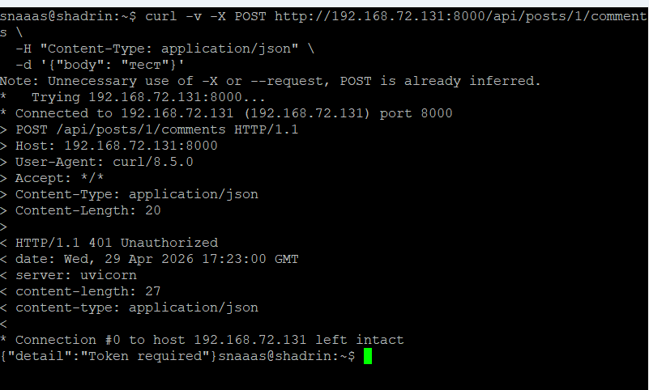

«Bearer» — это схема аутентификации, которая означает «предъявитель токена». Токен является носителем прав доступа — кто его предъявил, тот и авторизован. Формат Authorization: Bearer <token> стандартизирован в RFC 6750. Префикс нужен, чтобы сервер мог:

Идентифицировать тип токена (Bearer, Basic, Digest и т.д.)

Отличить JWT от других данных в заголовке

Поддерживать несколько схем авторизации одновременно

## Задание 2. /api/me.php

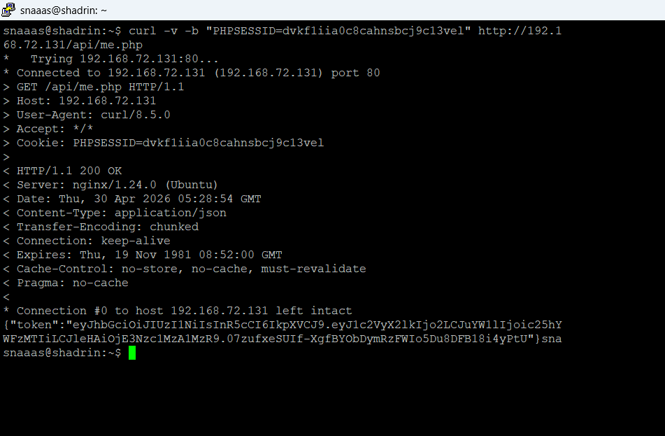

me.php использует session_start() потому что пользователь уже залогинен через обычную форму логина или OAuth. Кука PHPSESSID идентифицирует сессию на сервере, где уже хранится user_id. Это безопаснее, чем передавать логин/пароль каждый раз. PHP читает ID сессии из куки, находит файл сессии и восстанавливает $_SESSION. Таким образом, me.php работает как мост между PHP-сессиями и JWT для FastAPI.

## Задание 3. React получает JWT

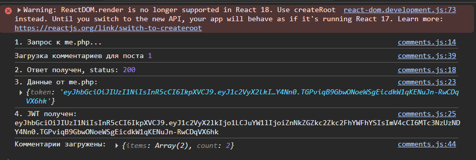

## Задание 4. Bearer в запросах

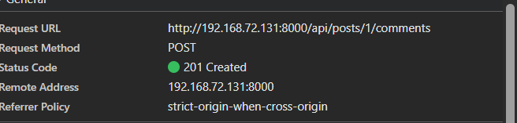

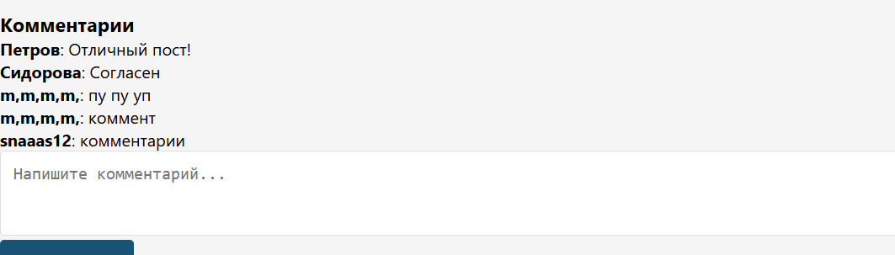

## Задание 5. jwt.io

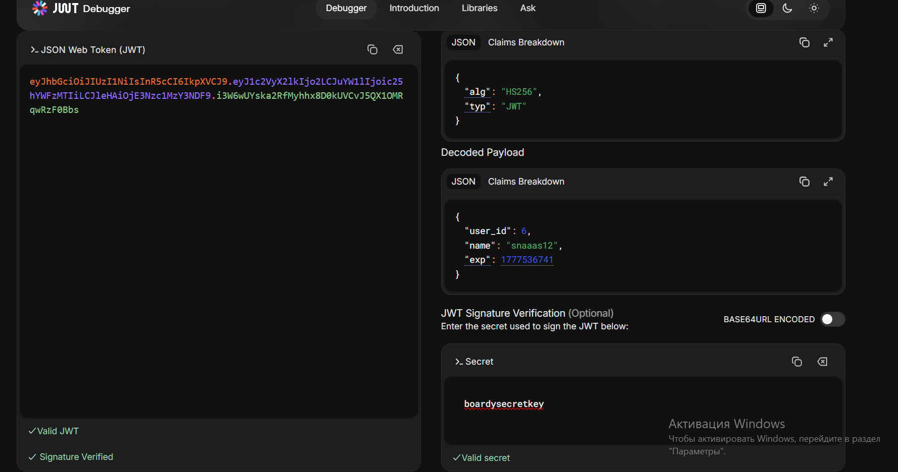

Payload закодирован (Base64Url), а не зашифрован. Злоумышленник, перехватив JWT, сможет декодировать его и прочитать user_id, name, exp. Это не проблема, потому что:

Токен не содержит секретной информации (паролей)

Главная защита — подпись. Без знания secret_key злоумышленник не может изменить payload или создать валидный токен

Если нужна конфиденциальность — используют JWE (JSON Web Encryption), но в нашем случае достаточно подписи

## Задание 6. Истёкший токен

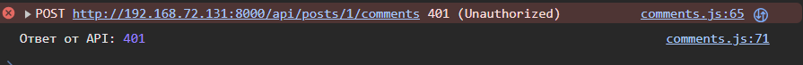

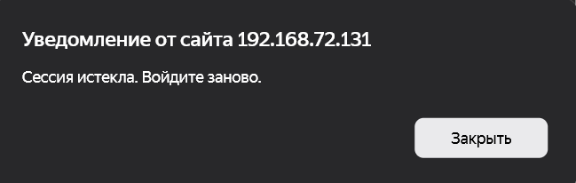

## Задание 7. Невалидный токен

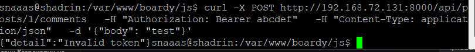

## Задание 8. OAuth App на GitHub

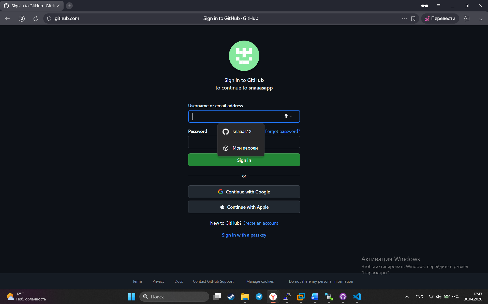

## Задание 9. Столбец github_id

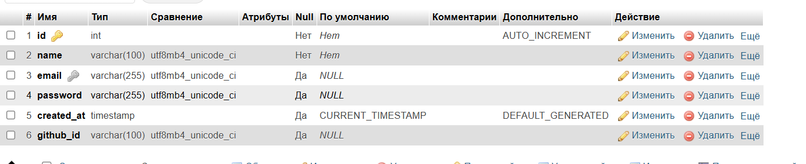

## Задание 10. Кнопка «Войти через GitHub»

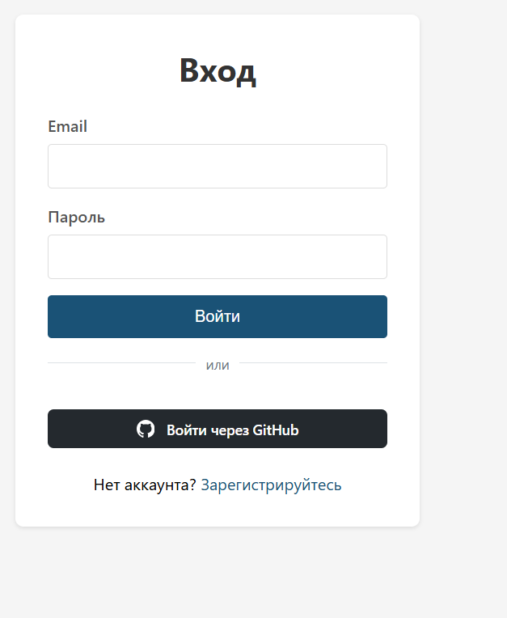

## Задание 11. OAuth flow

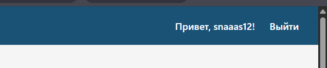

P.S.
Другой фотки нет, сначала залогинился и только потом начал делать отчет. :(

## Задание 12. github_id в базе

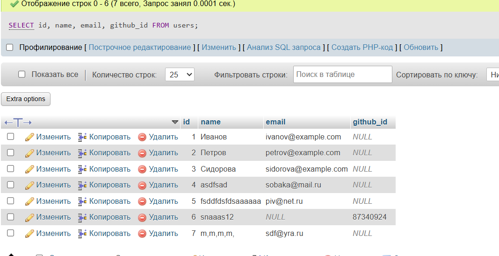

У пользователя GitHub может не быть публичного email, или он может быть не подтверждён. github_id — это уникальный числовой идентификатор пользователя в GitHub, который гарантированно существует, не меняется и не повторяется. Поиск по нему надёжнее, чем по email.

## Задание 13. OAuth → JWT → API

1. Пользователь → нажимает «Войти через GitHub» на /login.php
2. → oauth-github.php: создаёт state, сохраняет в сессию, редиректит на GitHub
3. GitHub → показывает запрос на авторизацию
4. Пользователь → нажимает «Authorize»
5. GitHub → редиректит на oauth-callback.php с code и state
6. oauth-callback.php: проверяет state, обменивает code на access_token
7. → GET api.github.com/user с access_token → получает профиль
8. → ищет/создаёт пользователя по github_id
9. → создаёт сессию PHP (user_id, user_name)
10. → редирект на /messages.php
11. React-компонент → useEffect → fetch /api/me.php с кукой PHPSESSID
12. me.php → генерирует JWT из сессии → возвращает React
13. React → сохраняет JWT в state
14. Пользователь → пишет комментарий
15. React → POST на FastAPI с Authorization: Bearer <JWT>
16. FastAPI (auth.py) → проверяет JWT, извлекает user_id
17. FastAPI (comments.py) → создаёт комментарий с author_id из JWT
18. → комментарий отображается с именем из GitHub

## Задание 14. Параметр state
state — это случайная строка, которую клиент генерирует перед редиректом на OAuth-провайдера, сохраняет в сессии, а провайдер возвращает её обратно. При возврате клиент сверяет полученный state с сохранённым. Это предотвращает CSRF-атаки.

Сценарий CSRF-атаки без state:

Злоумышленник регистрирует своё OAuth-приложение и получает свой client_id.

Злоумышленник отправляет жертве ссылку

Жертва кликает по ссылке, GitHub просит авторизовать приложение злоумышленника.

Жертва нажимает «Authorize». GitHub редиректит жертву на 

Код(code) попадает к злоумышленнику. Он обменивает его на токен доступа и получает доступ к данным жертвы.

С защитой через state:

Приложение генерирует случайный state и сохраняет его в сессии

Злоумышленник не знает этот state и не может подставить его в свою ссылку

При возврате приложение сверяет state и отклоняет подделку

## Задание 15. Три способа входа

## Задание 16. Сравнение механизмов

| Вопрос                     | Куки+сессии              | JWT                                  | OAuth                          |
|----------------------------|--------------------------|--------------------------------------|--------------------------------|
| Где хранятся данные?       | На сервере (файлы/БД)    | В самом токене (клиент)              | У провайдера (GitHub)          |
| Кто прикрепляет к запросу? | Браузер автоматически    | Клиент вручную (header)              | Провайдер редиректит           |
| Для какого типа клиентов?  | Браузер (SPA + SSR)      | Любой (React, mobile, microservices) | Сторонние приложения           |
| Можно ли отозвать?         | Да — удалить сессию      | Нет — пока не истечёт                | Да — через провайдера          |
| Кросс-доменно работает?    | Нет (только same-origin) | Да (через Bearer header)             | Да (редирект + callback)       |
| Сложность кода             | Средняя                  | Высокая (ручное управление DOM)      | Средняя (декларативный подход) |

## Задание 17. Баги и пакеты

Три бага в коде, которые Laravel закрывает из коробки:

1. Секрет в коде
Код:

php
$secret_key = 'your-secret-key-change-me';
Чем опасно: Попадает в git. Боты сканируют GitHub и находят ключи за минуты.

Какой пакет решает: Laravel Passport — хранит ключи в файлах .gitignore

2. Нет отзыва токенов
Код: Токен живёт 1 час, его нельзя принудительно аннулировать.

Чем опасно: Злоумышленник с перехваченным токеном имеет доступ до истечения часа. После смены пароля старые токены всё ещё работают.

Какой пакет решает: Laravel Passport — хранит токены в БД, можно удалить запись

3. Нет Refresh Token
Код: Токен истёк → пользователь входит заново.

Чем опасно: Плохой UX. Для OAuth — повторная авторизация каждый час.

Какой пакет решает: Laravel Passport — выдает refresh_token для автоматического обновления