# Лабораторная работа №13: WebSocket – реалтайм-лента

---

## Часть A. FastAPI: WebSocket

### 1. ConnectionManager

Создан модуль `routers/ws.py`, который реализует менеджер активных WebSocket-соединений. Класс `ConnectionManager` хранит список открытых сокетов в памяти процесса и предоставляет методы для подключения, отключения и массовой рассылки сообщений. Эндпоинт `/ws` принимает WebSocket-соединения, регистрирует их и поддерживает канал открытым до тех пор, пока клиент не отключится.

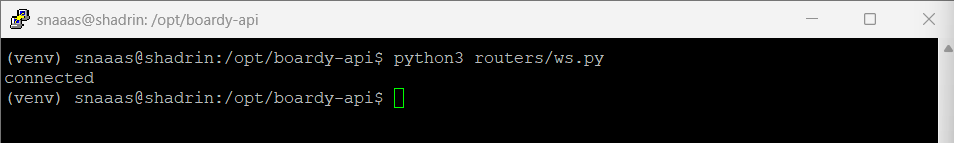

**Ответы на вопросы отчёта:**

*Почему `self.active` — список в памяти процесса, а не в базе данных?*

`self.active` хранит не данные, а активные WebSocket-соединения – живые TCP-каналы между сервером и клиентом. База данных не способна хранить открытые сокеты, так как соединение – это объект в оперативной памяти, связанный с конкретным процессом. База данных не может вызвать метод `send_text()` у сокета или определить, разорвано ли соединение. Поэтому хранение соединений в памяти – единственный практический способ.

*Что произойдёт, если Uvicorn перезапустится?*

При перезапуске Uvicorn все активные WebSocket-соединения будут разорваны. Клиенты потеряют связь с сервером. В коде, однако, предусмотрен механизм автоматического переподключения на стороне клиента: при закрытии соединения браузер через несколько секунд инициирует новое подключение. Это одна из архитектурных проблем – потеря состояния сервером.

---

### 2. /internal/broadcast

Добавлен эндпоинт `/internal/broadcast` в `main.py`. Этот эндпоинт принимает POST-запросы от Laravel, извлекает данные нового поста и вызывает метод `broadcast()` у менеджера соединений, который рассылает сообщение всем подключённым клиентам.

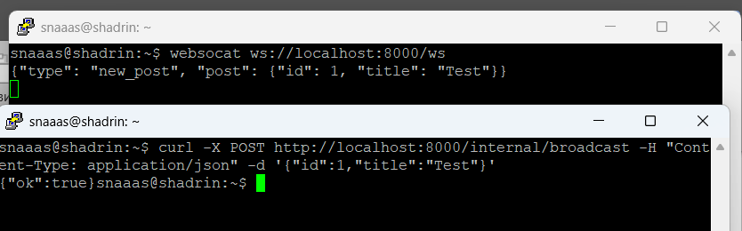

**Ответы на вопросы отчёта:**

*Почему `/internal/broadcast` не требует JWT-авторизации?*

Этот эндпоинт предназначен исключительно для внутреннего взаимодействия между сервисами (Laravel → FastAPI). JWT-авторизация нужна для внешних клиентов, а здесь запрос идёт внутри доверенной серверной инфраструктуры. Добавление JWT создало бы лишнюю сложность и накладные расходы.

*Какой риск остаётся и как его закрывает Nginx?*

Риск заключается в том, что любой внешний пользователь, узнавший адрес эндпоинта, может отправить фальшивый POST-запрос и подменить сообщение в реальном времени. Это может использоваться для спама, фишинга или распространения ложной информации. Nginx закрывает этот риск через директивы `allow 127.0.0.1; deny all;` – запросы разрешены только с localhost, то есть только от самого сервера.

---

### 3. Два клиента

Проведён тест с двумя параллельными WebSocket-клиентами. Оба клиента подключены к серверу и ожидают сообщений. При отправке одного события через `curl` оба клиента получают его одновременно, что доказывает корректную работу механизма `broadcast()`.

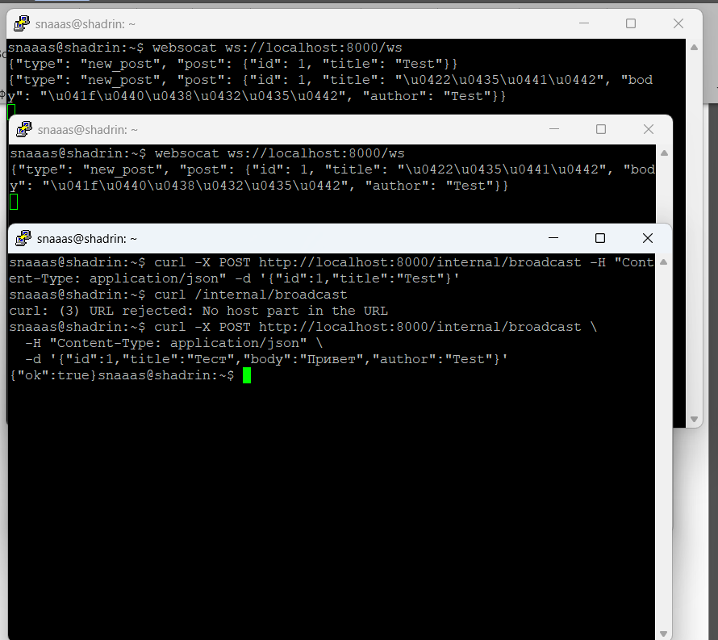

**Ответы на вопросы отчёта:**

*Что произойдёт, если один из клиентов отключился, а broadcast уже начался?*

В коде метода `broadcast()` предусмотрена обработка этой ситуации. При отправке сообщения каждому клиенту используется блок `try/except`. Если при отправке возникает исключение (например, клиент уже отключился), этот клиент добавляется в список `dead`. После завершения цикла отправки все клиенты из списка `dead` удаляются из `self.active`. Остальные клиенты получают сообщение в штатном режиме.

*Где в коде это обрабатывается?*

Обработка происходит в методе `broadcast()` класса `ConnectionManager`. Сначала происходит перебор всех активных соединений с попыткой отправить сообщение. При ошибке клиент добавляется в отдельный список, а затем отдельным циклом удаляется из основного списка соединений.

---

## Часть B. Laravel: HTTP-callback

### 4. PostController

В метод `store()` контроллера `PostController` добавлен вызов `Http::post()` после успешного создания поста в базе данных. Запрос отправляется на эндпоинт `/internal/broadcast` FastAPI с данными нового поста (id, заголовок, текст, автор, дата). Весь вызов обёрнут в `try/catch`, чтобы ошибки broadcast не влияли на создание поста.

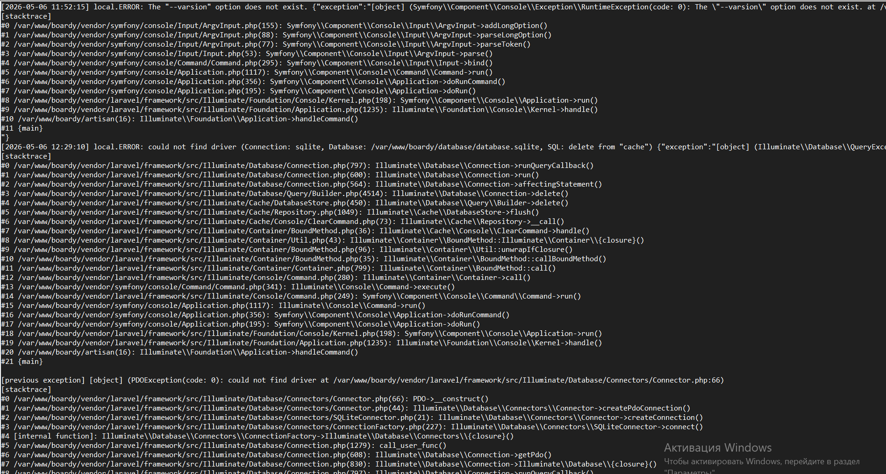

**Ответы на вопросы отчёта:**

*Зачем `timeout(2)`?*

`timeout(2)` ограничивает время ожидания ответа от FastAPI двумя секундами. Если FastAPI не отвечает за это время, запрос прерывается, и создание поста продолжается. Это защищает пользователя от долгого ожидания – если FastAPI недоступен, пост всё равно сохранится, а пользователь не заметит задержки.

*Что случится, если FastAPI недоступен и timeout не указан?*

Если не указать timeout, Laravel будет ждать стандартный таймаут Guzzle (обычно 30 секунд). Пользователь будет видеть, что страница "зависла" на полминуты, прежде чем получит подтверждение о создании поста. Это крайне негативно влияет на пользовательский опыт, особенно при частых проблемах с FastAPI.

---

### 5. Проверка callback

Выполнена проверка того, что Laravel действительно вызывает FastAPI при создании поста. Через веб-форму создан пост, после чего в логах Uvicorn появилась запись о входящем POST-запросе на `/internal/broadcast`. Это подтверждает корректную настройку взаимодействия между сервисами.

**Ответы на вопросы отчёта:**

*Опишите проблему этой архитектуры. Почему HTTP-callback называют костылём? Минимум 3 конкретных проблемы.*

1. **Синхронность** – Laravel ждёт ответа от FastAPI перед отправкой ответа пользователю. Это увеличивает время отклика и создаёт ненужную задержку, хотя broadcast не критичен для успешного создания поста.

2. **Единая точка отказа** – если FastAPI недоступен, broadcast не происходит, и сообщение теряется навсегда. Laravel продолжает работать, но пользователи не получают реалтайм-обновление. Нет очереди или механизма повторной отправки.

3. **Проблемы масштабирования** – при запуске нескольких экземпляров FastAPI каждый будет иметь свой собственный `ConnectionManager` в памяти. Laravel отправит callback только в один экземпляр, и только клиенты, подключённые к этому экземпляру, получат сообщение. Остальные клиенты ничего не увидят.

---

## Часть C. JS клиент

### 6. WebSocket в Blade

В шаблон `index.blade.php` добавлен JavaScript-код, который подключается к WebSocket-серверу при загрузке страницы. Код обрабатывает открытие соединения, входящие сообщения, ошибки и закрытие. При получении сообщения типа `new_post` вызывается функция добавления поста в ленту.

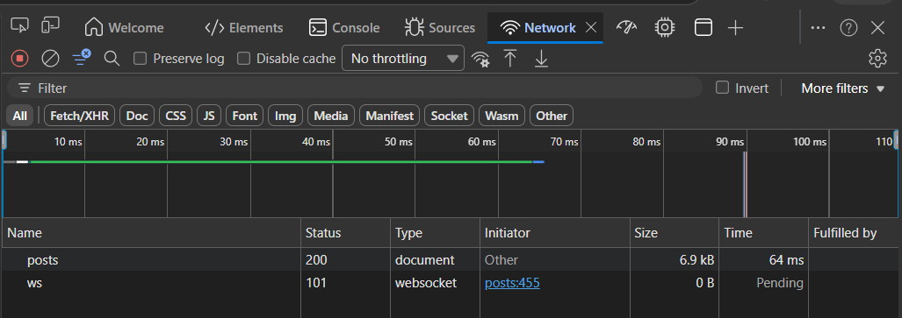

**Ответы на вопросы отчёта:**

*Почему на локалке нужно `ws://`, а на проде `wss://`?*

`ws://` – это незащищённый WebSocket (аналог HTTP), а `wss://` – защищённый (аналог HTTPS) с шифрованием TLS. На локалке нет SSL-сертификата, поэтому `wss://` работать не будет. На проде `wss://` обязателен для шифрования трафика и защиты от атак типа "man-in-the-middle", особенно при передаче авторизационных данных.

*Что произойдёт, если использовать `wss://` без TLS?*

Современные браузеры блокируют подключения по `wss://`, если для указанного домена нет валидного SSL-сертификата. Браузер выдаст ошибку безопасности, и WebSocket не установится. Соединение не будет работать ни в каком виде.

---

### 7. Два браузера

Проведено тестирование реалтайм-ленты на двух браузерах. В первом браузере создан пост через веб-форму. Во втором браузере пост появился автоматически без перезагрузки страницы. В инструментах разработчика виден входящий JSON-фрейм с данными нового поста.

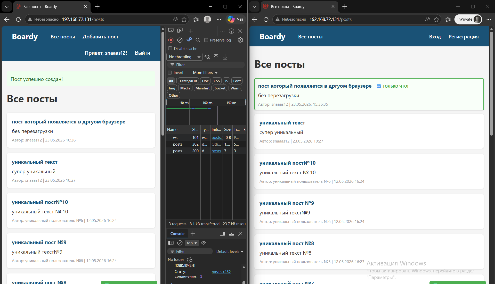
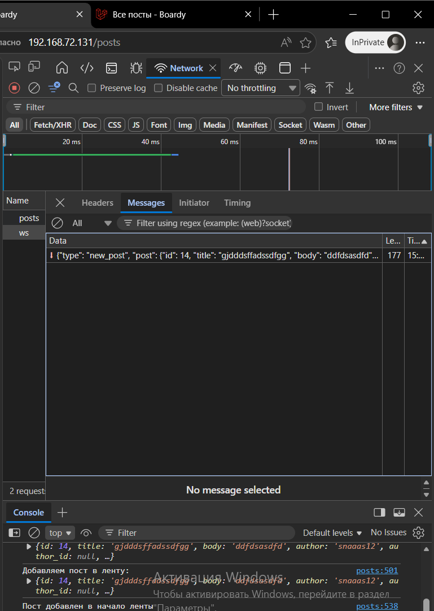

---

### 8. XSS

Проведён тест на защиту от XSS-атак. Создан пост с телом ``. Пост отобразился в ленте, но JavaScript-код не выполнился – тег отобразился как обычный текст. Это доказывает корректную работу функции экранирования.

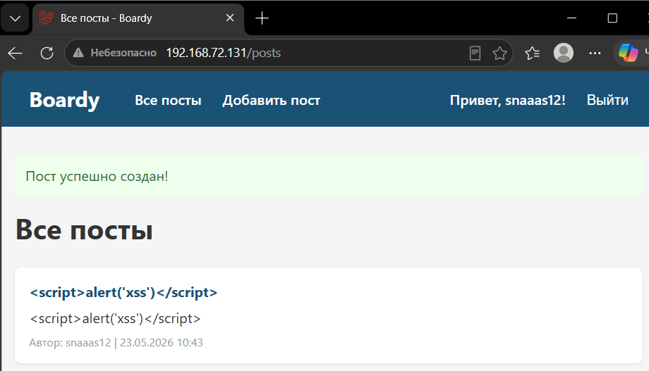

**Ответы на вопросы отчёта:**

*Что делает функция `escapeHtml()`?*

Функция `escapeHtml()` заменяет специальные HTML-символы на их безопасные HTML-сущности. Например, `<` заменяется на `&lt;`, `>` на `&gt;`, `&` на `&amp;`. Это предотвращает интерпретацию пользовательского ввода как HTML-кода.

*Что случится, если вставить данные напрямую в `innerHTML` без экранирования?*

Если вставлять данные напрямую через `innerHTML` без экранирования, злоумышленник сможет выполнить произвольный JavaScript-код в контексте вашего сайта. Это XSS-атака, которая может привести к краже cookies, перехвату сессий, подмене содержимого страницы и другим серьёзным последствиям.

---

### 9. Переподключение

Проведён тест автоматического переподключения. FastAPI (Uvicorn) остановлен через `systemctl stop`. WebSocket-соединение в браузере разорвалось. Через 5 секунд FastAPI запущен снова. Браузер автоматически восстановил WebSocket-соединение без перезагрузки страницы. В инструментах разработчика видны два соединения: первое закрыто, второе открыто.

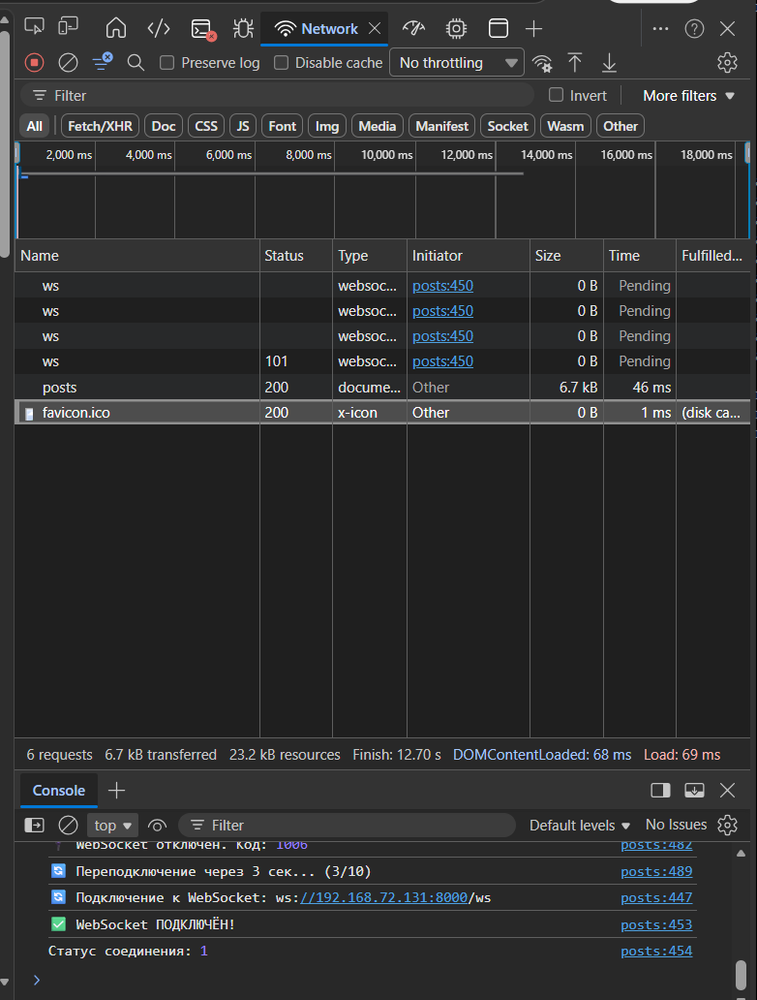

---

## Часть D. Nginx

### 10. WS-проксирование

В конфигурационный файл Nginx добавлен блок `location /ws`, который проксирует WebSocket-соединения на FastAPI. В блоке указаны обязательные директивы: `proxy_http_version 1.1`, `proxy_set_header Upgrade`, `proxy_set_header Connection "upgrade"`, а также `proxy_read_timeout 86400` для долгоживущих соединений. Проверка через `websocat` подтвердила успешное установление соединения.

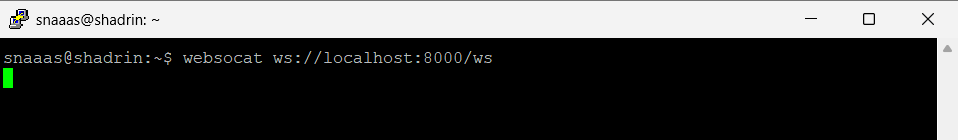

**Ответы на вопросы отчёта:**

*Что сломается, если убрать `proxy_http_version 1.1`?*

WebSocket требует HTTP/1.1, так как заголовок `Upgrade` не поддерживается в HTTP/1.0. Без этой директивы Nginx будет использовать HTTP/1.0, и соединение не установится.

*Что сломается, если убрать `proxy_set_header Upgrade`?*

Nginx не передаст заголовок `Upgrade: websocket` на бэкенд (FastAPI). FastAPI не поймёт, что клиент хочет установить WebSocket-соединение, и будет обрабатывать запрос как обычный HTTP.

*Что сломается, если убрать `proxy_read_timeout`?*

Будет использован стандартный таймаут Nginx (обычно 60 секунд). WebSocket-соединение будет разрываться каждую минуту, даже если оно активно. Клиенту придётся постоянно переподключаться, что сделает реалтайм-функциональность практически неработоспособной.

---

### 11. Закрыть /internal

В конфигурацию Nginx добавлен блок `location /internal`, который ограничивает доступ к эндпоинту `/internal/broadcast`. Директивы `allow 127.0.0.1; deny all;` разрешают запросы только с localhost – то есть только от самого сервера. Проверка через `curl` с внешнего IP-адреса вернула ошибку `403 Forbidden`.

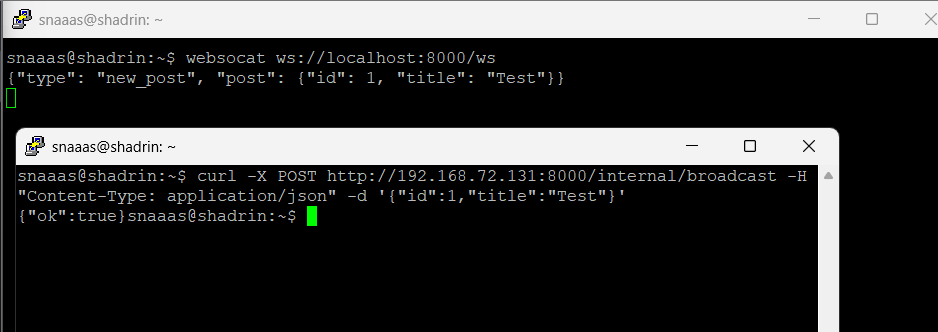

**Ответы на вопросы отчёта:**

*Почему `/internal/broadcast` опасен без ограничения доступа?*

Без ограничения доступа любой пользователь интернета может отправить POST-запрос на этот эндпоинт и создать фальшивое сообщение, которое увидят все реальные пользователи в реальном времени. Это может использоваться для спама, фишинга (подставить вредоносные ссылки), распространения ложной информации или атаки на пользователей.

*Кто мог бы его вызвать?*

Любой, кто знает адрес эндпоинта. Поскольку это обычный HTTP POST, вызвать его может кто угодно – злоумышленник с помощью `curl`, вредоносный скрипт на любом сайте, расширение браузера или просто любопытный пользователь, узнавший адрес из документации или сетевого трафика.

