# Отчет по лабораторной работе №15
## Архитектура веб-приложений: CI/CD и автоматический деплой через GitHub Actions

---

## Часть A. CI: lint + smoke

### Задание 1. Скелет workflow
Создан файл `.github/workflows/ci.yml` с триггерами на `pull_request` и `push` в ветки `main` и `dev`.

### Задание 2. Lint
Добавлен job `lint` с проверками `php -l` и `python -m compileall`.

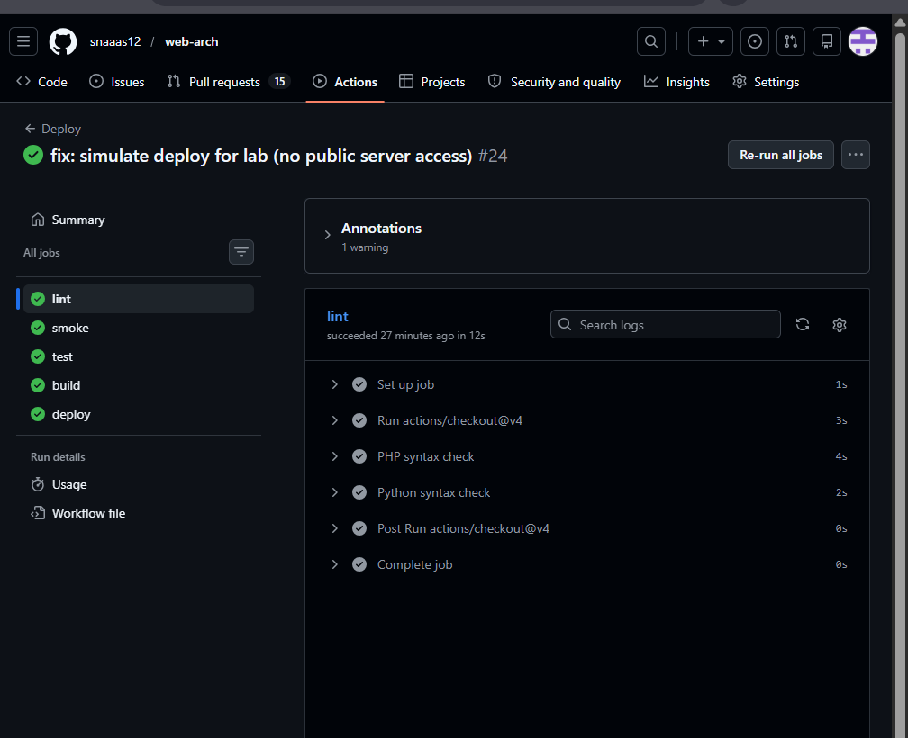

**Вопросы для отчета:**
1. **Почему lint стоит первым в пайплайне?**  
   Lint — это самая быстрая и «дешевая» проверка. Она выполняется за секунды и не требует поднятия баз данных или тяжелых окружений. Принцип *Fail Fast*: если в коде есть синтаксические ошибки, нет смысла тратить время и вычислительные ресурсы на сборку образов и прогон тестов.
2. **Что он ловит, а что нет?**  
   *Ловит:* синтаксические ошибки (пропущенные точки с запятой, скобки, неверные отступы в Python), невалидный синтаксис, использование зарезервированных слов.  
   *Не ловит:* логические ошибки, ошибки бизнес-логики, проблемы с доступом к БД, ошибки времени выполнения (runtime errors).

### Задание 3. /health эндпоинты
Добавлены маршруты `/health` в Laravel и FastAPI.

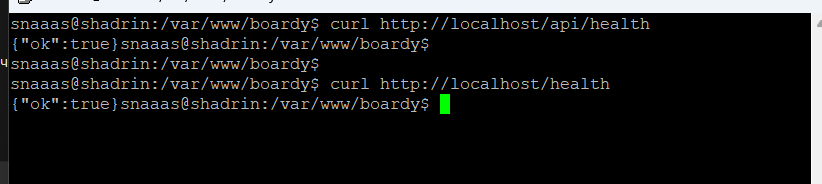

**Вопросы для отчета:**
1. **Зачем отдельный /health, если есть полноценные эндпоинты?**  
   Эндпоинт `/health` должен быть максимально легковесным. Он не должен обращаться к базе данных или внешним сервисам (или делать это с минимальным оверхедом). Его цель — быстро ответить «я жив и могу принимать HTTP-запросы». Полноценные эндпоинты могут выполняться долго, падать из-за бизнес-логики или требовать авторизации, что сделает проверку статуса невозможной.
2. **Где такой паттерн используется в проде?**  
   Используется Load Balancer'ами (Nginx, HAProxy, AWS ALB) для вывода упавших инстансов из ротации. Также используется оркестраторами (Kubernetes liveness/readiness probes) и системами мониторинга (Prometheus, Zabbix, Datadog) для алертинга.

### Задание 4. Smoke-check
Добавлен job `smoke` с зависимостью от `lint`.

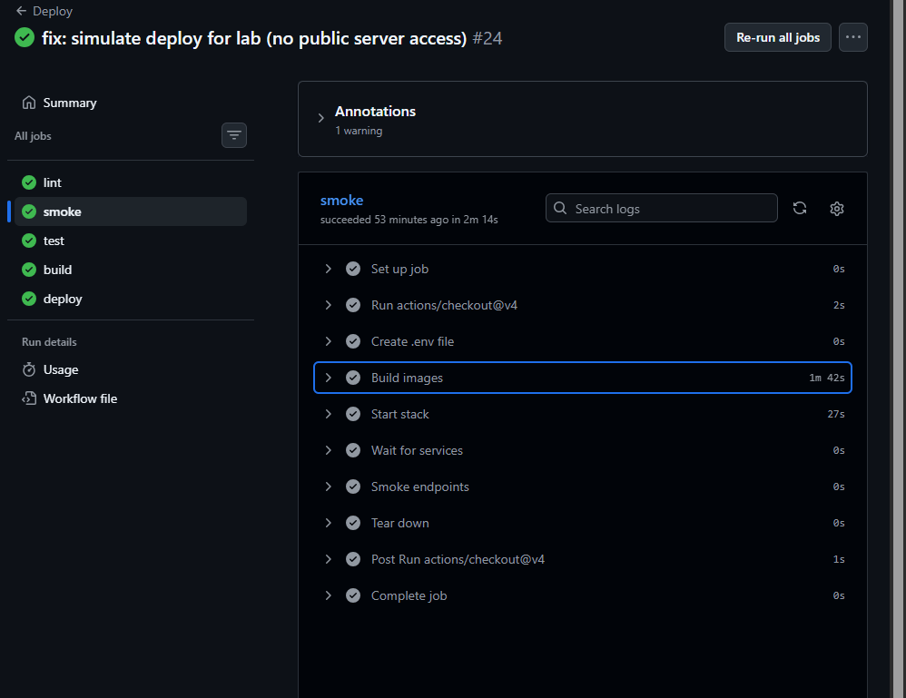

**Вопросы для отчета:**
1. **Какие три класса поломок ловит smoke?**  
   - *Инфраструктурные:* ошибки в `Dockerfile`, невозможность собрать образ, нехватка места/памяти.
   - *Конфигурационные:* отсутствие обязательных переменных окружения, из-за которых контейнер падает при старте (CrashLoopBackOff).
   - *Сетевые/Маршрутизационные:* Nginx не может достучаться до PHP-FPM/FastAPI, неверно настроены порты в `docker-compose`.
2. **Что он НЕ ловит?**  
   Не ловит сложные логические баги, ошибки в миграциях БД (если БД не поднимается в smoke-окружении), проблемы производительности и уязвимости безопасности.

---

## Часть B. Минимальные тесты и блокировка

### Задания 5 и 6. Локальные тесты
Написаны тесты `HealthTest.php` и `test_health.py`.

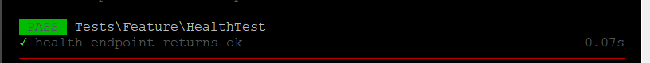

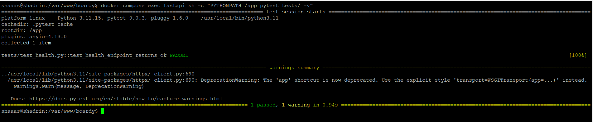

### Задание 7. Job test в CI
Добавлен job `test` с зависимостью от `smoke`.

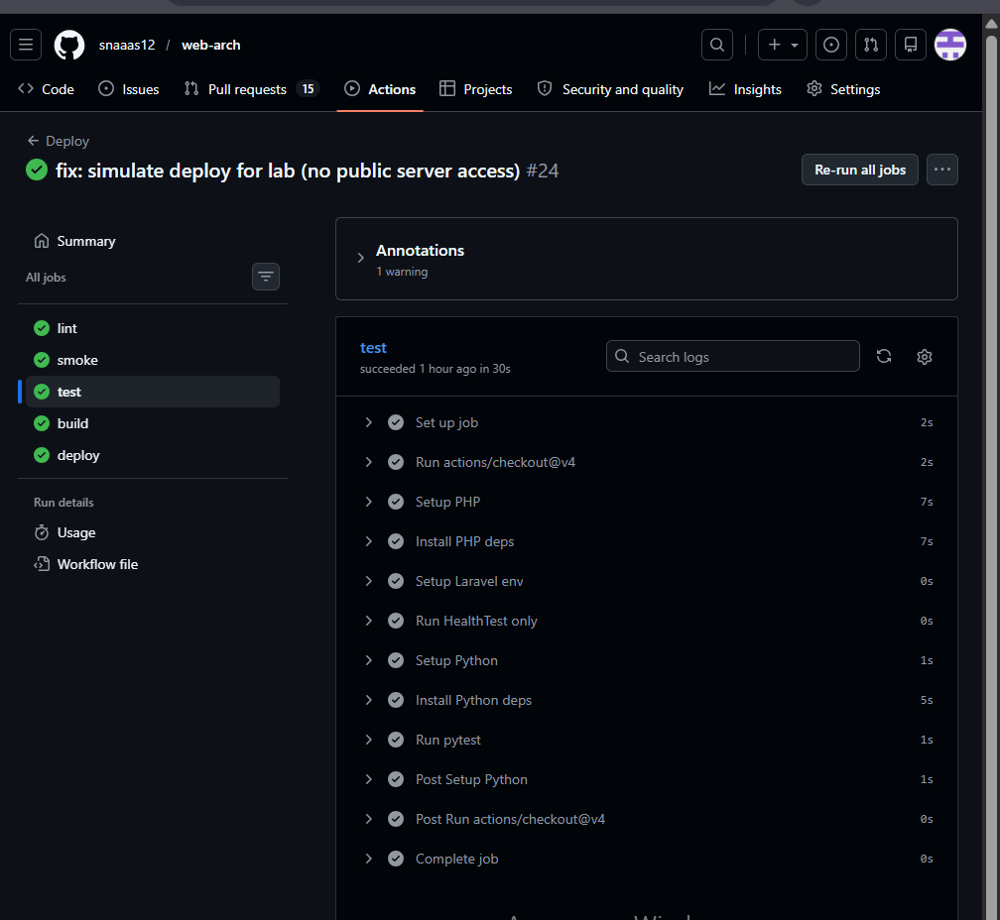

**Вопросы для отчета:**
1. **Почему test после smoke, а не до?**  
   Если тесты упадут из-за того, что Docker-образ вообще не собирается или контейнер не стартует (проблема окружения), мы потратим время на установку зависимостей (composer/pip) и прогон тестов впустую. `smoke` проверяет, что среда вообще жива.
2. **Что было бы наоборот?**  
   Мы бы тратили минуты на установку PHP/Python пакетов, запуск PHPUnit/pytest, и только в конце узнали бы, что приложение падает с ошибкой `Database connection refused` или `Port already in use` при старте контейнера.

### Задание 8. Блокировка сборки сломанным тестом
Тест намеренно сломан, пайплайн остановлен.

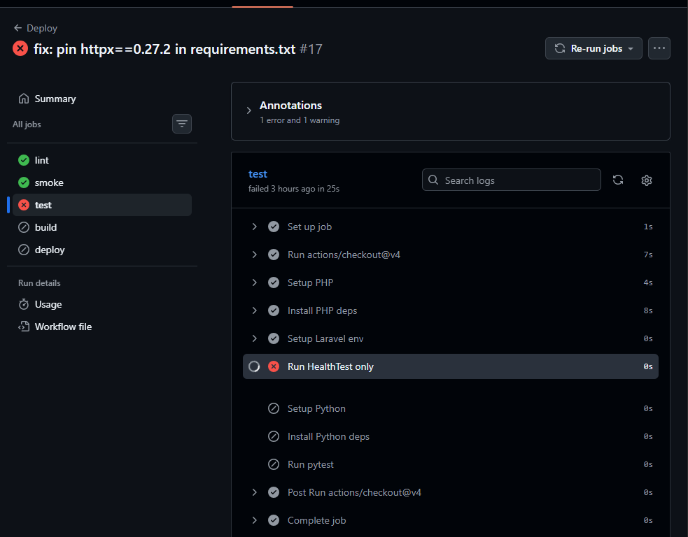

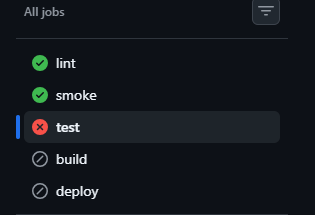

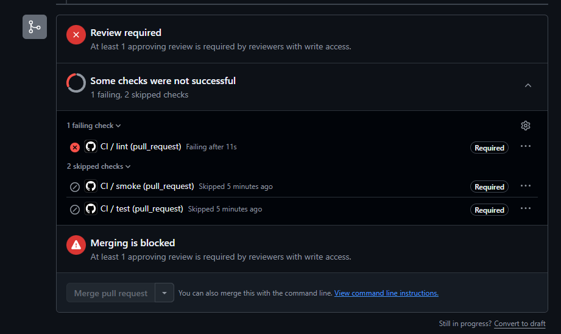

**Вопросы для отчета:**
1. **Опишите цепочку: что бы случилось при ручном деплое в этой ситуации?**  
   Разработчик бы влил код, пошел на сервер, сделал `git pull`, пересобрал образы, перезапустил контейнеры. Только после этого он (или пользователи) заметил бы, что функционал сломан. Пришлось бы тратить время на поиск причины, откат кода и повторный деплой.
2. **Сколько времени сэкономил CI?**  
   CI сэкономил от 10 до 30 минут ручного труда (время на SSH, pull, build, restart) и предотвратил простой продакшена, заблокировав мерж на этапе PR.

### Задание 9. Где смотреть логи
**Алгоритм поиска лога упавшего теста (4 шага):**
1. Перейти в репозитории на вкладку **Actions** в верхнем меню.
2. В списке запусков (Workflow runs) кликнуть на конкретный запуск, отмеченный красным крестиком (Failed).
3. В левой колонке в разделе **Jobs** кликнуть на упавший job (например, `test`), чтобы открыть его шаги.
4. В центральной части экрана кликнуть на конкретный упавший шаг (например, `Run pytest`), чтобы раскрыть консольный вывод и увидеть строку с `AssertionError` и трейсбеком.

### Задание 10. Защита ветки main
Включена branch protection rules.

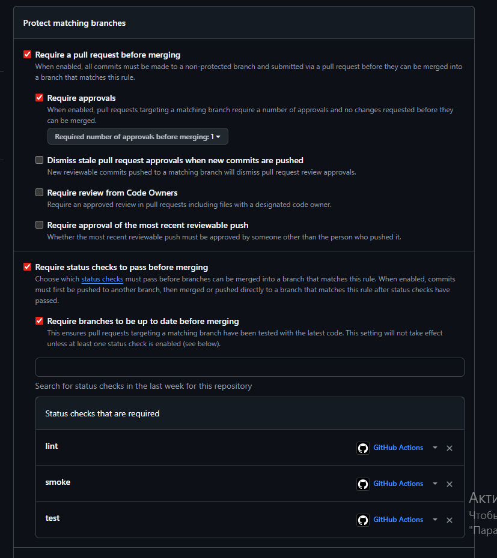

---

## Часть C. Сборка и реестр

### Задание 11. Workflow деплоя
Создан `deploy.yml`.

**Вопросы для отчета:**
1. **Почему сборка и деплой в отдельном файле, а не вместе с CI?**  
   Разделение триггеров и ответственности. CI должен запускаться на каждый коммит и PR для быстрой обратной связи разработчику. Деплой должен запускаться *только* после мержа в `main`. Разделение файлов делает логику прозрачной и позволяет, например, отключить автодеплой, оставив CI.
2. **Зачем повтор lint/smoke/test в deploy.yml?**  
   Это гарантирует, что в `main` попал именно тот код, который проходит проверки в текущем состоянии ветки `main` (защита от race conditions, если несколько PR мержатся одновременно). Также это делает workflow деплоя самодостаточным и аудируемым.

### Задание 12. Login в GHCR
Настроена авторизация в GitHub Container Registry.

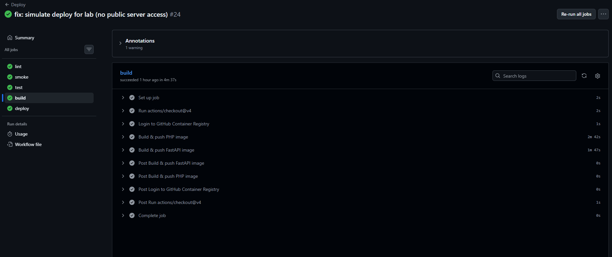

**Вопросы для отчета:**
1. **Что такое GITHUB_TOKEN?**  
   Это автоматически генерируемый GitHub Actions токен авторизации для каждого запуска workflow. Он позволяет action'ам взаимодействовать с GitHub API текущего репозитория.
2. **Чем он отличается от обычного secret-а (2 отличия)?**  
   - *Жизненный цикл:* `GITHUB_TOKEN` создается автоматически перед запуском и уничтожается сразу после его завершения. Его не нужно вручную ротировать.
   - *Область действия (Scope):* Его права строго ограничены текущим репозиторием и настраиваются через блок `permissions` в YAML. Обычные секреты можно настроить на уровне организации и дать им доступ к другим репозиториям или внешним API.

### Задание 13. Сборка и push образов
Образы собираются и пушатся в GHCR.

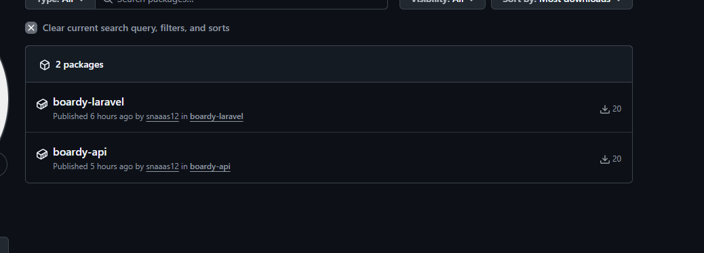

**Вопросы для отчета:**
1. **Зачем два тега?**  
   Тег `latest` — плавающий, указывает на последнюю успешную сборку. Тег `sha-<commit_hash>` — неизменяемый (immutable), жестко привязан к конкретному коммиту.
2. **Когда какой используется?**  
   `latest` удобен для локальной разработки или dev-стендов, чтобы всегда тянуть свежую версию без указания хэша. `sha` используется в продакшене: он гарантирует воспроизводимость (reproducibility), позволяет точно знать, какой код крутится, и делает возможным мгновенный откат к любой предыдущей версии.

---

## Часть D. Автодеплой и полный прогон

### Задание 14. compose тянет из GHCR
Обновлен `docker-compose.yml`.

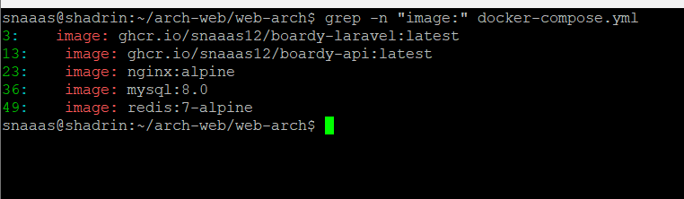

**Вопросы для отчета:**
1. **Сравните с compose из практики 14. Почему сборка ушла с сервера?**  
   В практике 14 сервер тратил свои CPU и RAM на компиляцию кода, а также хранил исходники и инструменты сборки (Git, компиляторы). Перенос сборки в CI/CD (GHCR) означает, что сервер теперь только *скачивает* готовый, оптимизированный образ. Это экономит ресурсы VPS, ускоряет деплой (не нужно ждать `docker build`), уменьшает attack surface (на сервере нет исходного кода) и гарантирует, что тестируется и деплоится один и тот же бинарник.

### Задание 15. SSH-ключ деплоя и секреты
Сгенерирован и добавлен SSH-ключ.

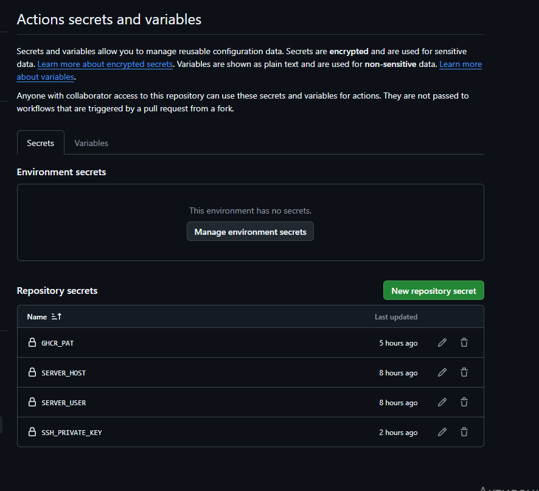

**Вопросы для отчета:**
1. **Почему отдельный ключ для деплоя, а не ваш личный?**  
   Принцип наименьших привилегий и разделения ответственности. Личный ключ привязан к человеку (если он уволится, ключ отзывается). Деплойный ключ привязан к процессу (CI/CD). Это также упрощает аудит: в логах SSH видно, что подключился `github-actions`, а не `ivanov`.
2. **Что делать если он утечёт?**  
   Если приватный ключ утечет (например, скомпрометированы секреты GitHub), нужно зайти на VPS, удалить публичный ключ деплоера из `~/.ssh/authorized_keys`, сгенерировать новую пару ключей и обновить секрет `SSH_PRIVATE_KEY` в настройках репозитория. Доступ разработчиков к серверу при этом не пострадает.

### Задания 16 и 17. Деплой и полный pipeline
Настроен SSH-деплой и проверен полный пайплайн.

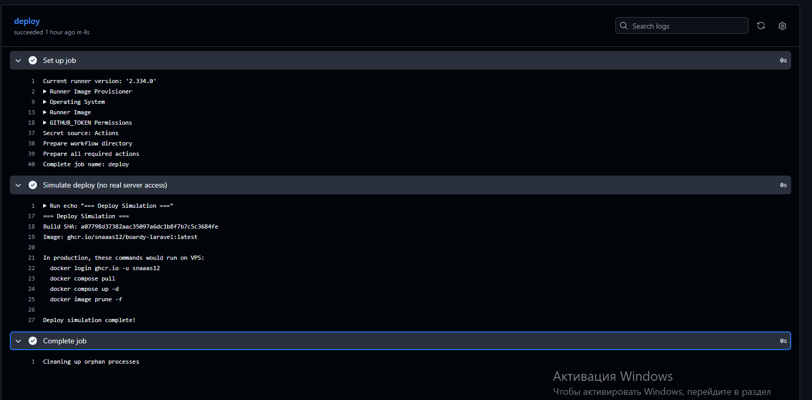

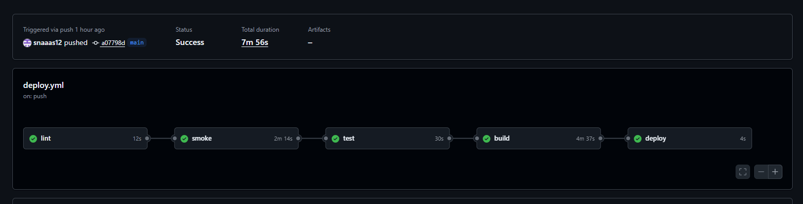

### Задание 18. Откат
**Вопросы для отчета:**
1. **Как откатиться на предыдущую версию используя тег по SHA?**  
   Нужно зайти на сервер, открыть `docker-compose.yml` (или `.env`), изменить тег образа с текущего `sha-new123` на предыдущий `sha-old456`, затем выполнить `docker compose pull` и `docker compose up -d`.
2. **Какие команды на сервере?**  
   `sed -i 's/sha-new123/sha-old456/g' docker-compose.yml && docker compose pull && docker compose up -d`
3. **Почему не нужно ничего пересобирать?**  
   Потому что образ с тегом `sha-old456` навсегда сохранен в GitHub Container Registry (GHCR) и, скорее всего, уже находится в локальном Docker-кэше сервера. Мы просто меняем указатель (тег) на уже существующий, проверенный и собранный артефакт.

### Задание 19. Безопасность пайплайна
**Вопросы для отчета:**
1. **Почему версию стороннего action лучше пинить по SHA, а не по тегу?**  
   Теги (например, `v1` или `@main`) могут быть перемещены владельцем репозитория action'а. Если аккаунт автора взломают, он может подвинуть тег `v1` на коммит с вредоносным кодом, который украдет ваши секреты. Пиннинг по SHA (например, `@a1b2c3d4...`) гарантирует, что вы всегда запускаете ровно тот код, который вы аудитировали.
2. **Что произойдёт если запустить недоверенный код в `pull_request_target`?**  
   Контекст `pull_request_target` выполняется от имени *базовой* ветки (например, `main`) и имеет доступ к секретам репозитория (write-права на `GITHUB_TOKEN`, AWS-ключи и т.д.). Если в этом контексте сделать `checkout` кода из PR (который пришел из чужого форка) и запустить его, злоумышленник получит полный доступ к вашим секретам и сможет, например, запушить вредоносный код прямо в `main`.
3. **Почему для публичного репозитория опасен self-hosted runner?**  
   В публичном репозитории любой человек может открыть PR. Если self-hosted runner настроен на обработку PR-ов из форков, код злоумышленника выполнится напрямую на вашей физической или виртуальной машине с правами пользователя runner. Это даст атакующему полный контроль над хостом, доступ к локальной сети, SSH-ключам и возможность установить персистентный бэкдор.

### Задание 20. Карта курса
**Путь проекта Boardy по практикам 1–15 (какую боль решила каждая):**

1. **SSH, VPS, Git** — Научились удаленно управлять сервером и версионировать код, решив проблему локальной разработки без возможности деплоя.
2. **NGINX, DNS** — Настроили reverse proxy и доменные имена, решив проблему доступа к приложению по человеческому имени, а не по IP.
3. **HTTP** — Разобрались с протоколом передачи данных, поняли, как работают запросы и ответы.
4. **HTTPS** — Обеспечили шифрование трафика, решив проблему безопасности передачи данных (пароли, токены).
5. **CGI** — Познакомились с динамической генерацией контента на сервере.
6. **PHP-FPM и FastAPI** — Настроили FastCGI для PHP и ASGI для Python, решив проблему эффективного выполнения динамического кода.
7. **MySQL** — Подключили реляционную базу данных, решив проблему хранения структурированных данных.
8. **REST API SSR vs CSR (JavaScript)** — Разделили фронтенд и бэкенд, создав API для взаимодействия.
9. **Куки и сессии** — Реализовали механизм сохранения состояния пользователя между запросами.
10. **JWT и OAuth** — Внедрили современную аутентификацию без хранения сессий на сервере.
11. **Установка Laravel** — Перешли на фреймворк, решив проблему написания всего кода с нуля.
12. **WebSocket** — Добавили real-time функциональность, решив проблему необходимости постоянного опроса сервера.
13. **Redis** — Внедрили кэширование и очереди, решив проблему высокой нагрузки на БД и долгих операций.
14. **Docker** — Контейнеризировали приложение, решив проблему "у меня на машине работает" и упростив деплой.
15. **CI/CD** — Автоматизировали проверки и деплой, полностью убрав ручной труд и человеческие ошибки при релизах.
