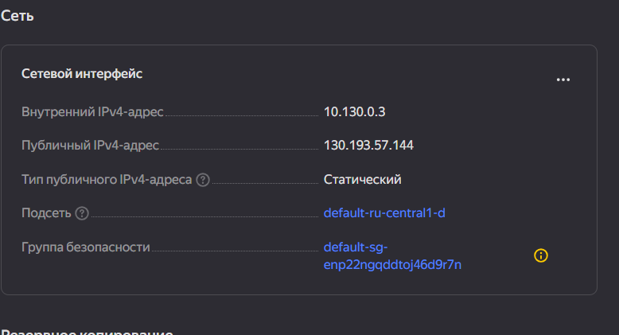
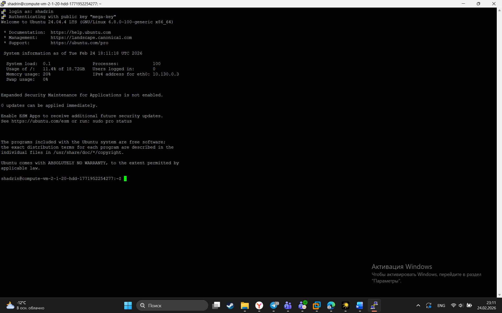
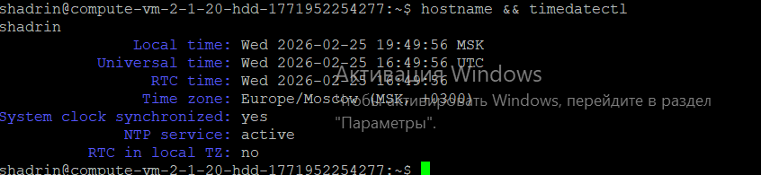
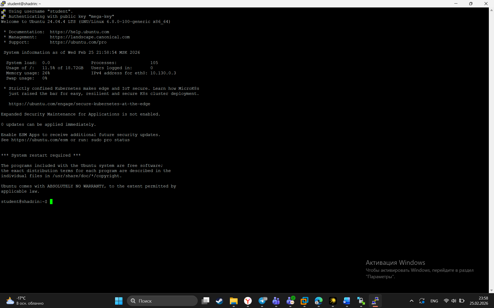
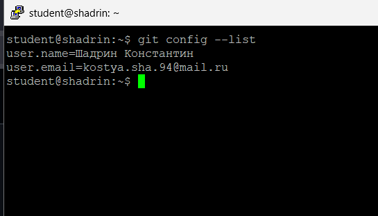
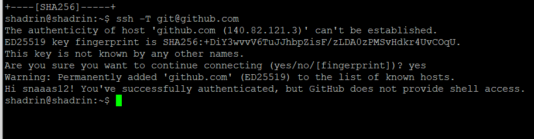
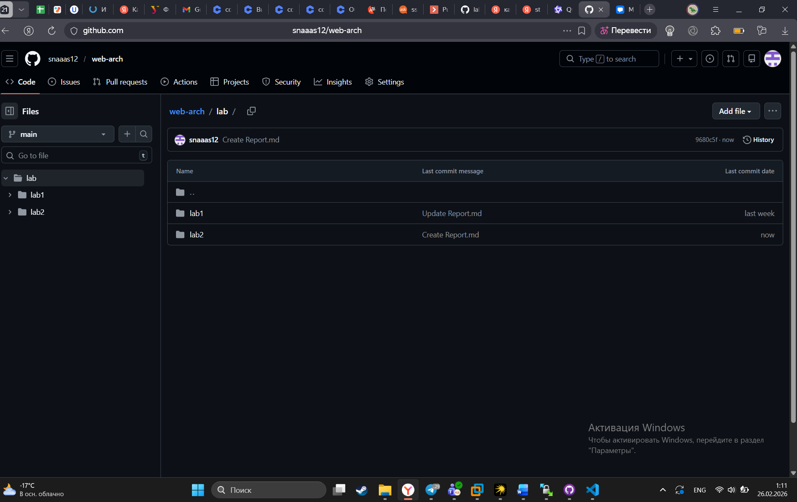
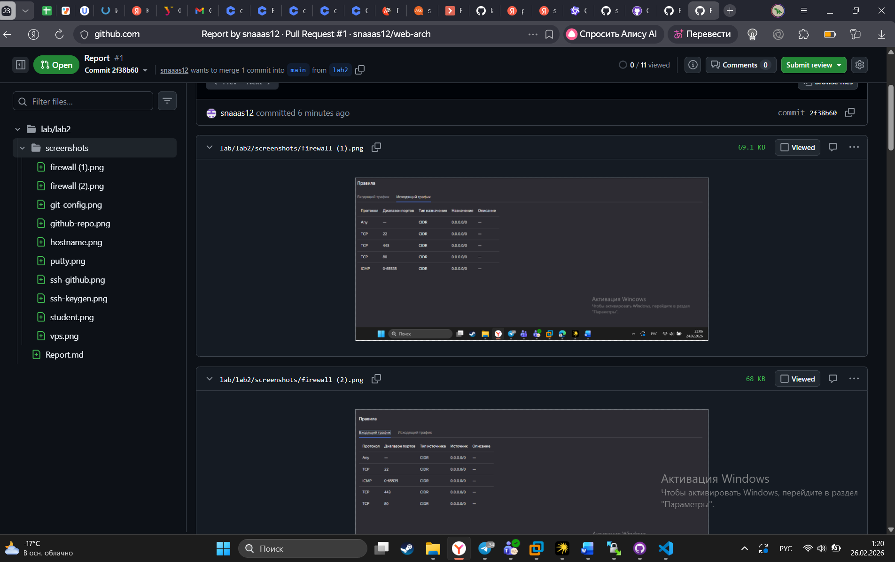

# Лабораторная работа № 2 "SSH, VPS, Git"

ФИО: Шадрин Константин Дмитриевич 

## 1 SSH-ключ

Генерирование SSH ключа

## 2 VPS и файрвол

панель yandex-cloud с VPS

Настройки файрвола 

.png)
.png)

## 3 Подключение через PuTTY

подключение к VPS через PuTTY

## 4 Настройка сервера

Настройка времени и имени хоста

## 5 Пользователь student

Созданный пользователь student

## 6 Git и SSH-ключ → GitHub

Настройки гитхаба

аутентификация на гитхабе

## 7 Репозиторий и структура 

## 8 Ветка и Pull Request

