Лабораторная работа № 1 "HTTPS для Boardy"

ФИО: Шадрин Константин Дмитриевич 

## №1 установка certbot

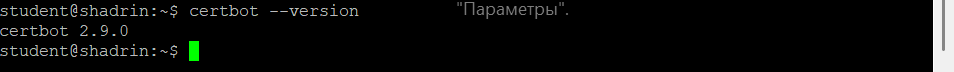

## №2 получения сертификата

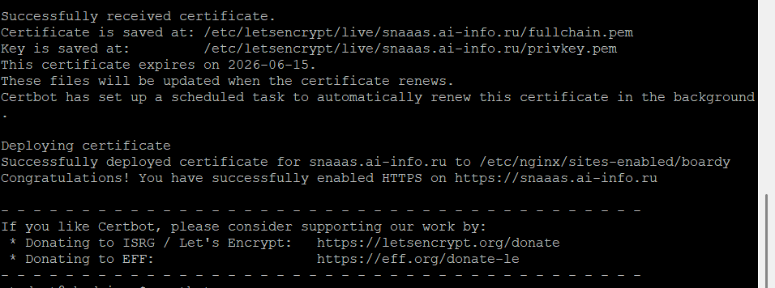

## №3 проверка в браузере

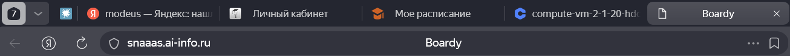

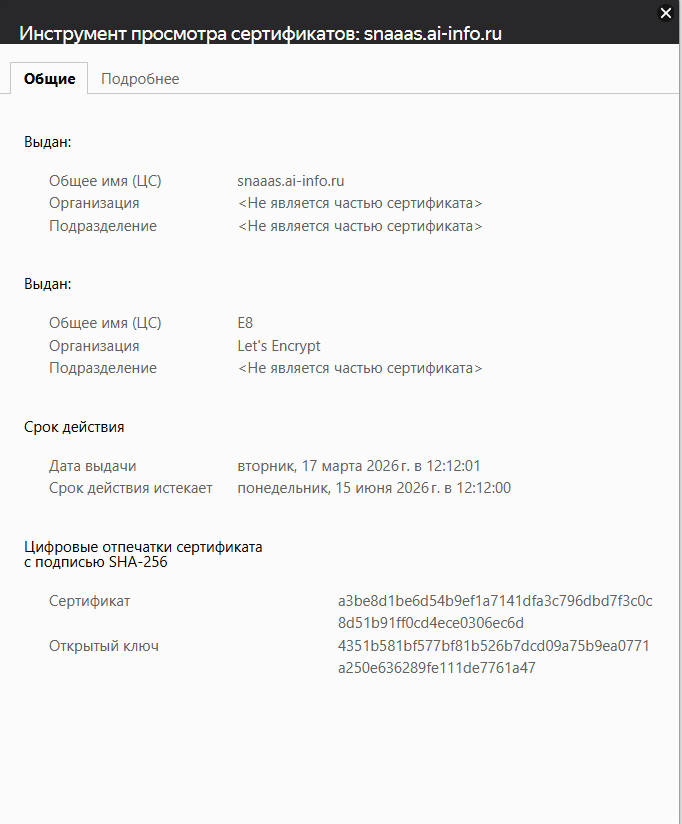

## №4 Редирект 

код 301 - 301 Moved Permanently (перемещен постоянно)

Location - https://snaaas.ai-info.ru/

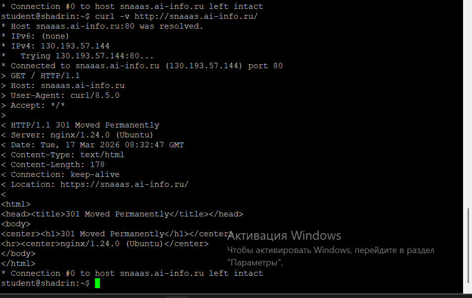

## №5 конфиг после certbot

listen 443 ssl - прослушивание HTTPS порта
ssl_certificate -  путь к сертификату
ssl_certificate_key - путь к приватному ключу

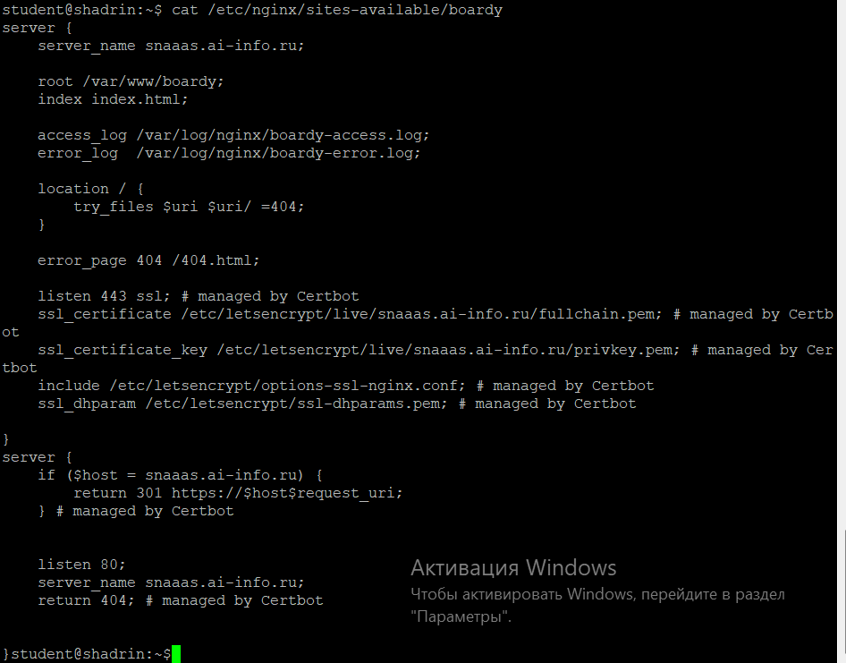

## №6 сертификат для api-поддомена

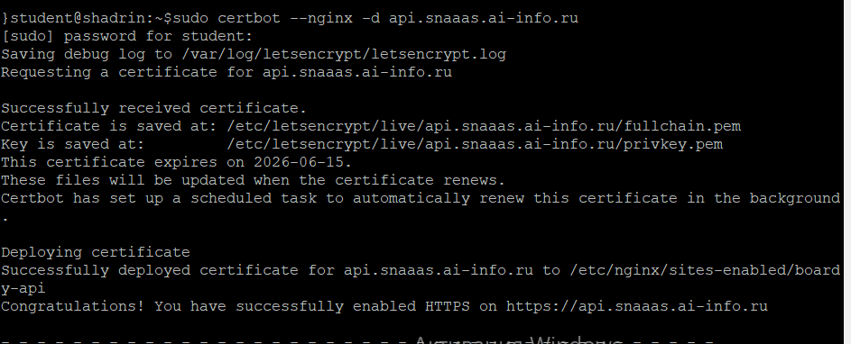

## №7 проверка обоих доменов 

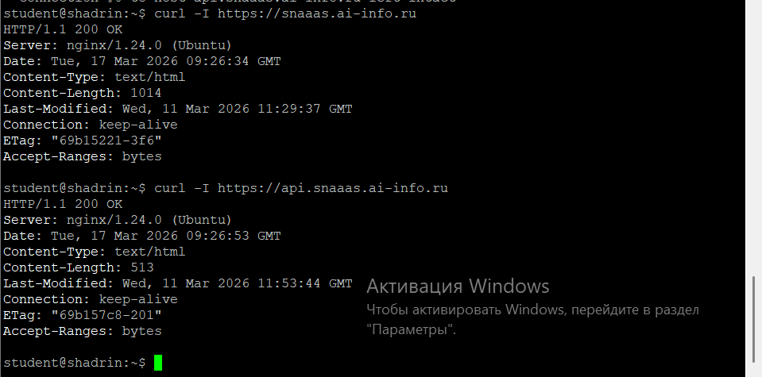

## №8 TSL handshake

ver TLS - 1.3

шифрование - TLS_AES_256_GCM_SHA384

subject - snaaas.ai-info.ru

Issuer - C=US; O=Let's Encrypt; CN=E8 (Let's Encrypt)

Срок действия - Expires: June 15, 2026 

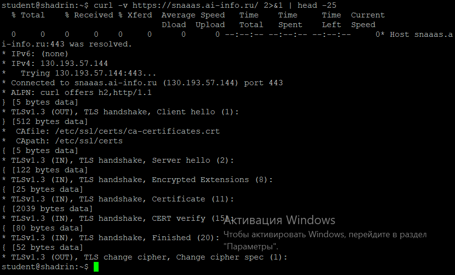

## №9 цепочка доверия

Сертификат сайта подписан Let's Encrypt. Let's Encrypt подписан ISRG Root X1. ISRG Root встроен в ОС.

Сервер отправляет браузеру несколько сертификатов: Сертификат сайта, промежуточный сертификат 

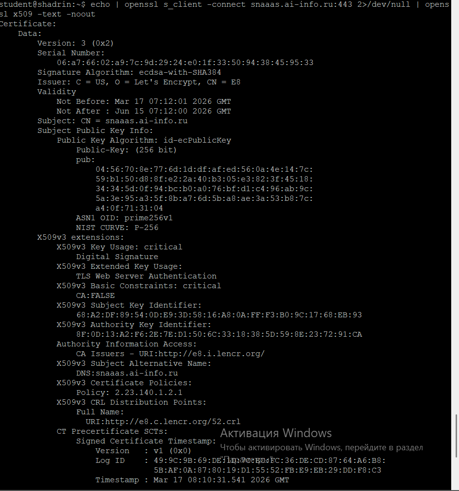

## №10

У сертификатов одинаковый Issuer - C = US, O = Let's Encrypt, CN = E8
И различные subjects у основной страницы - CN = snaaas.ai-info.ru , а у api - CN = api.snaaas.ai-info.ru

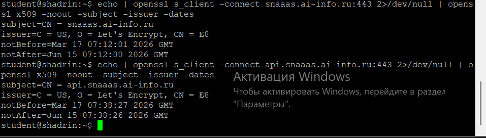

## №11 HSTS

HSTS - механизм, который принудительно активирует соединение через HTTPS. Предотвращает атаки типа "человек посередине" (MITM)

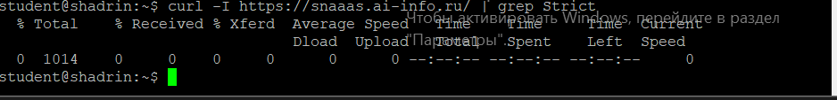

## №12 Кэширование и gzip

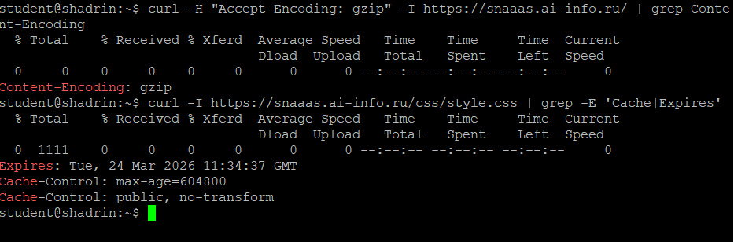

## №13 автообновление

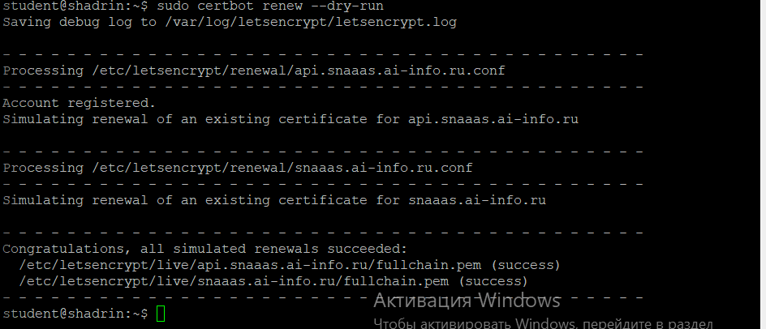

## №14 PR

