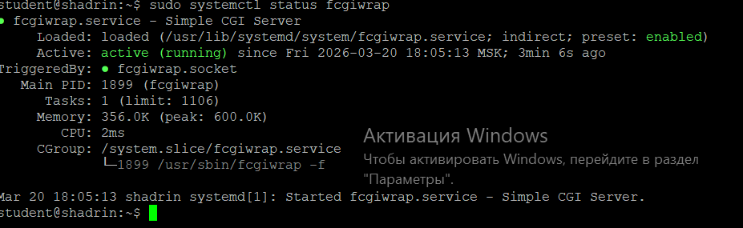
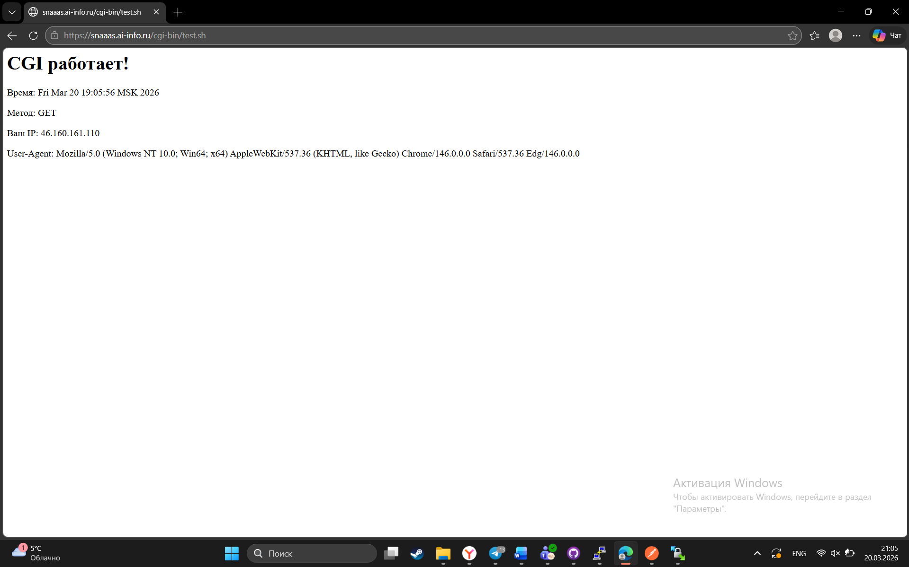
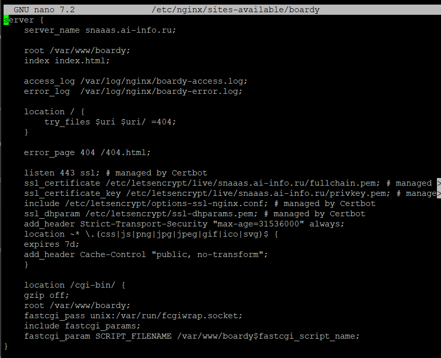
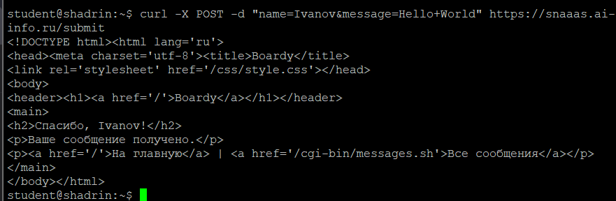
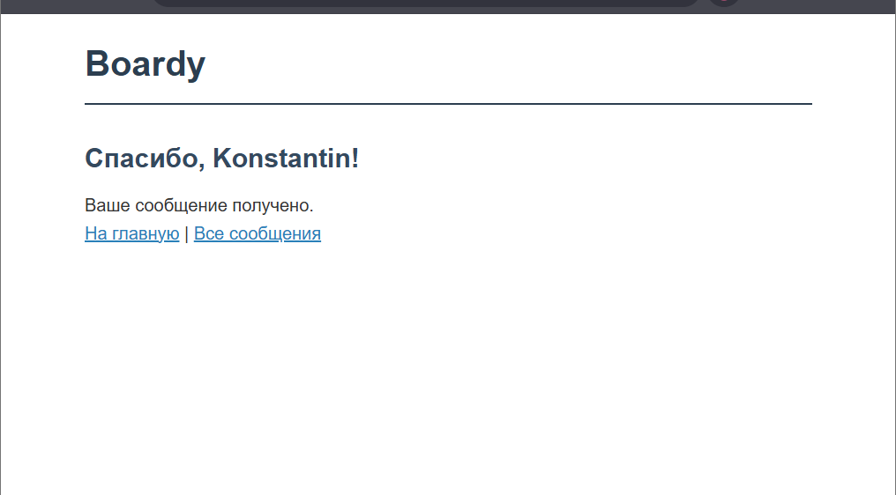
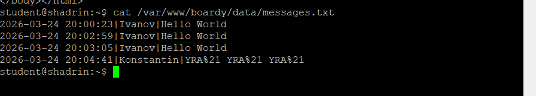
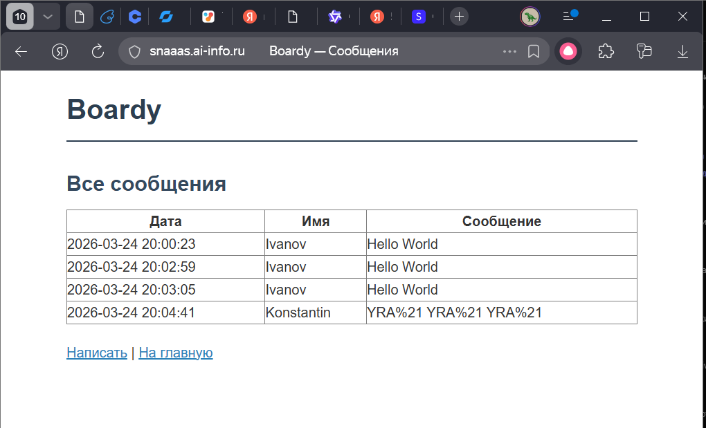
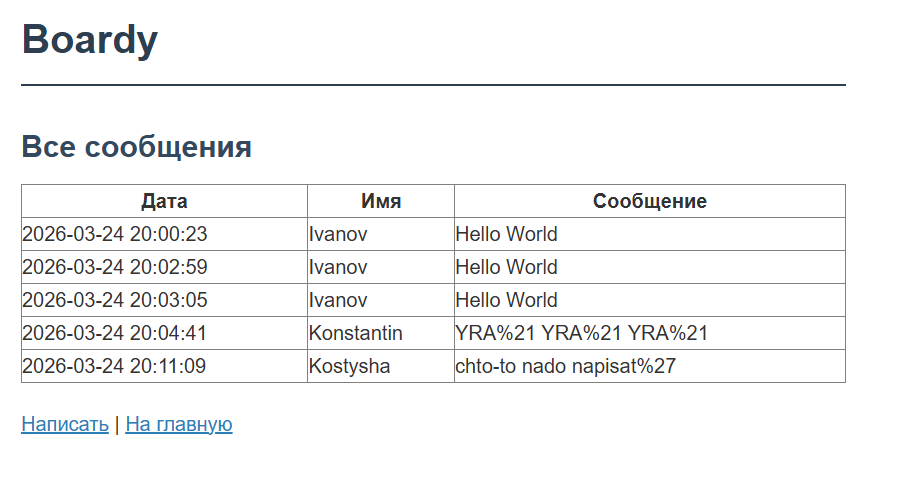
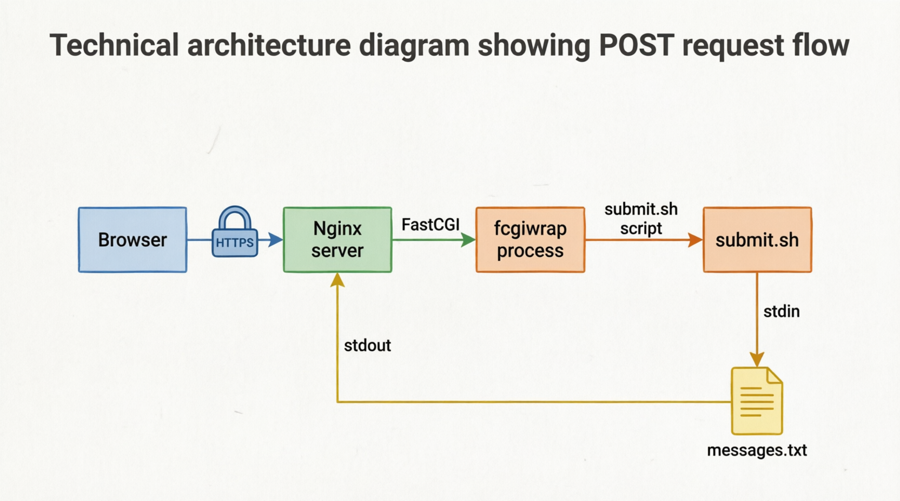

Лабораторная работа № 6 "CGI"

ФИО: Шадрин Константин Дмитриевич 

## №1 Установка fcgiwrap

## №2 Тестовый скрипт

## №3 Конфигурация Nginx

* fastcgi_pass unix:/var/run/fcgiwrap.socket -> Указывает адрес FastCGI-сервера, которому Nginx будет передавать запросы для обработки

* include fastcgi_params -> Подключает стандартный файл параметров FastCGI

* fastcgi_param SCRIPT_FILENAME /var/www/boardy$fastcgi_script_name -> Передаёт FastCGI полный путь к исполняемому скрипту на файловой системе

## №4 Скрипт обработки формы

## №5 Форма в браузере

## №6 Данные на диске

## №7 Скрипт вывода сообщений

## №8 Полный цикл

## №9 Путь запроса

## №10 Теоретические вопросы

* CGI - это стандартный протокол, позволяющий веб-серверу запускать внешние программы для генерации динамического контента. В 1993 году он решил проблему «статичного» веба, дав возможность обрабатывать пользовательский ввод и создавать страницы «на лету», а не просто отдавать файлы с диска.
* CGI - скрипт получает тело POST-запроса, читая данные из стандартного потока ввода . Дополнительные метаданные запроса передаются скрипту через переменные окружения.
* Классический CGI создает отдельный процесс операционной системы для обработки каждого отдельного запроса. При высокой нагрузке это приводит к быстрому исчерпанию ресурсов, так как система тратит много времени на постоянное создание и уничтожение процессов.
* Директива fastcgi_pass передает запросы по специализированному бинарному протоколу FastCGI, передавая переменные и параметры напрямую в приложение. Директива proxy_pass работает как обычный обратный прокси, просто пересылая сырой HTTP-запрос на другой сервер, не зная внутренней структуры приложения.
* Nginx, в отличие от Apache, архитектурно не умеет запускать CGI-скрипты напрямую. fcgiwrap нужен как «мост-переводчик»: он принимает запросы от Nginx по эффективному протоколу FastCGI и запускает обычные CGI-скрипты как отдельные процессы.