Лабораторная работа №7 "PHP-FPM + FastAPI"

## №1 Установка PHP-FPM

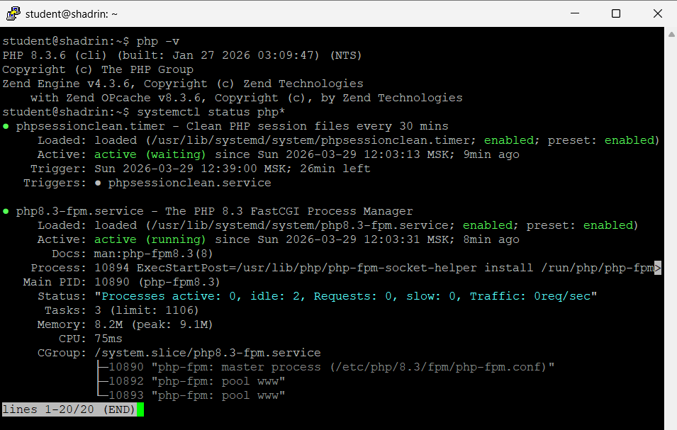

## №2 Форма и сообщения на PHP

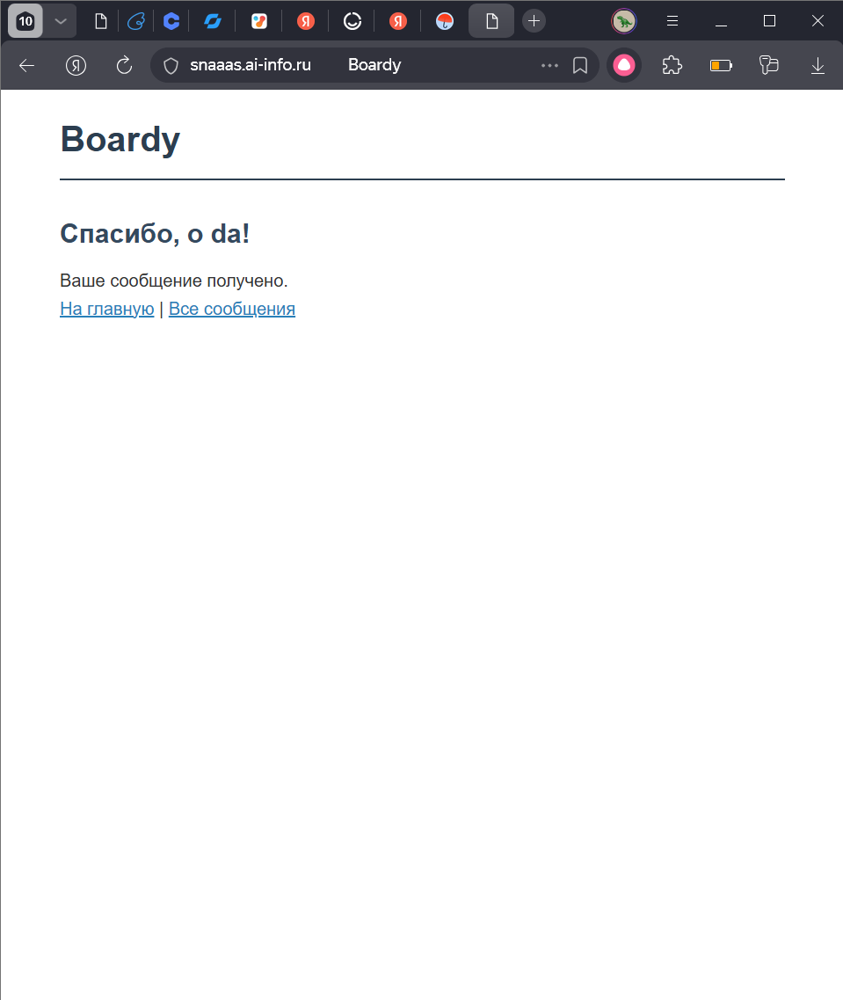

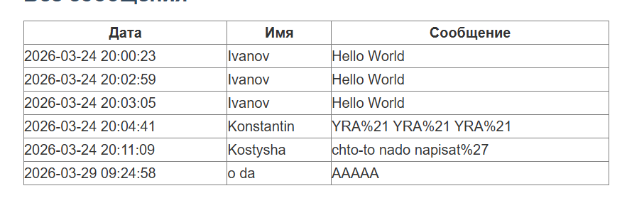

## №3 Конфиг Nginx для PHP

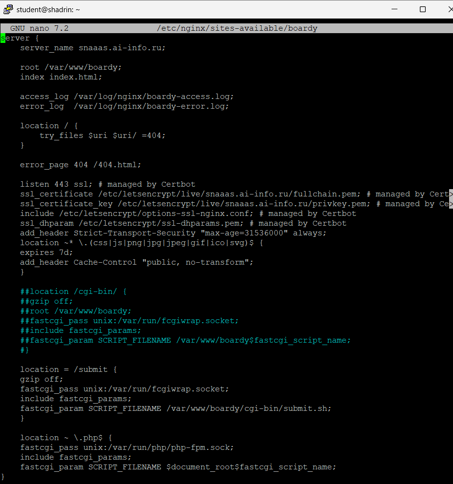

PHP-FPM быстрее CGI/fcgiwrap, потому что он переиспользует процессы и кэширует скомпилированный код в памяти, избегая дорогих операций создания процессов (fork/exec) при каждом запросе.

## №4 Shared nothing

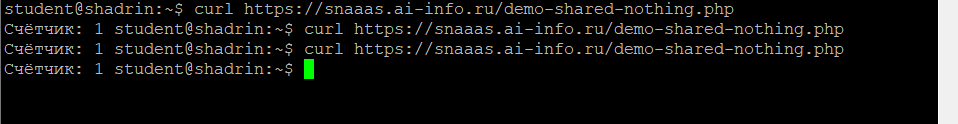

Счётчик не растет так-как переменные не "живут" между запросами. Shared Nothing - это архитектурный подход, при котором каждый запрос обрабатывается в полностью изолированной среде, без доступа к памяти, переменным или состоянию других запросов.

## №5 Блокировка воркеров

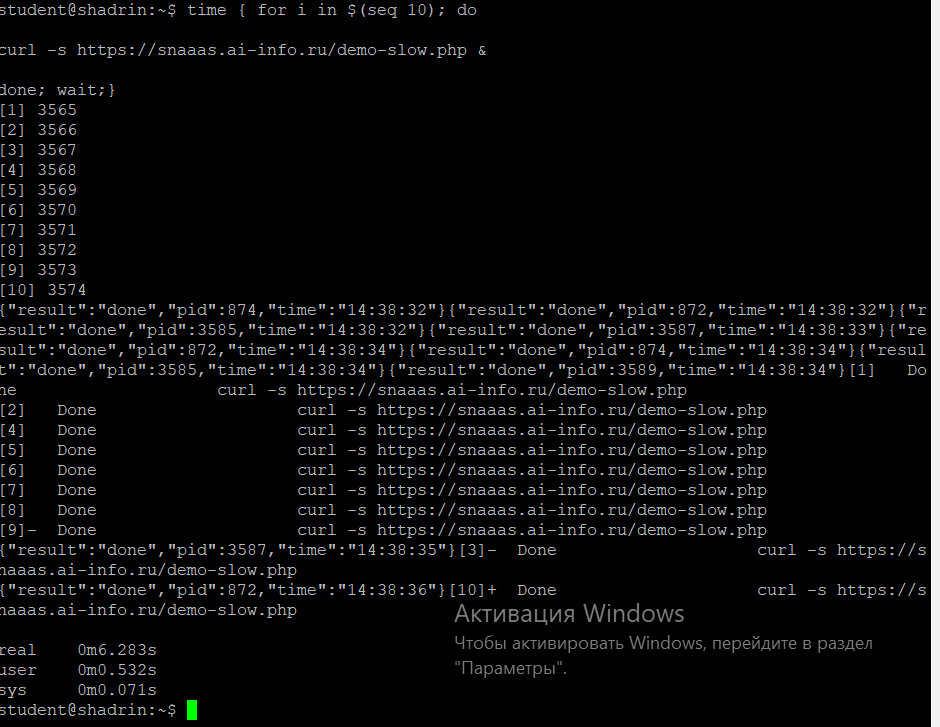

Это заняло примерно 6 секунд. Работало 4 воркера. Было отправлено 10 запросов сначала отработали 4 запроса == 2 сек. после чего еще 4 запроса и еще 2 секунды и все завершилось выполнением 2-ух запросов.

## №6 Установка и приложение

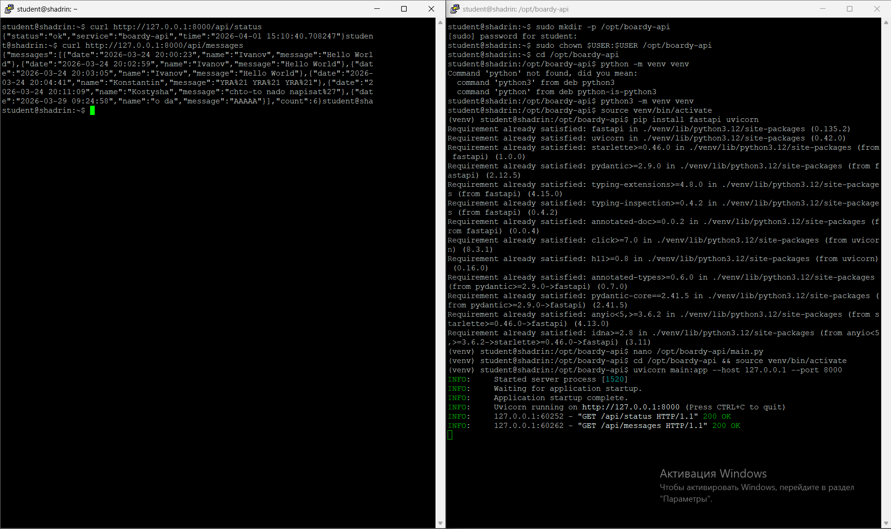

## №7 Живой процесс (счётчик)

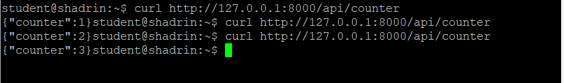

В данном случае счетчик растет так как процесс после окончания не "умирает", а продолжает ожидать новый запрос. 

## №8 Async: 10 запросов за 2 секунды

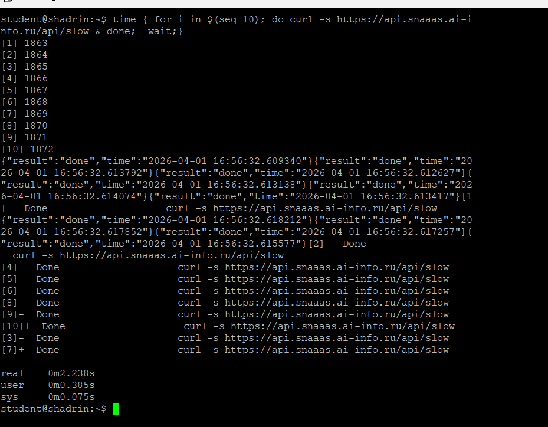

Так как в коде мы используем asyncio.sleep() - это не блокирует выполнение других запросов. То есть запустился первый процесс ожидает 2 сек. в это же время начинает выполняться следующий процесс и т.д.

## №9 Блокирующий код убивает event loop

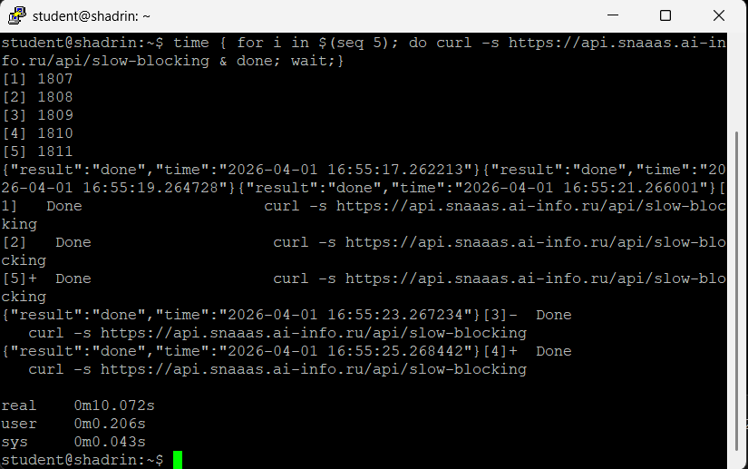

они отличается следующими строчками кода. asyncio.sleep() и time.sleep(). time.sleep() блокирует дальнейшие выполнение процессов. Не может произойти той ситуации, когда во время ожидания ожидания первого процесса, начнется выполнять другой процесс.

## №10 Swagger

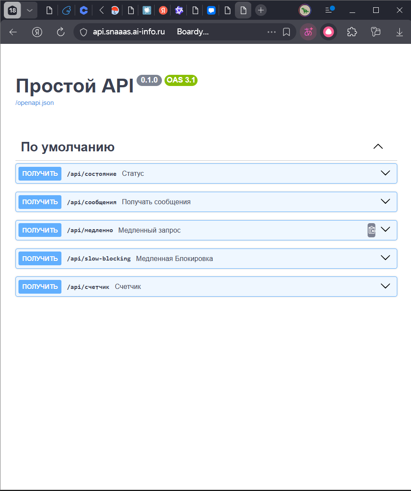

## №11 systemd-сервис

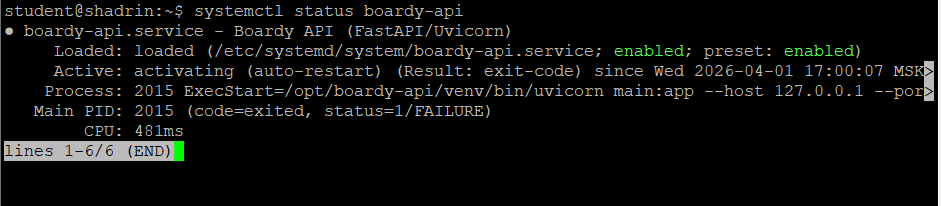

## №12 Nginx proxy_pass

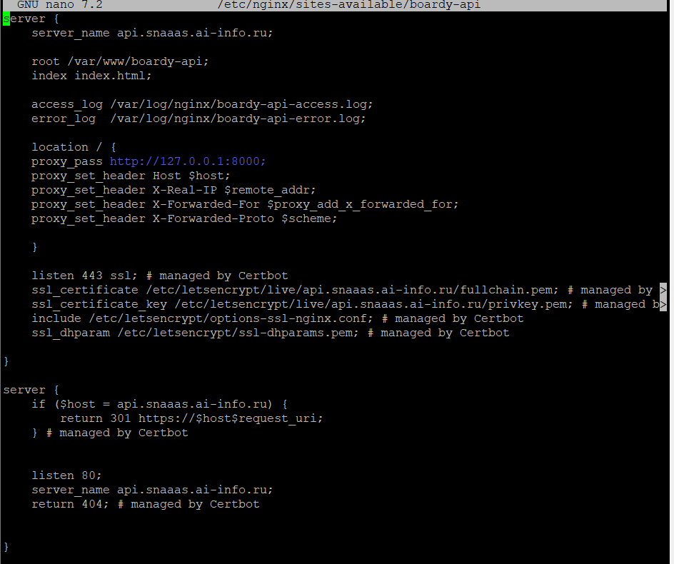

proxy_pass использует стандартный протокол HTTP для связи с полноценными веб-серверами, тогда как fastcgi_pass применяет специализированный бинарный протокол FastCGI для передачи параметров скриптам через менеджер процессов. Python-фреймворки сами являются автономными серверами, поэтому им достаточно простого HTTP-проксирования, а исторически сложившаяся архитектура PHP требует внешнего менеджера, который общается с веб-сервером именно через FastCGI.

## №13 Два формата

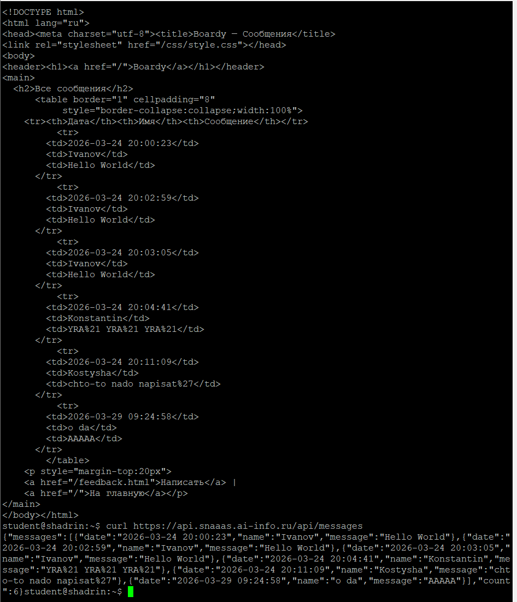

messages.php возвращает HTML-разметку — готовые данные для отображения в браузере человеком, где логика и представление смешаны. api/messages возвращает чистый JSON — структурированные данные без оформления, предназначенные для программной обработки другими приложениями. Первый формат — для людей, второй — для машин.

## №14 Процессы

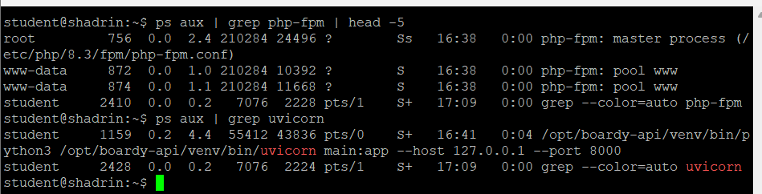

## #15 PR

