# Лабораторная работа № 8 "MySQL"

# №1 Установка MySQL

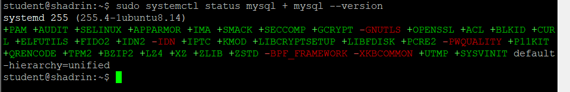

# №2 База данных и пользовател

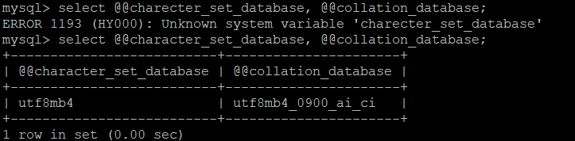
utf8mb4 Полный Unicode: все языки + эмодзи. Стандарт.
collation - это сортировка, то есть определяются правила  сравнения строк, работа order by, учитывание регистра. unicode_ci - показывает, что регистр не учитывается при сравнении

# №3 phpMyAdmin

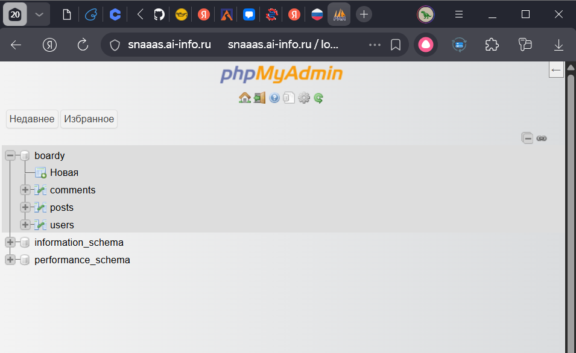

# №4 Три таблицы

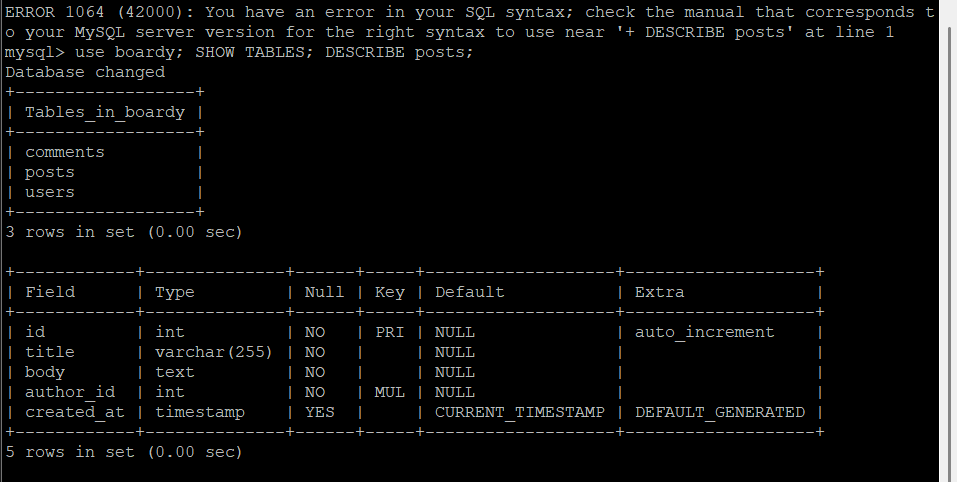

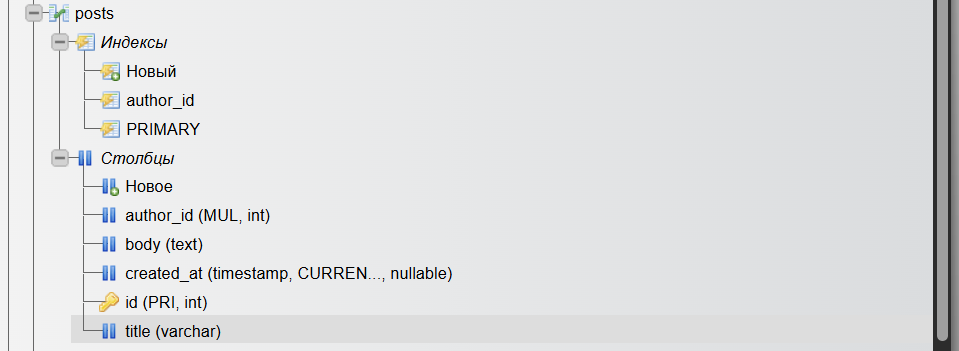

FOREIGN KEY — это ограничение целостности, которое связывает колонку в одной таблице с первичным ключом в другой таблице.
ON DELETE CASCADE - Это правило, которое определяет, что делать с записями в дочерней таблице (posts), когда удаляется запись в родительской (users).
Мы используем движок InnoDB.

# №5 SQL-скрипт

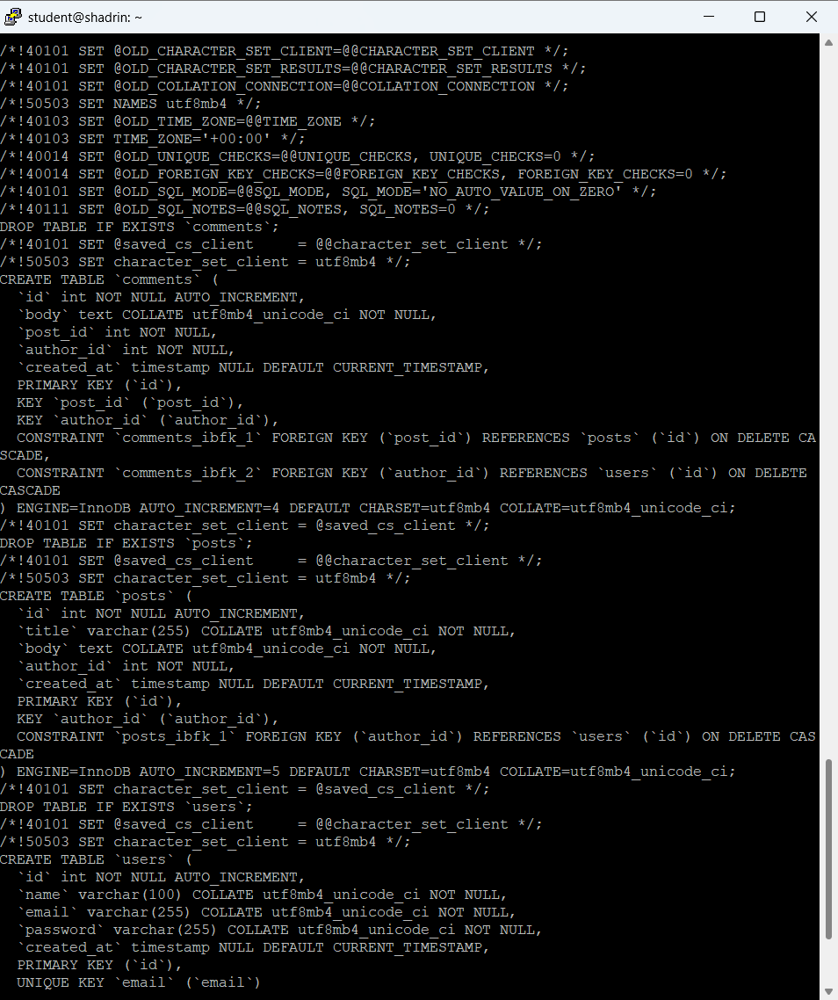

# №6 INSERT

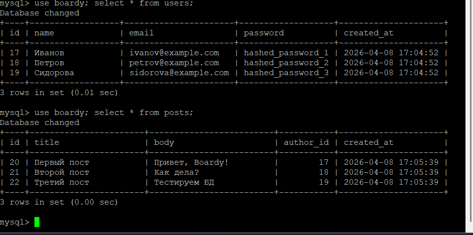

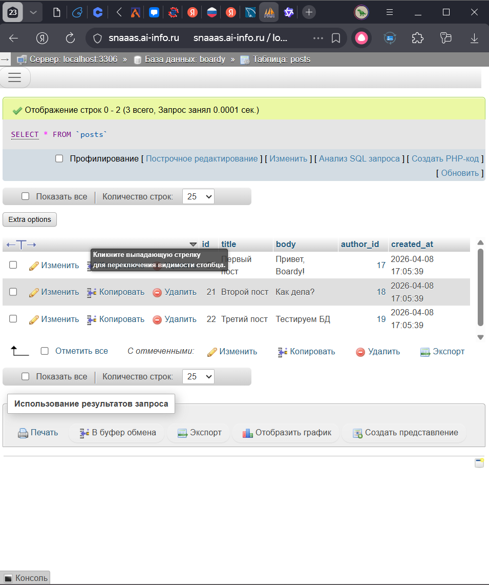

# №7 SELECT + JOIN

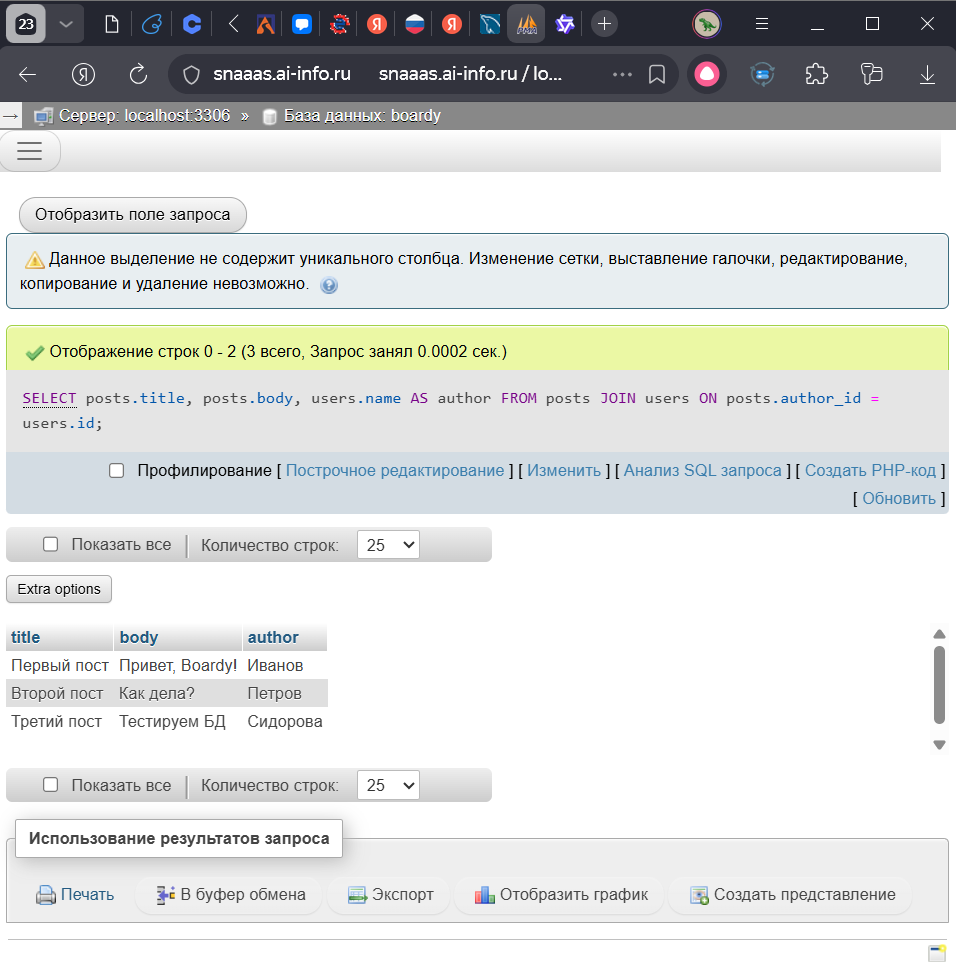

JOIN - оператор, объединяющий данные из различных таблиц в одну. 
Получить имя автора без использования JOIN можно так:
SELECT 
    title,
    body,
    (SELECT name FROM users WHERE users.id = posts.author_id) AS author
FROM posts;

# №8 Foreign Key — защита целостности

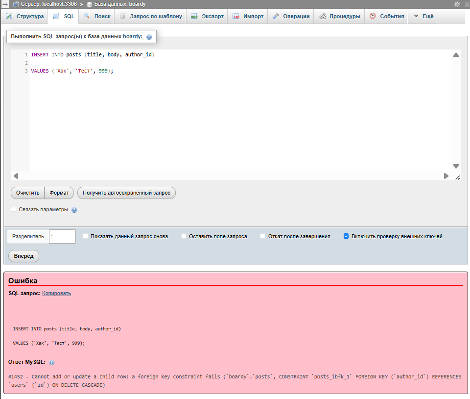

# №9 CASCADE

# №10 SQL-инъекция

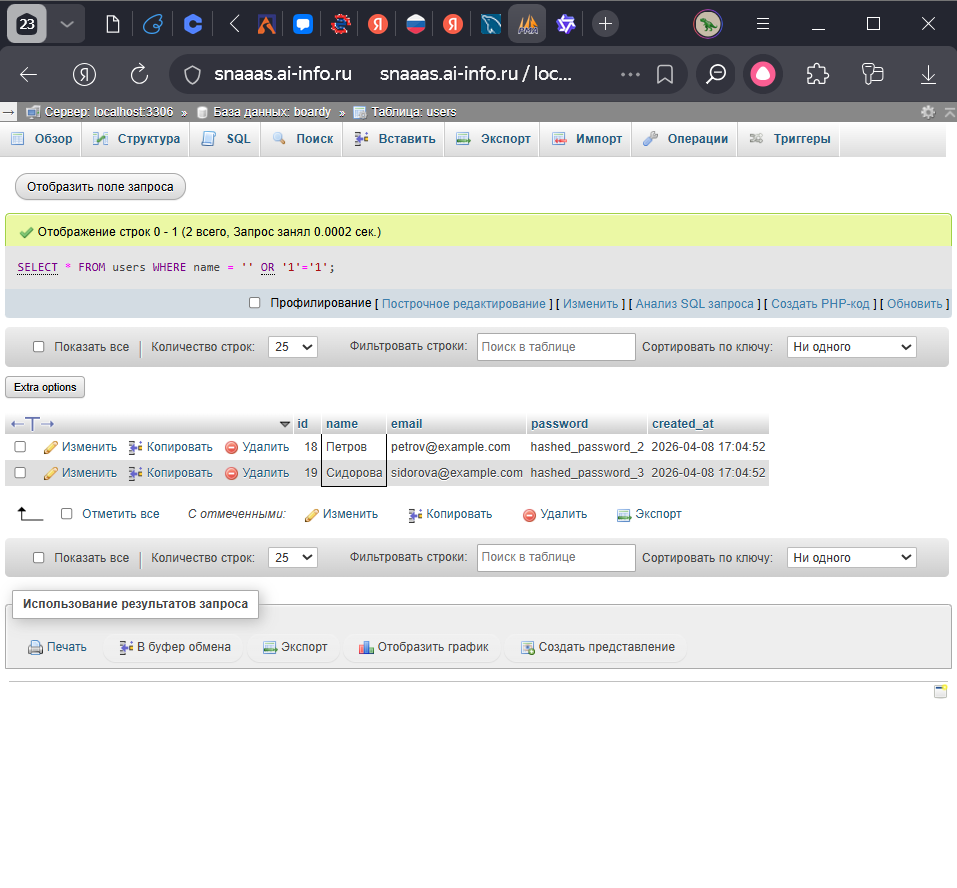

SQL инъекция работает так:

Не порядочный пользователь передает спец символы, которые меняют структуру SQL запроса.

Prepared Statements работают так, что логика SQL и данные пользователя передаются раздельно

# №11 db.php

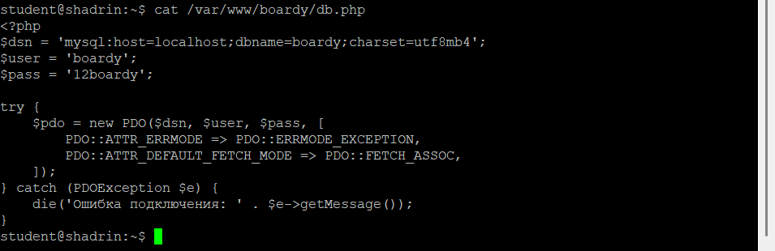

# №12 submit.php через MySQL

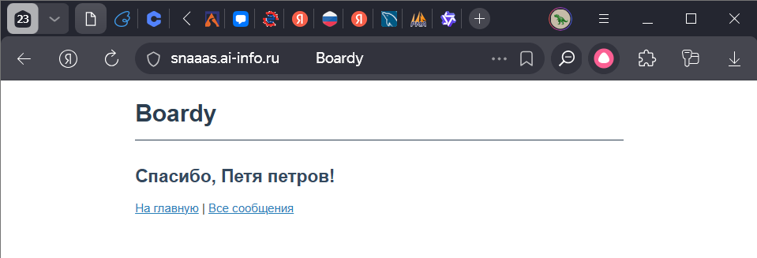

# №13 messages.php через MySQL

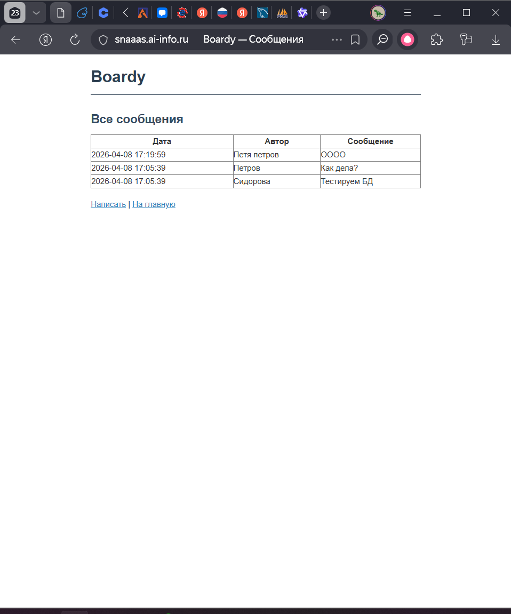

# №14 aiomysql

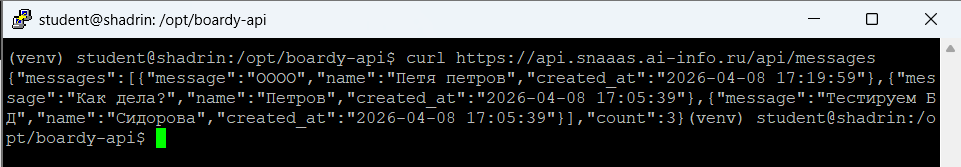

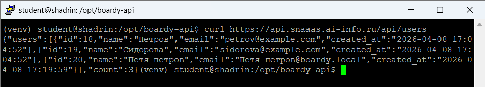

aiomysql - это ассинхронный драйвер MYSQL. Он работает с async/await и не блокирует поток выполнения. mysql-connector - синхронный и не может себе позволить себе такую роскошь, как асинхронность.
Если мы будем пользоваться синхронным драйвером, то уменьшится производительность нашего сервиса.
Программа будет ждать выполнения каждого запроса и не принимать другие в это время.

# №15 PR

