# "Lab9: REST API, CRUD comments, JS, React"

## №1 Структура проекта

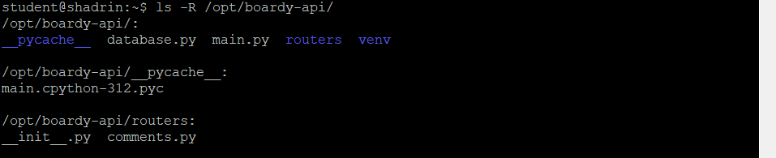

## №2 GET — список комментариев

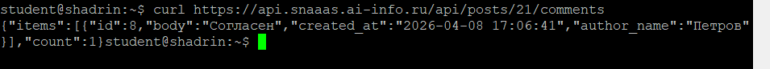

SELECT c.id, c.body, c.created_at, u.name AS author_name
FROM comments c
JOIN users u ON c.author_id = u.id
WHERE c.post_id = %s
ORDER BY c.created_at

JOIN нужен, чтобы получить имя автора из таблицы users по внешнему ключу author_id, так как в таблице comments хранится только ID автора.

## №3 POST — создать комментарий

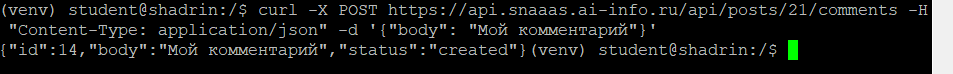

 201 означает "Created" — ресурс успешно создан, в отличие от 200 ("OK"). Content-Type: application/json указывает серверу, что тело запроса отправлено в формате JSON.

## №4 PUT — редактировать

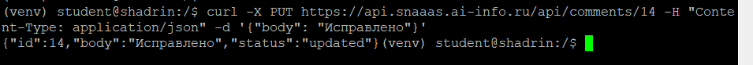

 PUT обновляет существующий ресурс и идемпотентен (повторный запрос даёт тот же результат), а POST создаёт новый. URL /comments/{id} идентифицирует конкретный комментарий, тогда как /posts/{id}/comments идентифицирует коллекцию комментариев поста.

## №5 DELETE — удалить

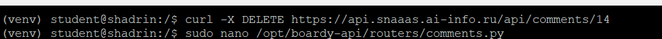

GET (200 — успешное получение данных), POST (201 — ресурс создан), PUT (200 — ресурс обновлён), DELETE (204 — ресурс удалён, тело ответа пустое)

## №6 Ошибки

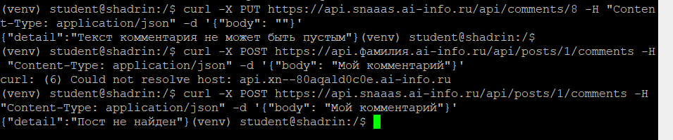

404 означает "Not Found" — ресурс (пост или комментарий) не существует в БД, а 422 "Unprocessable Entity" — данные прошли валидацию URL, но не прошли бизнес-правила (например, пустой текст комментария).

## №7 Swagger

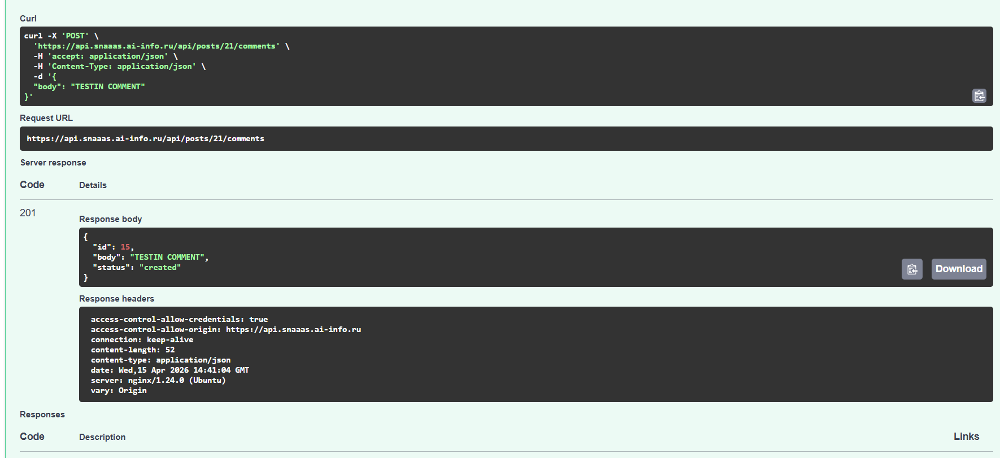

Swagger автоматически генерирует интерактивную документацию по OpenAPI-схеме, позволяя тестировать эндпоинты прямо из браузера без curl.

## №8 Vanilla JS - дема

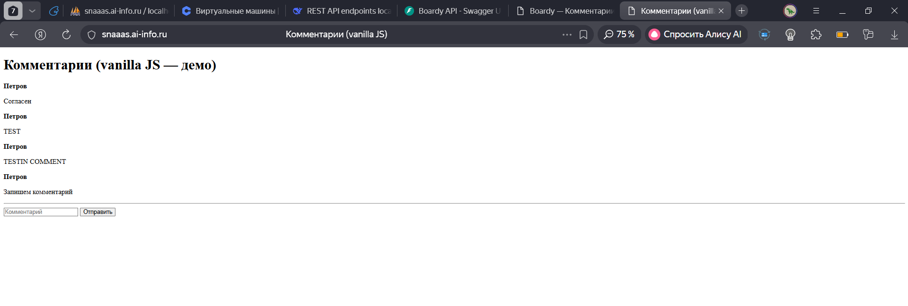

Функция esc() экранирует спецсимволы HTML (<, >, &, "), превращая их в безопасные сущности. Если её не вызвать, злоумышленник может вставить  и украсть данные других пользователей.

## №9 React — полный CRUD

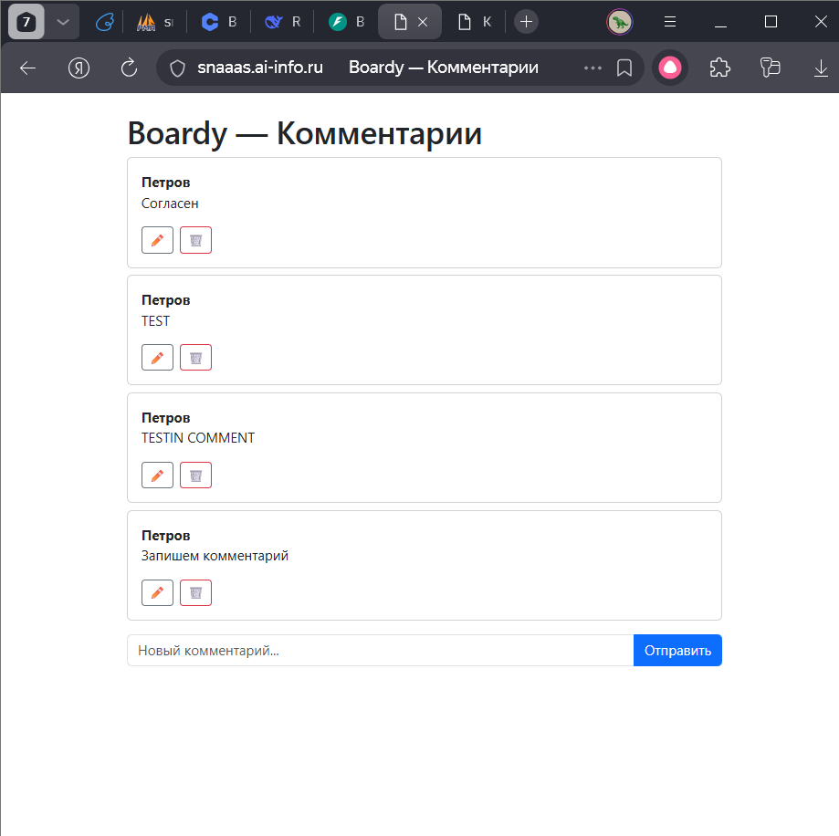

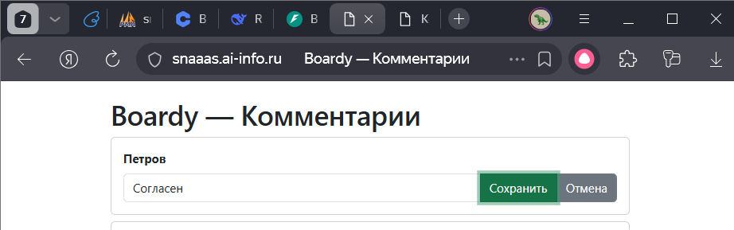

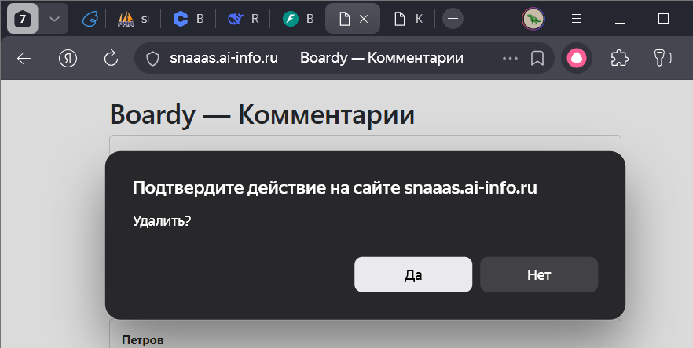

## №10 Сравнение кода

Где хранится состояние => Vanilla JS В DOM-элементах и глобальных переменных. React В хуке useState внутри компонента

Как обновляется список после добавления => Vanilla JS Перезагружаем весь список через innerHTML. React Вызываем setItems(), React сам перерисовывает

Как реализовано редактирование => Vanilla JS Вручную подменяем DOM, создаём input через createElement. React Условный рендер: {editId === item.id ? <input/> : 
}

Как защищаемся от XSS => Vanilla JS Ручное экранирование через esc(). React Автоматическое экранирование всех {} выражений

## №11 DevTools => Network

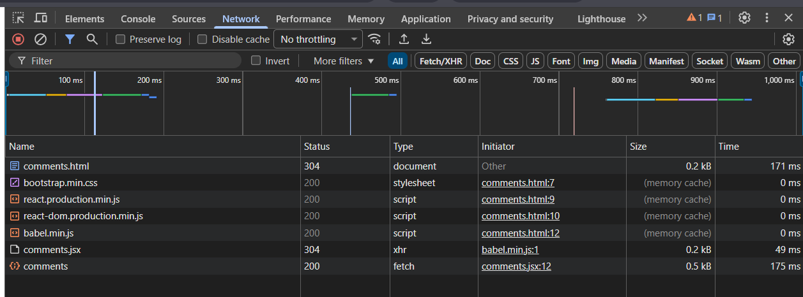

5 запросов: HTML, CSS, React, ReactDOM, Babel и JSX-файл; запрос к API — GET /api/posts/21/comments 

## №12 View Source

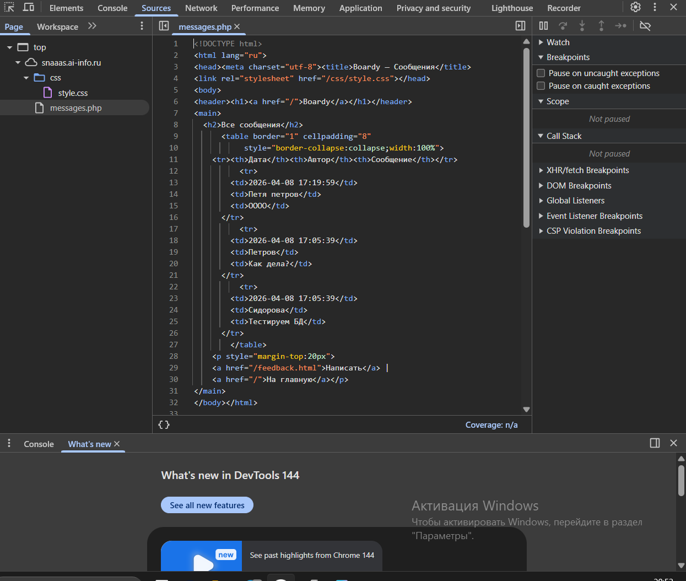

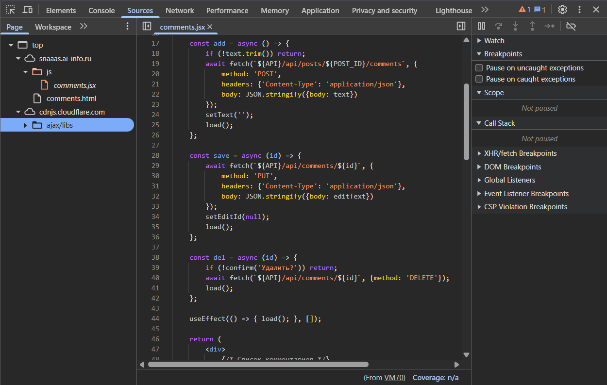

В CSR HTML — пустой контейнер, данные подгружаются через JavaScript после загрузки страницы. Поисковый бот увидит пустую страницу, если не умеет исполнять JavaScript.

## №13 XSS

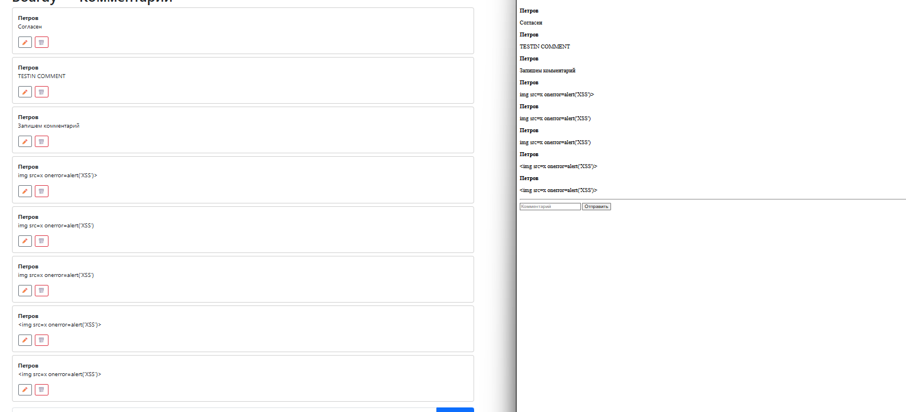

Vanilla JS требует ручного вызова esc(), React экранирует всё автоматически. Способ React надёжнее, так как разработчик не может случайно забыть вызвать экранирование.

## №14 

|                            | SSR (PHP)                  | vanilla JS                      | React                          |
|----------------------------|----------------------------|---------------------------------|--------------------------------|
| Кто рендерит HTML          | Сервер (PHP)               | Браузер (JS)                    | Браузер (React)                |
| Формат ответа сервера      | Готовый HTML               | JSON (через API)                | JSON (через API)               |
| View Source: данные видны? | Да                         | Нет                             | Нет                            |
| Перезагрузка при отправке  | Да                         | Нет                             | Нет                            |
| Защита от XSS              | Вручную (htmlspecialchars) | Ручная (esc())                  | Автоматическая                 |
| Сложность кода             | Средняя                    | Высокая (ручное управление DOM) | Средняя (декларативный подход) |