Лабораторная работа № 4 "HTTP, виртуальные хосты, старт проекта Boardy"

ФИО: Шадрин Константин Дмитриевич 

# №1 Директория проекта 

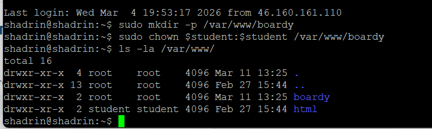

# №2 Конфиг виртуального хоста

server_name: Указывает доменное имя, по которому сервер будет отвечать на запросы.
root: Определяет путь к корневой директории на сервере, где хранятся файлы сайта.
access_log: Задает путь к файлу, в который записывается журнал всех входящих запросов.
error_log: Задает путь к файлу, в который записываются сообщения об ошибках сервера.
try_files: Последовательно проверяет существование указанных файлов или директорий и возвращает первый найденный вариант или заданный код ответа.
error_page: Настраивает отображение пользовательской страницы при возникновении определённого кода ошибки HTTP.

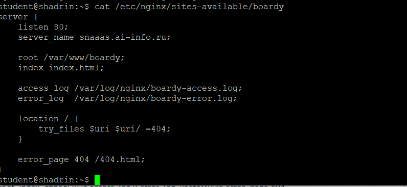

# №3 Лендинг

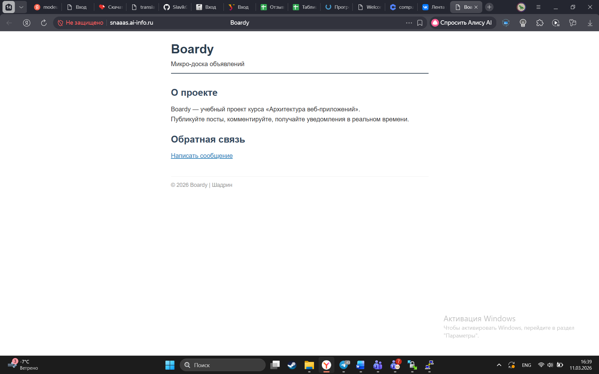

# №4 Форма обратной связи

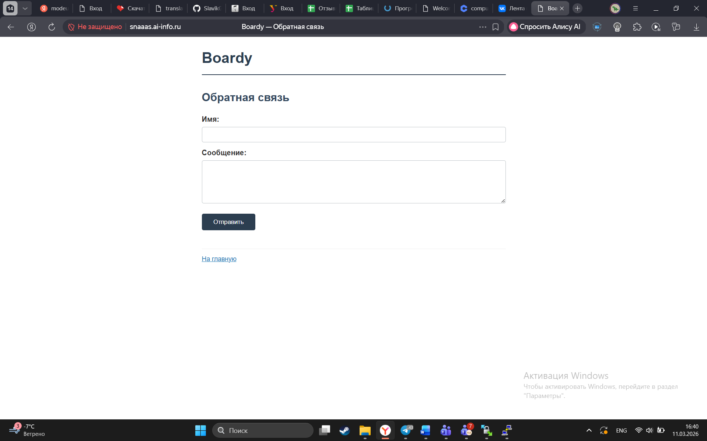

# №5 Стили и 404

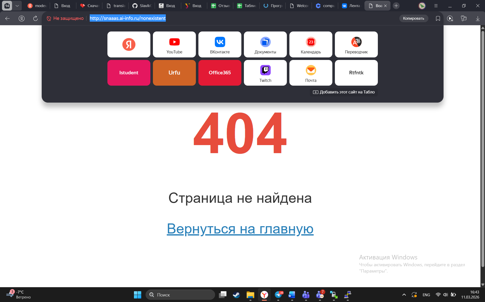

# №6 DNS-запись для поддомена

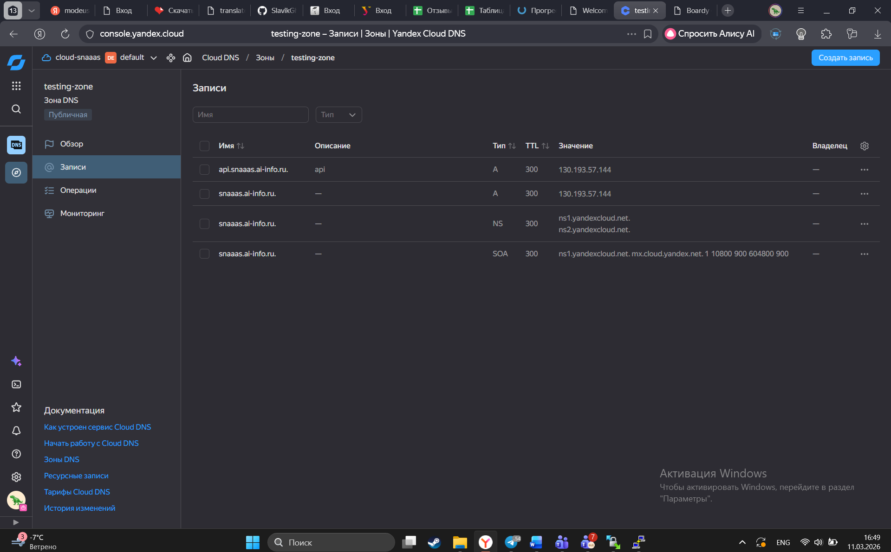

# №7 Проверка DNS

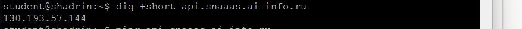

# №8 Конфиг и заглушка API

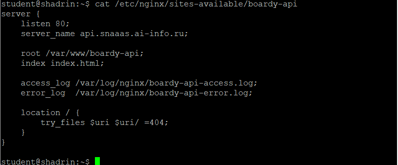

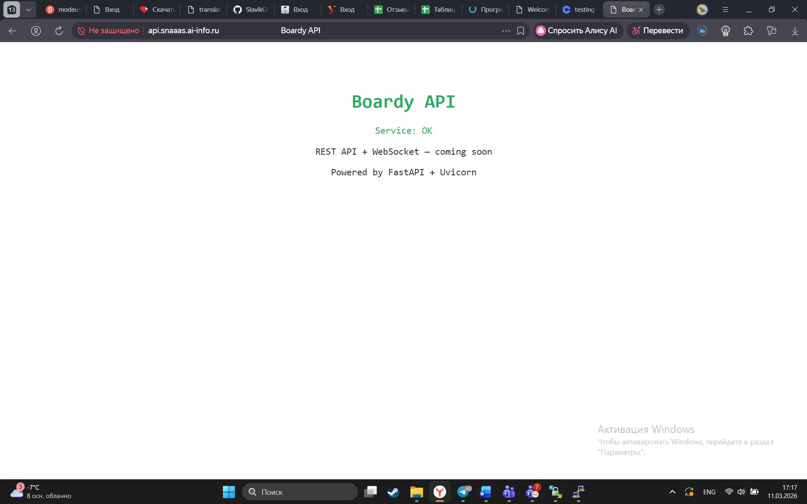

# №9 GET-запрос через curl -v

Стартовая строка запроса: метод GET, путь к ресурсу /, версия протокола HTTP/1.1.
Заголовок Host: snaaas.ai-info.ru - доменное имя сервера.
Стартовая строка ответа: версия протокола HTTP/1.1, код состояния 200, текстовое описание OK.
Content-Type: text/html - тип возвращаемого контента, в данном случае HTML-документ.
Content-Length: 1014 - размер тела ответа в байтах.

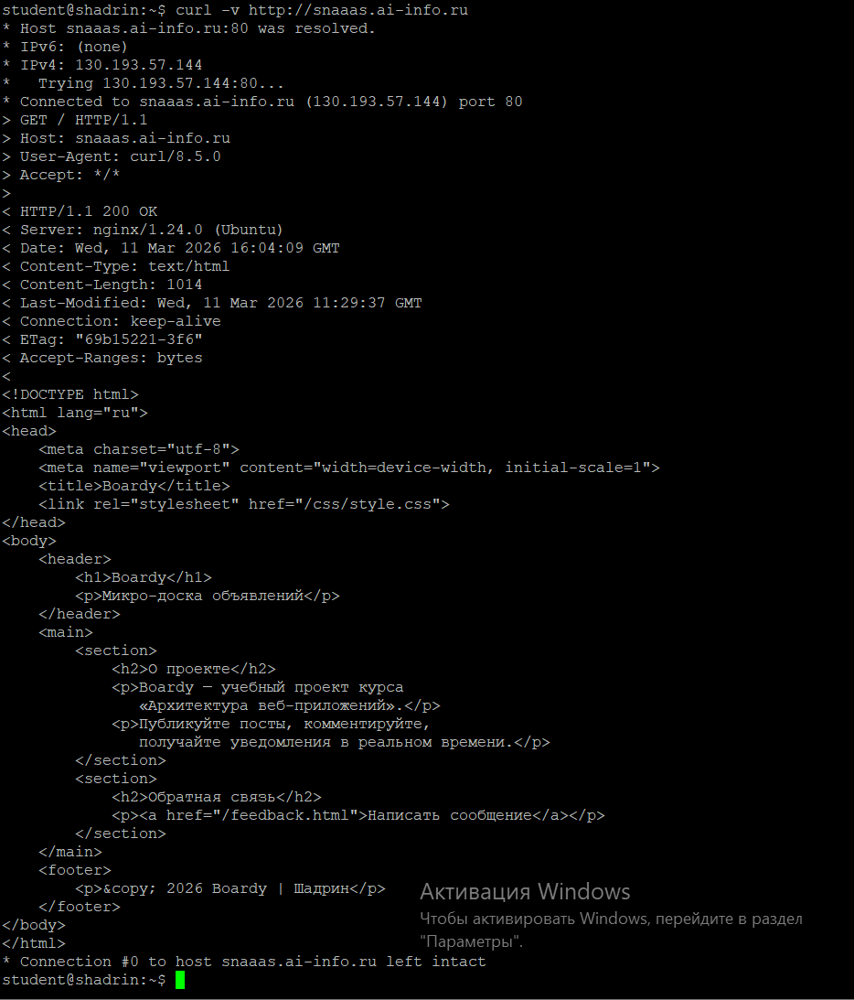

# №10 Виртуальные хосты в действии 

Host: snaaas.ai-info.ru => вернул основную страницу 
Host: unknown.ru => вернул ту же страницу Boardy 
Host: api.snaaas.ai-info.ru => вернул страницу заглушку API

unknown.ru переносит на snaaas.ai-info.ru, так как для него нет отдельного server block'а и nginx использует первый найденный в нашем случае snaaas.ai-info.ru

.png)

.png)

.png)

# №11 POST-запрос

"Лирическое отступление. так как мы не настраивали endpoint /submit => его просто не существует и появляется ошибка 404. Взял взамен этого feedback.html, чтобы появилась ошибка 405"

Метод: POST - метод HTTP для отправки данных на сервер
Content-Type запроса: application/x-www-form-urlencoded — формат кодирования данных формы
Тело запроса: name=Ivanov&message=Hello - данные формы, отправляемые на сервер.
Код ответа: 405 - метод POST не разрешён для этого ресурса.

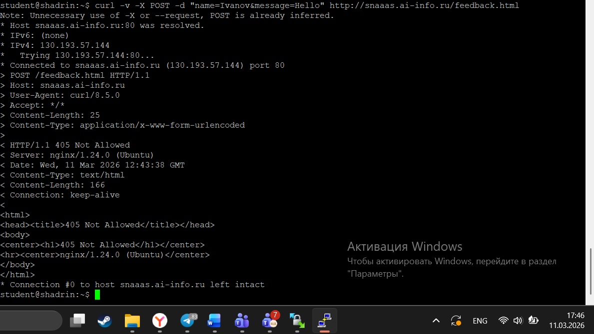

# №12 HEAD-запросы

В HEAD-запросе нет тела ответа. 
с помощью HEAD запроса можно: экономить трафик, получить метаданные, проверить существование ресурсу.

# №13 Раздельные логи

IP: 178.47.38.166
Метод: GET
Путь: /feedback.html
Код ответа: 304
User-Agent: Mozilla/5.0 (Windows NT 10.0; Win64; x64) AppleWebKit/537.36 (KHTML, like Gecko) Chrome/142.0.0.0 YaBrowser/25.12.0.0 Safari/537.36

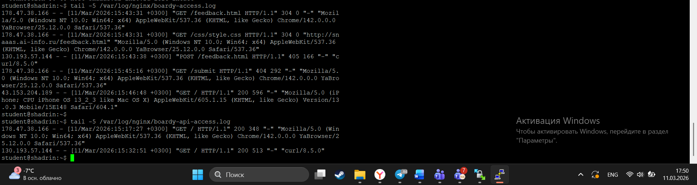

# №14 Фильтрация логов

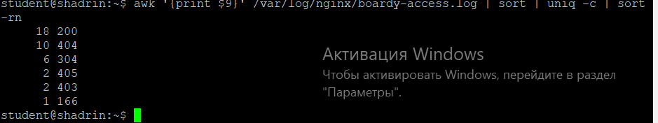

# №15 PR

